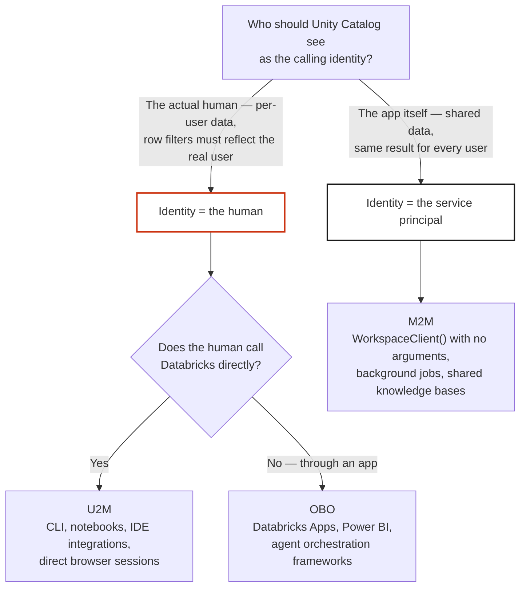

<!--
  Synced from databricks-fieldkit on 2026-07-14
  Sources: auth/overview.md, auth/m2m-service-principal.md, auth/obo-passthrough.md
  Public docs grounding:
    - https://docs.databricks.com/aws/en/dev-tools/auth/
    - https://docs.databricks.com/aws/en/dev-tools/auth/unified-auth
    - https://docs.databricks.com/aws/en/dev-tools/auth/oauth-u2m
    - https://docs.databricks.com/aws/en/dev-tools/auth/oauth-m2m
    - https://docs.databricks.com/aws/en/security/auth/single-sign-on/
  This file is auto-prepared and human-reviewed before publish.
-->

# Authentication (AuthN)

> AuthN is delegated to Identity Providers. Databricks does not run its own IdP — every user and every service authenticates against the same IdP configured at the account level, and Databricks trusts that identity for everything downstream.

## How It Works

Every Databricks workspace authenticates users through an external Identity Provider. The cloud determines the default, but the mechanics are the same: the IdP verifies the user, issues a token, and Databricks trusts that token.

| Cloud | IdP | Customizable? |
|-------|-----|---------------|
| Azure | Entra ID (Azure AD) | **No.** Built-in, out of the box. Entra IS the IdP. SSO, MFA, Conditional Access all inherited from your tenant. |
| GCP | Cloud Identity / Google Workspace | **Partially.** Cloud Identity is the default, but you can configure SSO with your own SAML/OIDC provider on top. |
| AWS | Bring Your Own | **Yes.** No built-in IdP. You configure any SAML 2.0 or OIDC provider (Okta, Entra, Ping, OneLogin) via account-level SSO. |

The important point: **you don't configure authentication inside Databricks.** The IdP handles user verification, password management, MFA, and conditional access. Databricks trusts the IdP's assertion. Users never create "Databricks passwords," and there is no separate identity system for apps, model serving endpoints, or agents — everything traces back to the same account-level IdP trust relationship.

## Token Acquisition Paths — U2M, OBO, M2M

U2M, OBO, and M2M are not different authentication systems. They are three different ways to acquire a Databricks token for a verified identity, and they determine what identity Unity Catalog sees for authorization decisions.

| Path | Who authenticates | Identity Unity Catalog sees | Token acquired by |
|---|---|---|---|
| **U2M** (user-to-machine) | The human, directly | The human | The human's own client (CLI, notebook, IDE, browser) |
| **OBO** (on-behalf-of) | The human, via an app | The human | An application, forwarding the human's token |
| **M2M** (machine-to-machine) | A service principal | The service principal | The application itself, using its own credentials |

### U2M — the human authenticates directly

The human completes the IdP login flow and receives a Databricks token with no intermediary. This is how the CLI (`databricks auth login`), notebooks, IDE integrations, and browser sessions authenticate.

### OBO — the app forwards the human's token

The human has already authenticated with the IdP. An application receives or acquires the human's Databricks token and passes it downstream rather than acting as itself. Unity Catalog evaluates row filters and column masks as that human, not as the app. Common carriers for the forwarded token:

- Databricks Apps proxy header (`X-Forwarded-Access-Token`)
- Token federation / exchange for external apps (RFC 8693)
- A serving endpoint request that includes the caller's token in `Authorization: Bearer`

### M2M — the app authenticates as itself

No human is in the loop. The application authenticates using its own service principal credentials. Every user of the app shares the same service principal identity for these calls. Use M2M for shared data (knowledge bases, product catalogs, configuration), background jobs, and any operation where "which user is asking" does not need to be part of the access decision.

## Choosing a Path



## Auth Path by AI Component

| Component | Recommended path | Identity in UC | How the token arrives |
|---|---|---|---|
| Genie (via a Databricks App) | OBO | Calling user | Forwarded proxy header passed through to the Genie API |
| Genie (direct API integration) | U2M | Calling user | User's own token in `Authorization: Bearer` |
| Multi-agent orchestration | OBO | Calling user | Token forwarded to sub-agents automatically |
| Vector Search | M2M | App service principal | `WorkspaceClient()` with no arguments |
| Unity Catalog Functions | OBO or M2M | User or service principal | Depends on whether per-user filtering matters |
| Custom MCP server (hosted as a Databricks App) | OBO or M2M | User or service principal | Forwarded proxy header, or `WorkspaceClient()` |
| Custom MCP server (called from a local client) | U2M | Calling user | OAuth PKCE via an MCP client such as `mcp-remote` |
| External MCP via a Unity Catalog HTTP connection | M2M or per-user OAuth | Service principal or user | Depends on the connection's configured auth method |
| Foundation Model API | M2M | App service principal | `WorkspaceClient()` with no arguments |
| Lakebase (via a Databricks App) | M2M | App service principal (mapped to a Postgres role) | OAuth token as the Postgres password, refreshed by the connection pool |
| Lakebase (direct connection) | U2M or native Postgres | Databricks user or native Postgres role | OAuth token or Postgres password |

Lakebase is the one exception worth calling out: every other resource in this table uses Unity Catalog for authorization (grants, row filters, column masks). Lakebase uses PostgreSQL-native authorization — roles, `GRANT`, and row-level security policies. Per-user access on Lakebase is enforced with Postgres RLS, not UC row filters.

## `current_user()` vs `is_member()`

A common source of confusion when building AI apps on Databricks: `current_user()` and `is_member()` don't always evaluate the same identity once a request has passed through OBO.

| Function | Evaluates | U2M | OBO (through Genie or an orchestration layer) | M2M |
|---|---|---|---|---|
| `current_user()` | The authenticated identity | Human email | Human email — Genie and orchestration layers inject the OBO caller's email explicitly | Service principal UUID |
| `is_member('group')` | The identity of whatever is actually executing the SQL | Human's groups (correct) | The execution service's identity, not the human — this is expected behavior for a service acting on the human's behalf | Service principal's groups (correct if the SP is in the group) |

**Recommended pattern**: if the same tables are read across U2M, OBO, and M2M paths, build row filters and column masks on `current_user()` plus an allowlist table rather than `is_member()`. This keeps the same policy correct across all three paths:

```sql
-- Works identically for OBO (current_user() = the human's email)
-- and for M2M (current_user() = the service principal's UUID)
CREATE OR REPLACE FUNCTION my_catalog.my_schema.mask_sensitive(val DECIMAL(12,2))
  RETURNS DECIMAL(12,2)
  RETURN IF(
    EXISTS (SELECT 1 FROM my_catalog.my_schema.privileged_principals WHERE principal_id = current_user()),
    val, NULL
  );
```

`is_member()` remains a good fit for policies that only ever run in a pure U2M or pure M2M context.

## OAuth Scopes

| Operation | Scope |
|---|---|
| Genie space access | `dashboards.genie` **and** `genie` (both required — on Azure, add `genie` explicitly even though the console picker leads with `dashboards.genie`) |
| Model Serving / agent orchestration endpoints | `model-serving` (shown as `serving.serving-endpoints` in the account console's scope picker) |
| SQL statement execution | `sql` |
| Unity Catalog operations, including External MCP over a UC HTTP connection | `unity-catalog` — the External MCP proxy checks this scope when verifying `USE CONNECTION` privilege on the target connection |
| Vector Search | `vector-search` |
| Long-lived sessions | `offline_access` (refresh tokens) |
| Broad REST API access | `all-apis` |

Scopes apply to both U2M and OBO tokens. M2M tokens carry the implicit scope of the service principal's Unity Catalog grants. When configuring a custom OAuth app integration for a Databricks App, add the full scope set your app needs upfront — a missing scope surfaces as a 403 with a "required scopes" message rather than a partial failure, so it's easier to provision once than to discover gaps tab-by-tab.

Two surfaces configure user-authorized scopes for a custom app integration, and they are not interchangeable:

| | CLI (`custom-app-integration update`) | Account console → User Authorization |
|---|---|---|
| Updates the integration's declared scope list | Yes | Yes |
| Produces OBO tokens carrying the scope in the JWT's `scope` claim, with user consent | No | Yes |

For OBO calls that depend on effective per-scope claims (OBO SQL via the Statement Execution API, for example), configure scopes through the account console's **User Authorization** capability so users are prompted to consent and the resulting token carries the scopes you selected. Continue to use the CLI to manage the integration's overall scope list. This account-console configuration is independent of the individual app's own proxy authorization setting.

## Implementing M2M (Service Principal)

Databricks Apps automatically inject the app's service principal credentials into the runtime environment — you never add them to `app.yaml`:

```
DATABRICKS_CLIENT_ID      = <app-service-principal-application-id>
DATABRICKS_CLIENT_SECRET  = <app-service-principal-secret>
DATABRICKS_HOST           = https://<workspace-hostname>
```

`WorkspaceClient()` with no arguments picks these up automatically:

```python
from databricks.sdk import WorkspaceClient

w = WorkspaceClient()
me = w.current_user.me()
print(me.user_name)   # the service principal's application ID, not an email
```

The same pattern extends to Vector Search, SQL, and Foundation Model calls — construct `WorkspaceClient()` once and reuse it, or exchange for a short-lived token when a downstream client (for example an OpenAI-compatible client for a serving endpoint) expects a bearer token directly.

External services outside Databricks Apps — pipelines, API gateways, backend jobs — obtain an M2M token explicitly via the OAuth 2.0 client credentials flow:

```http
POST https://<workspace-host>/oidc/v1/token
Content-Type: application/x-www-form-urlencoded

grant_type=client_credentials&client_id=<client-id>&client_secret=<client-secret>&scope=all-apis
```

Tokens expire in one hour — cache and refresh proactively rather than requesting a new token per call. Request the minimum scope the workload needs (`sql`, `all-apis`, `clusters`, `jobs`) instead of defaulting to `all-apis` everywhere.

### Granting access to a service principal

Grant Unity Catalog privileges to a **group**, then add the service principal to that group — never grant directly to the SP:

```sql
GRANT USE CATALOG ON CATALOG my_catalog TO `pipeline-readers`;
GRANT USE SCHEMA ON SCHEMA my_catalog.my_schema TO `pipeline-readers`;
GRANT SELECT ON TABLE my_catalog.my_schema.my_table TO `pipeline-readers`;
```

This makes revoking access, rotating secrets, and adding a second SP (for a blue/green deploy, for example) all group-membership operations rather than privilege changes — and it gives you an audit trail of group membership changes separate from data access events. Scope one service principal per service, with a group name that reflects the service's function (`pipeline-readers`, `api-gateway`, and so on).

Some grants are handled automatically when a Databricks App is deployed with a `resources` block in `app.yaml` (Genie space access, Vector Search index access, serving endpoint access, SQL warehouse access, function execution). Catalog, schema, and table-level Unity Catalog grants are not covered by `app.yaml` and need to be applied once via SQL, as shown above.

Service principals carry two identifiers: an **application ID** (what `current_user()` returns, and what Unity Catalog grants reference) and a numeric **member ID** (used for SCIM group membership operations). Keep the two straight when scripting group membership changes.

## Implementing OBO (On-Behalf-Of)

Five prerequisites need to be true for OBO to produce the human's identity in Unity Catalog. Missing any one causes OBO to silently resolve to the app's service principal identity instead of the human:

1. **The user exists in Databricks** — via SCIM provisioning or manual account creation. Token exchange validates the user exists before issuing a token.
2. **A token federation policy or OAuth app integration is configured** at the account level, mapping the IdP's token claims to a Databricks identity.
3. **Row filters and column masks use `current_user()`**, not `is_member()` — see the section above.
4. **The calling app passes a genuine Databricks user token** — not a service principal token, not a PAT — obtained via token federation, OAuth PKCE, or the Databricks Apps proxy header.
5. **The receiving runtime reads the token correctly** — the extraction method differs by runtime, described below.

### Reading the forwarded token in a Databricks App

Databricks Apps inject the authenticated user's OAuth token as a request header, `X-Forwarded-Access-Token`. Read it directly from the request context and forward it to downstream calls:

```python
# Streamlit — read via st.context.headers, not request.headers
import streamlit as st

headers = st.context.headers
user_token = headers.get("X-Forwarded-Access-Token", "")
host = headers.get("X-Forwarded-Host", "")
if host and not host.startswith("http"):
    host = f"https://{host}"
```

For calls to Genie, a Model Serving endpoint, or the Statement Execution API, pass this token directly as `Authorization: Bearer {user_token}` using `httpx` or `requests` — not the Databricks SDK's default `WorkspaceClient()`, which resolves credentials from `DATABRICKS_HOST`/`DATABRICKS_TOKEN` environment variables set to the app's own service principal credentials. Direct HTTP calls keep the forwarded user token separate from the app's own M2M credentials.

### `ModelServingUserCredentials()`

`ModelServingUserCredentials()` extracts the OBO caller's identity from the **Model Serving request context** — it's built for code running inside a model serving endpoint (for example, an agent deployed via Agent Bricks or Mosaic AI Model Serving), where it correctly resolves the calling human's identity. It is not intended for use inside Databricks Apps code, since that context doesn't carry the same request metadata; in Apps, read `X-Forwarded-Access-Token` directly as shown above. A quick identity check at app startup catches a misapplied credential strategy early:

```python
from databricks.sdk import WorkspaceClient
from databricks.sdk.credentials_provider import ModelServingUserCredentials

w = WorkspaceClient(credentials_strategy=ModelServingUserCredentials())
identity = w.current_user.me().user_name
if "@" not in identity:
    raise RuntimeError(
        f"Expected the calling human's email, got {identity}. "
        "In Databricks Apps, read X-Forwarded-Access-Token instead."
    )
```

### Multi-app (proxy-to-proxy) OBO

When one Databricks App calls another Databricks App — for example a Streamlit front end calling a custom MCP server hosted as its own app — the second app's proxy replaces the incoming `Authorization` header with its own service principal's token, since it doesn't re-forward another app's token as-is. It does, however, set `X-Forwarded-Email` from the validated caller identity, and that header can't be set by the calling app itself. The reliable pattern for this hop is to read the forwarded email and apply an explicit per-user filter in the query, combined with the receiving app's own M2M credentials:

```python
import contextvars
from starlette.types import ASGIApp, Receive, Scope, Send

_request_caller: contextvars.ContextVar[str] = contextvars.ContextVar("request_caller", default="")

class ExtractCallerMiddleware:
    """Pure ASGI middleware — BaseHTTPMiddleware breaks ContextVar propagation."""
    def __init__(self, app: ASGIApp) -> None:
        self.app = app

    async def __call__(self, scope: Scope, receive: Receive, send: Send) -> None:
        if scope["type"] == "http":
            headers = {k.lower(): v for k, v in scope.get("headers", [])}
            caller_email = headers.get(b"x-forwarded-email", b"").decode("utf-8")
            ctx = _request_caller.set(caller_email)
            try:
                await self.app(scope, receive, send)
            finally:
                _request_caller.reset(ctx)
            return
        await self.app(scope, receive, send)

def _caller_email() -> str:
    return _request_caller.get("")

@mcp.tool()
def get_my_records(stage: str = "") -> dict:
    """Scoped to the calling user via the proxy-verified email + an M2M query filter."""
    caller = _caller_email()
    if not caller:
        return {"error": "X-Forwarded-Email not set — request did not arrive through the Apps proxy"}

    w = WorkspaceClient()   # M2M: the app's own service principal credentials
    rows = _run_sql(w, f"""
        SELECT id, stage, amount
        FROM   my_catalog.my_schema.records
        WHERE  owner_email = '{caller.replace("'", "''")}'
        LIMIT  50
    """)
    return {"caller": caller, "records": rows}
```

This pattern needs an ASGI middleware wrapping `mcp.streamable_http_app()` directly (rather than `mcp.run(transport="streamable-http")`) so the middleware can be attached.

### Verifying OBO end to end

Confirm Unity Catalog is evaluating the identity you expect by querying `current_user()` with the forwarded token:

```python
import requests

def verify_uc_identity(host: str, user_token: str, warehouse_id: str) -> str:
    r = requests.post(
        f"{host}/api/2.0/sql/statements",
        headers={"Authorization": f"Bearer {user_token}", "Content-Type": "application/json"},
        json={"warehouse_id": warehouse_id, "statement": "SELECT current_user()", "wait_timeout": "10s"},
    )
    r.raise_for_status()
    return r.json()["result"]["data_array"][0][0]
```

## Databricks Documentation

AuthN is well-documented. Start here:

- [Unified client authentication](https://docs.databricks.com/aws/en/dev-tools/auth/unified-auth) — the auth model across SDKs, CLI, and Terraform
- [OAuth U2M authentication](https://docs.databricks.com/aws/en/dev-tools/auth/oauth-u2m) — interactive login
- [OAuth M2M authentication](https://docs.databricks.com/aws/en/dev-tools/auth/oauth-m2m) — service principal / client credentials flow
- [Single sign-on (SSO)](https://docs.databricks.com/aws/en/security/auth/single-sign-on/) — workspace IdP configuration
- [Databricks authentication overview](https://docs.databricks.com/aws/en/dev-tools/auth/) — full reference across all supported flows

These patterns are cloud-agnostic in principle, with minor endpoint differences per cloud.

## What AuthN Does NOT Cover

AuthN answers "who are you?" It does not answer:

- What data can you see? (UC grants, row filters, column masks)
- What APIs can you call? (OAuth scopes)
- What external services can you reach? (UC connections)
- What shows up in the audit trail? (depends on token type: OBO vs M2M)

Those are all **authorization** decisions. See [Authorization](authorization.md).
