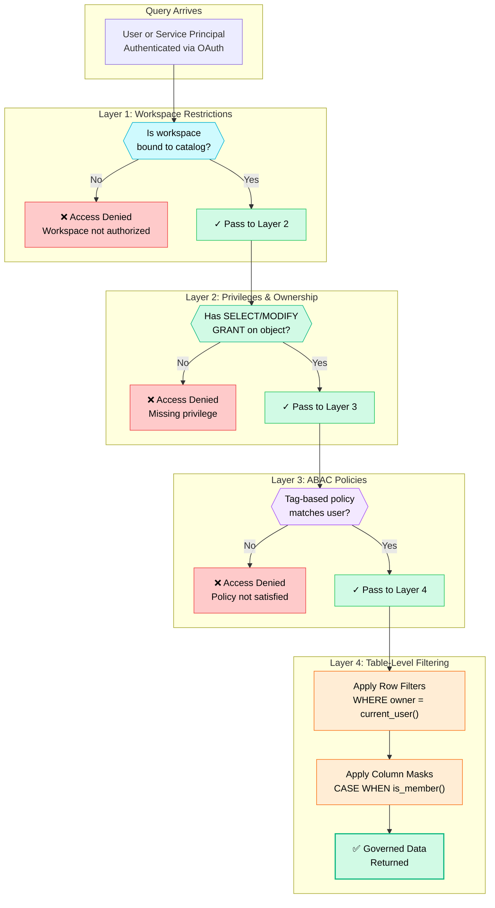
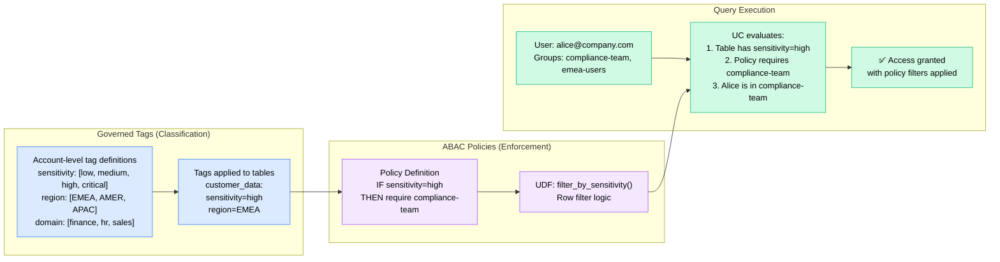
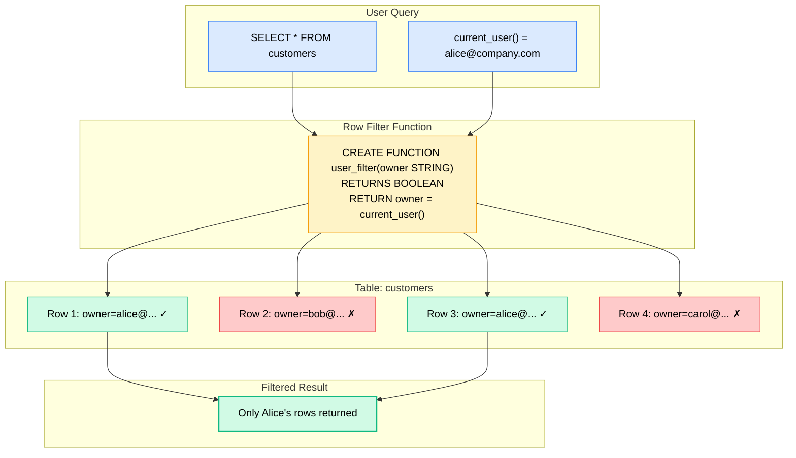
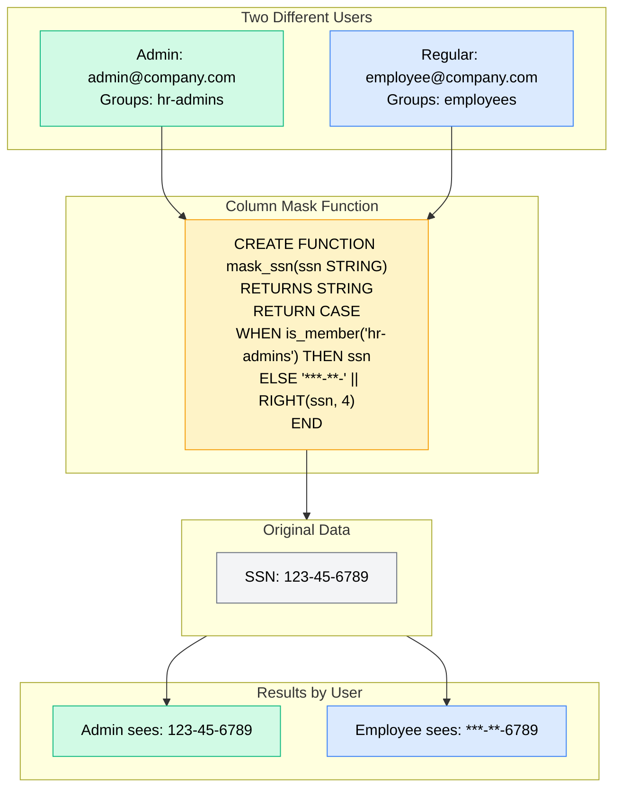
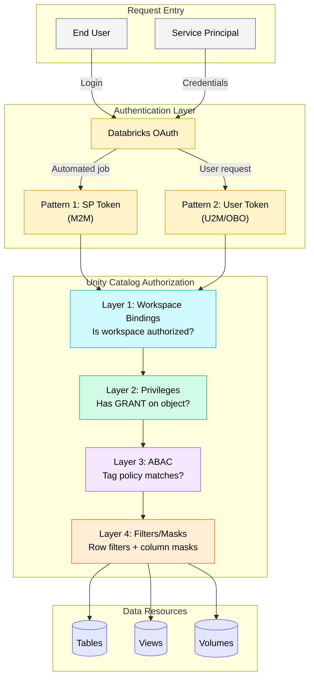

# Unity Catalog Authorization Flows — Reference Diagrams

> **Official Documentation:** [Access Control in Unity Catalog](https://docs.databricks.com/aws/en/data-governance/unity-catalog/access-control) | [ABAC](https://docs.databricks.com/aws/en/data-governance/unity-catalog/abac) | [Row Filters & Column Masks](https://docs.databricks.com/aws/en/sql/language-manual/sql-ref-row-filter-column-mask.html) | [Governed Tags](https://docs.databricks.com/aws/en/admin/governed-tags/)

This document provides visual reference diagrams for Unity Catalog authorization, showing how the four layers of access control work together to enforce secure, fine-grained data access.

## Four Layers of Access Control

Access control in Unity Catalog is built on **four complementary layers** that work together:

| Layer | Question Answered | Mechanisms | Docs |
|-------|-------------------|------------|------|
| **1. Workspace Restrictions** | WHERE can users access data? | Workspace bindings on catalogs, external locations, storage credentials | [Docs](https://docs.databricks.com/aws/en/catalogs/binding.html) |
| **2. Privileges & Ownership** | WHO can access WHAT? | GRANTs (`SELECT`, `MODIFY`, etc.), object ownership, admin roles | [Docs](https://docs.databricks.com/aws/en/data-governance/unity-catalog/manage-privileges/) |
| **3. ABAC Policies** | WHAT data based on tags? | [Governed tags](https://docs.databricks.com/aws/en/admin/governed-tags/) + policies with UDFs for dynamic enforcement | [Docs](https://docs.databricks.com/aws/en/data-governance/unity-catalog/abac) |
| **4. Table-Level Filtering** | WHAT rows/columns visible? | Row filters, column masks, dynamic views | [Docs](https://docs.databricks.com/aws/en/sql/language-manual/sql-ref-row-filter-column-mask.html) |

## 1) Four-Layer Authorization Flow



## 2) ABAC with Governed Tags Flow



## 3) Row Filter Evaluation Flow



## 4) Column Mask Evaluation Flow



## 5) Complete Authorization Flow (All Patterns)



## When to Use Each Mechanism

| Mechanism | Use When | Example | Docs |
|-----------|----------|---------|------|
| **Workspace bindings** | Isolating environments (dev/prod) | Restrict prod catalog to prod workspace | [Docs](https://docs.databricks.com/aws/en/catalogs/binding.html) |
| **Privileges (GRANTs)** | Basic access control | `GRANT SELECT ON TABLE` to group | [Docs](https://docs.databricks.com/aws/en/data-governance/unity-catalog/manage-privileges/) |
| **ABAC policies** | Centralized, tag-driven governance at scale | All `sensitivity=high` tables require compliance group | [Docs](https://docs.databricks.com/aws/en/data-governance/unity-catalog/abac) |
| **Row filters** | Per-user row-level security | Users see only their own records | [Docs](https://docs.databricks.com/aws/en/sql/language-manual/sql-ref-row-filter-column-mask.html) |
| **Column masks** | Sensitive data redaction | Mask SSN for non-HR users | [Docs](https://docs.databricks.com/aws/en/sql/language-manual/sql-ref-row-filter-column-mask.html) |
| **Dynamic views** | Complex filtering logic, Delta Sharing | Multi-table joins with embedded filters | [Docs](https://docs.databricks.com/aws/en/views/dynamic-views.html) |

> **Recommendation:** Use [ABAC](https://docs.databricks.com/aws/en/data-governance/unity-catalog/abac) for centralized, scalable governance. Use row filters and column masks when per-table logic is required or ABAC hasn't been adopted yet.

## 6) is_member() vs current_user() Under OBO — Critical Distinction

> Verified on Azure Databricks, March 2026 (AI Auth Showcase build).

When UC row filters or column masks are evaluated under OBO (e.g., Genie Conversation API called from a Databricks App), the two UC built-in functions behave differently:

| Function | Evaluated as | Correct under OBO? |
|---|---|---|
| `current_user()` | The **calling user's email** (the OBO principal) | YES — use for identity-based row filters |
| `is_member('group')` | The **SQL execution identity** (e.g., Genie's service account) | NO — evaluates the service account's group memberships, not the user's |

**The trap:** A column mask using `is_member('sales-managers')` will always evaluate as if the Genie service account is (or is not) in `sales-managers`, regardless of which user called Genie via OBO. The result is the same for every user.

**The fix for OBO-compatible access control:**

Instead of `is_member()`, use `current_user()` with an allowlist table:

```sql
-- OBO-compatible: evaluates to the calling user's email
CREATE FUNCTION catalog.schema.manager_filter(rep_email STRING)
RETURNS BOOLEAN
RETURN rep_email = current_user()
    OR EXISTS (
        SELECT 1 FROM catalog.schema.quota_viewers
        WHERE user_email = current_user()
    );

ALTER TABLE catalog.schema.opportunities
  SET ROW FILTER catalog.schema.manager_filter ON (rep_email);
```

This pattern works correctly whether the query arrives via Genie OBO, a Databricks App, or direct SQL — `current_user()` always resolves to the authenticated caller.

> **Last verified:** 2026-03-08, Azure Databricks. Source: AI Auth Showcase build.

## 7) Databricks Apps: app.yaml Resource Grants and SP Lifecycle

When a Databricks App declares resources in `app.yaml`, the platform auto-grants the app service principal (SP) permissions on each deploy. However, several grants are NOT covered by `app.yaml` and must be applied manually:

| Grant type | Auto via app.yaml? | Manual required? |
|---|---|---|
| SQL Warehouse CAN_USE | Yes (via `sql_warehouse` resource block) | No |
| USE CATALOG | No | Yes |
| USE SCHEMA | No | Yes |
| SELECT on tables | No | Yes |
| USE CONNECTION (for external MCP) | No | Yes — must be on the calling identity |

**SP lifecycle gotcha:** When an app is deleted and recreated, a new SP UUID is generated. All manually applied grants (UC privileges, warehouse permissions, allowlist table rows) must be redone. The `app.yaml` resource grants are automatically reapplied on the next deploy.

**Multi-app gotcha:** Each Databricks App (main app, MCP app, etc.) gets its own distinct SP. Grants on the main app's SP do not carry over to the MCP app's SP. Check both SPs separately.

## Related Documentation

- [Authentication Flows](authentication-flows.md) -- Visual reference for authentication patterns
- [Access Control in Unity Catalog](https://docs.databricks.com/aws/en/data-governance/unity-catalog/access-control) -- Official four-layer model
- [ABAC](https://docs.databricks.com/aws/en/data-governance/unity-catalog/abac) -- Attribute-based access control
- [Governed Tags](https://docs.databricks.com/aws/en/admin/governed-tags/) -- Tag management for ABAC
- [Interactive Scrollytelling: Access Control Layers](https://bhavink.github.io/applied-ai-governance/interactive/uc-access-control-layers.html) -- Visual explainer

---

## Proxy Architecture -- Hop-by-Hop Header Traces

The Databricks Apps proxy layer sits between the internet and your app process. Every Databricks App gets an automatic reverse proxy that authenticates callers, injects identity headers, and strips the original Authorization header. Understanding how headers flow through single, dual, and triple proxy architectures is essential for building correct auth patterns.

### Proxy-Injected Headers Reference

These headers are set by the Databricks Apps proxy on every authenticated request. Your app reads them from the incoming request -- they are not something you send.

| Header | Example Value | What It Is | Trust Level |
|---|---|---|---|
| `X-Forwarded-Email` | `alice@example.com` | Caller's email from the validated OAuth token | **High** -- set by proxy from authenticated identity. Cannot be forged by the calling app. Use this for identity. |
| `X-Forwarded-User` | `{user_id}@{workspace_id}` | Composite user + workspace identifier | High |
| `X-Forwarded-Preferred-Username` | Display name | Display name from the user's profile | High |
| `X-Forwarded-Access-Token` | `eyJraWQi...` (JWT) | Minimal OIDC identity token issued by the proxy | Medium -- **not** the user's original token; scopes are limited |
| `X-Forwarded-Groups` | Comma-separated list | Workspace groups the user belongs to | High |
| `X-Databricks-Org-Id` | `<workspace-id>` | Workspace ID | Informational |

### What X-Forwarded-Access-Token Is and Is Not

| Property | Value |
|---|---|
| **Format** | JWT (`eyJ...`) -- three base64url segments |
| **Issuer** | The Databricks Apps proxy (not the user's OAuth provider) |
| **`sub` claim** | The app's **service principal UUID** -- not the user |
| **Default scopes** | Minimal OIDC: `offline_access email iam.current-user:read openid iam.access-control:read profile` |
| **Usable for** | Genie API, Agent Bricks endpoints (server-side scope validation) |
| **NOT usable for** | Statement Execution API (`sql` scope not present by default) |

**Exception -- UI User Authorization (Public Preview):** When an app is configured with UI User Authorization, the `X-Forwarded-Access-Token` **can** contain service scopes like `sql`. The default CLI-configured scope model does not include them.

---

### Single-Proxy Path -- Browser to One App

The simple case: a user opens a Databricks App in a browser.

```
Step 1: User navigates to https://<app-name>-<workspace-id>.<region>.databricksapps.com
        Browser sends: session cookie (from prior OAuth login)

Step 2: Databricks Apps Proxy (automatic)
        |-- Validates session cookie against workspace OIDC
        |-- STRIPS the cookie / Authorization header
        |-- INJECTS:
        |     X-Forwarded-Email: alice@example.com
        |     X-Forwarded-User: {user_id}@<workspace-id>
        |     X-Forwarded-Preferred-Username: Alice Example
        |     X-Forwarded-Access-Token: eyJ... (SP-scoped OIDC JWT)
        |     X-Forwarded-Groups: west_sales,...
        |     X-Databricks-Org-Id: <workspace-id>
        +-- Forwards to app process on port 8000

Step 3: app.py receives the request
        |-- Reads X-Forwarded-Access-Token via st.context.headers
        |   -> uses it for Genie API calls, Agent Bricks calls (OBO)
        |-- Reads X-Forwarded-Email for user identity
        +-- Uses WorkspaceClient() (no args) for M2M operations
```

**Headers at each hop:**

| Hop | Authorization | X-Forwarded-Email | X-Forwarded-Access-Token | Notes |
|---|---|---|---|---|
| Browser --> Proxy | Session cookie | (not set) | (not set) | Browser sends cookie, not Bearer |
| Proxy --> app.py | (stripped) | `alice@...` | `eyJ...` (SP JWT) | Proxy replaces auth, injects identity |

---

### Two-Proxy Path -- Main App Calls Custom MCP Server

When a Streamlit app calls a custom MCP server, both are Databricks Apps. Each has its own proxy.

```
+---------------------------------------------------------------------+
|                        USER BROWSER                                  |
|  Cookie: _databricks_session=<session-id>                            |
+--------------------------------+------------------------------------+
                                 |
                                 v
+---------------------------------------------------------------------+
|  PROXY 1 -- for the main app                                        |
|                                                                      |
|  Validates: session cookie                                           |
|  Strips:   Cookie / Authorization                                    |
|  Injects:  X-Forwarded-Email: alice@example.com                      |
|            X-Forwarded-Access-Token: eyJ...TOKEN_A (SP1 JWT)         |
|            X-Forwarded-User: {user_id}@<workspace-id>                |
|                                                                      |
|  app.yaml: authorization NOT disabled (default = enabled)            |
+--------------------------------+------------------------------------+
                                 |
                                 v
+---------------------------------------------------------------------+
|  app.py (Streamlit)                                                  |
|                                                                      |
|  Reads: X-Forwarded-Access-Token -> user_token (TOKEN_A)            |
|                                                                      |
|  Calls MCP server:                                                   |
|    POST https://my-mcp-server-<workspace-id>..../mcp                 |
|    Headers:                                                          |
|      Authorization: Bearer {TOKEN_A}                                 |
|      Content-Type: application/json                                  |
|      Accept: application/json, text/event-stream                     |
|    Body: {"jsonrpc":"2.0","method":"tools/call",...}                  |
+--------------------------------+------------------------------------+
                                 |
                                 v
+---------------------------------------------------------------------+
|  PROXY 2 -- for the MCP server app (authorization: disabled)         |
|                                                                      |
|  With auth DISABLED, Proxy 2:                                        |
|    * Does NOT strip/replace the Authorization header                 |
|    * Passes through X-Forwarded-Email from the incoming request      |
|    * Passes through all other X-Forwarded-* headers                  |
|    * Does NOT perform authentication itself                          |
+--------------------------------+------------------------------------+
                                 |
                                 v
+---------------------------------------------------------------------+
|  server/main.py (FastMCP on port 8000)                               |
|                                                                      |
|  Middleware reads from the incoming request:                          |
|    X-Forwarded-Email: alice@example.com -> ContextVar                |
|                                                                      |
|  OBO tools call _caller_email() -> "alice@example.com"               |
|  M2M tools call WorkspaceClient() -> uses app SP credentials         |
|  SQL uses explicit WHERE rep_email = '{caller}'                      |
+---------------------------------------------------------------------+
```

**Headers at each hop:**

| Hop | Authorization | X-Forwarded-Email | X-Forwarded-Access-Token | Source of Identity |
|---|---|---|---|---|
| Browser --> Proxy 1 | Cookie | (not set) | (not set) | Cookie |
| Proxy 1 --> app.py | (stripped) | `alice@...` | `eyJ...TOKEN_A` | Proxy 1 validates cookie |
| app.py --> Proxy 2 | `Bearer TOKEN_A` | (flows through) | (not sent by app.py) | app.py forwards TOKEN_A |
| Proxy 2 --> server/main.py | `Bearer TOKEN_A` (passthrough) | `alice@...` (passthrough) | (passthrough if present) | Passthrough -- auth disabled |

**The two-proxy problem**: If Proxy 2 has `authorization: enabled` (default), it strips the Authorization header from the upstream app and substitutes its own SP token. The user's identity from Proxy 1 never reaches the MCP server code via token. This is why `authorization: disabled` is necessary for app-to-app calls.

---

### Three-Proxy Path -- Main App --> UC External MCP Proxy --> Custom MCP

When the MCP server is registered as a UC HTTP Connection, Databricks provides a managed proxy at `/api/2.0/mcp/external/{connection_name}`. This adds a governance layer (USE CONNECTION checks) between the calling app and the MCP server.

```
Browser --> Proxy 1 (main app, auth enabled)
  --> app.py reads X-Forwarded-Access-Token as user_token
  --> app.py calls /api/2.0/mcp/external/{conn_name} with user_token as Bearer
  --> UC External MCP Proxy:
      - Checks: unity-catalog scope in token
      - Checks: USE CONNECTION privilege on calling identity
      - If no USE CONNECTION --> 403 "User does not have any privileges on Connection"
      - If granted --> forwards to the HTTP Connection's stored URL
      - Injects: x-forwarded-email from caller's token
  --> Proxy 2 (MCP server app, auth disabled)
      - Passes through all headers unchanged
  --> server/main.py
      - Reads x-forwarded-email for identity
      - M2M fallback for SQL (OBO token typically lacks sql scope)
```

**Headers at each hop:**

| Hop | Authorization | X-Forwarded-Email | Notes |
|---|---|---|---|
| Browser --> Proxy 1 | Session cookie | (not set) | Browser sends cookie |
| Proxy 1 --> app.py | (stripped) | `alice@example.com` | Proxy 1 injects identity |
| app.py --> UC External MCP Proxy | `Bearer {user_token}` | (not sent by app.py) | app.py forwards the token from Proxy 1 |
| UC External MCP Proxy --> Proxy 2 | (rewritten by platform) | `alice@example.com` (injected by UC proxy) | USE CONNECTION checked here |
| Proxy 2 --> server/main.py | (passthrough) | `alice@example.com` (passthrough) | auth disabled -- all headers pass through |

The key difference from the two-proxy path: the UC External MCP Proxy enforces **USE CONNECTION** before traffic ever reaches the MCP server. Access can be gated at the Unity Catalog level with no changes to MCP server code.

---

### authorization: disabled vs enabled

| Setting | Use When | Trade-off |
|---|---|---|
| **enabled** (default) | App serves browser users, external clients | Proxy strips forwarded tokens from upstream apps |
| **disabled** | App receives calls from another Databricks App | Proxy passes through all headers; no auth validation |

**Cannot serve both?** Two options:

1. **Two deployments** -- one with auth disabled (for app-to-app), one with default enabled (for external clients). Simplest, no code changes.
2. **Fallback logic** -- keep auth disabled, parse Bearer token from Authorization header when `X-Forwarded-Email` is empty. Decode JWT to extract email claim.

---

### External Client Path -- Claude Code / Cursor / MCP Inspector

When an external client connects directly (not through another Databricks App), there is only one proxy:

```
External Client (e.g., Claude Code)
    |
    | HTTPS POST with Authorization: Bearer {user_oauth_token}
    v
Proxy 2 -- for the MCP server app
    |
    | (behavior depends on authorization setting)
    v
server/main.py (FastMCP)
```

| Header | auth: disabled | auth: enabled |
|---|---|---|
| Authorization | Passes through: `Bearer {user_token}` | Stripped, replaced with SP token |
| X-Forwarded-Email | **Empty** -- no upstream proxy set it | **Set by Proxy 2** from validated token |
| X-Forwarded-Access-Token | **Empty** -- no upstream proxy set it | Set by Proxy 2: SP-scoped JWT |

With `authorization: disabled` and no upstream proxy, `X-Forwarded-Email` is empty. OBO tools that depend on caller identity will fail. M2M-only tools still work.

---

### Design Rationale: Why X-Forwarded-Email Instead of Parsing Bearer Token

| Approach | Pros | Cons |
|---|---|---|
| **X-Forwarded-Email** (recommended) | Set by infrastructure; unforgeable; no token parsing; works regardless of token format changes | Requires proxy to set it (fails when auth disabled + no upstream proxy) |
| **Parse Bearer JWT** | Works without proxy injection; self-contained | Token format is platform-internal; `sub` may be SP UUID not email; requires JWT decode + validation |
| **`current_user.me()` API call** | Authoritative; works with any valid token | Extra API call per request; adds latency; requires `iam.current-user:read` scope |

### Design Rationale: Why M2M for SQL Instead of OBO

The `X-Forwarded-Access-Token` is a minimal OIDC identity token. It does **not** contain the `sql` scope required by the Statement Execution API by default. The pattern is: **identity from the proxy header, authorization from the app SP**. The MCP server reads `X-Forwarded-Email` to know *who* is calling, then uses its own SP credentials (`WorkspaceClient()` no-args) to execute SQL with an explicit `WHERE rep_email = '{caller}'` clause. This produces the same access control as a UC row filter, without requiring the `sql` scope on the user's token.
