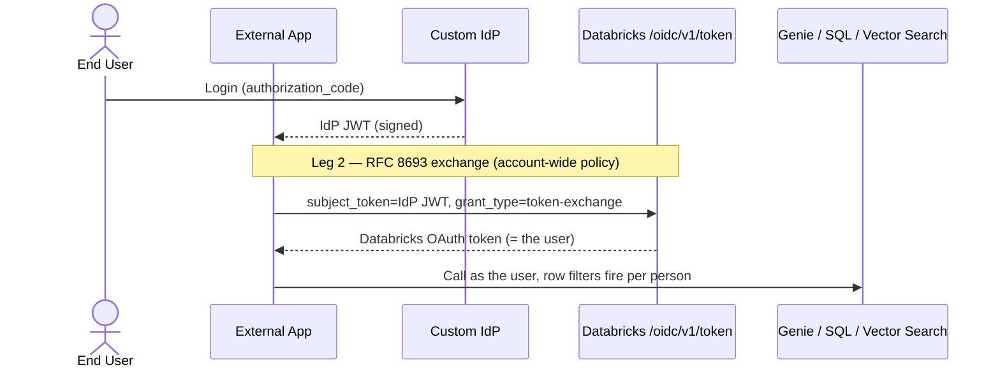

<!--
  Synced from databricks-fieldkit on 2026-06-05
  Sources: auth/peruser-byoidp-federation.md (composes auth/token-federation.md, auth/obo-passthrough.md, governance/row-filters.md)
  Public docs grounding:
    - https://docs.databricks.com/aws/en/dev-tools/auth/oauth-federation
    - https://docs.databricks.com/aws/en/dev-tools/auth/oauth-federation-policy
    - https://docs.databricks.com/aws/en/dev-tools/auth/oauth-federation-exchange
    - https://docs.databricks.com/aws/en/data-governance/unity-catalog/filters-and-masks/
    - https://docs.databricks.com/aws/en/genie/conversation-api
  This file is auto-prepared and human-reviewed before publish.
-->

# Per-User Data Access from an External App with a Bring-Your-Own IdP

> **What this is**: A service running **outside** Databricks, whose users log in with **their own (customer/partner) IdP**, calls Databricks data APIs (Genie, SQL, Vector Search, serving) **as each individual user** — so Unity Catalog row filters fire per person. The app exchanges the user's IdP JWT for a **per-user** Databricks token (RFC 8693, account-wide policy). The architecture hinges on **one fact: how the IdP signs its tokens.**
>
> **IdP-agnostic.** Works with any OIDC-compliant IdP that publishes a JWKS; the no-JWKS fallback is covered below.

This completes the external-access matrix alongside the two sibling patterns:

| Pattern | User is a Databricks user? | How the token is obtained | `current_user()` | RLS granularity |
|---|---|---|---|---|
| **This doc** — per-user BYO-IdP federation | Yes (SCIM-synced) | App **exchanges** the IdP JWT (RFC 8693), account-wide policy | the **human** | individual |
| [U2M from external apps](u2m-external-obo.md) | Yes (via the **workspace** SSO IdP) | Databricks **OAuth** redirect (no exchange) | the **human** | individual |
| [Federation blueprint](federation-implementation-blueprint.md) | No | Exchange IdP JWT with `client_id` = SP | the **SP** | group-based |

---

## When to use

- The service runs **outside** Databricks (CF Worker, Lambda, ECS, on-prem, another cloud).
- Users authenticate with a **custom / customer-owned IdP** — not necessarily the workspace's SSO IdP.
- You want **per-user identity** (`current_user()` = the human) with **individual** row-level security — not a shared service principal.
- Users will be **SCIM-synced** to the Databricks account.

### When NOT to use

- Users have **no** Databricks account and you want **role-based** access → [Federation blueprint](federation-implementation-blueprint.md).
- Users already log in through the **workspace's** SSO IdP and a Databricks OAuth redirect is fine → [U2M from external apps](u2m-external-obo.md).
- The caller is a **service/automation**, not a human → M2M federation ([Authorization](authorization.md)).

---

## The two legs (don't conflate them)

| Leg | Who → who | Grant | Purpose |
|---|---|---|---|
| **1. App login** | User → custom IdP → app | `authorization_code` | Logs the user into *your app*. Normal SSO. |
| **2. Federation** | App → Databricks | `token-exchange` (RFC 8693) | Turns the user's IdP JWT into a **per-user Databricks token**. |

Leg 1 alone never reaches Databricks. Leg 2 is mandatory and is where per-user identity enters.



The exchange is the standard token-exchange POST. For **per-user** identity use the account-wide policy form — **no `client_id`** (a `client_id` selects a service principal and loses per-user RLS):

```bash
POST https://<workspace-host>/oidc/v1/token
Content-Type: application/x-www-form-urlencoded

grant_type=urn:ietf:params:oauth:grant-type:token-exchange
&subject_token=<IDP_JWT>
&subject_token_type=urn:ietf:params:oauth:token-type:jwt
&scope=all-apis
```

Full recipe, error catalog, and IdP supplements: [Federation blueprint](federation-implementation-blueprint.md). Databricks copies the IdP token's `exp` **verbatim**, so always exchange a **fresh** JWT.

---

## Prerequisites

1. **Account SSO enabled** and a **federated token issuer** registered for the custom IdP (max **5** issuers per account).
2. **Users SCIM-synced** to the Databricks account — federation *maps* an identity, it does not create one. The JWT `subject_claim` must resolve to a real account user.
3. **The IdP publishes a public JWKS** so Databricks can validate the exchanged JWT's signature. ← *the load-bearing requirement; see next section.*
4. **Row filters / column masks** defined on the UC tables — this is what enforces RLS. See [Data Governance](../data-governance/uc-governance.md).
5. The user holds the needed **UC grants** (USE CATALOG/SCHEMA, SELECT), **CAN USE** on the warehouse, and access to the resource (e.g. Genie space).

---

## The JWKS decision (this determines the architecture)

The exchange validates the IdP's JWT signature against the IdP's **public keys**. The signing algorithm decides whether that is possible:

### Case A — IdP signs with an asymmetric key (RS256 / ES256)
You hold the public key, so a JWKS can be **published anywhere reachable over HTTPS** even if the IdP doesn't serve one natively. "No JWKS" is just a hosting gap → stay on the token-exchange path.

### Case B — IdP signs with a shared secret (HS256)
A shared-secret-signed token cannot be validated by an external relying party, so **token exchange is not available**. Use the fallback:

### Fallback — U2M OAuth login (no exchange)
Make the custom IdP the workspace's **Unified Login SSO** provider and have the app run a Databricks **`authorization_code` + PKCE** flow *against Databricks*. SAML SSO validates via the **X.509 certificate in IdP metadata — not a JWKS** — so this works without one. Full pattern: [U2M from external apps](u2m-external-obo.md). Result is identical (per-user token, per-user RLS). Cost: an interactive **browser redirect** is required (not viable for a purely headless backend), and the account has **one** Unified Login config.

| Situation | Path | Per-user RLS |
|---|---|---|
| RS256/ES256 (JWKS hostable) | Token-exchange federation | ✅ |
| No JWKS, IdP does SAML/OIDC SSO, app can do browser login | Databricks U2M OAuth + Unified Login | ✅ |
| HS256 + no SSO + headless only | Service principal (M2M) — last resort | ❌ RLS collapses |

> The service-principal row is an anti-pattern for this goal: every query runs as the SP, `current_user()` is the SP, and per-user row filters no longer apply. Use only if both real paths are impossible.

---

## RLS lives in Unity Catalog, not in the IdP or the API

The token only establishes *who* the user is. Enforcement is a UC **row filter** (or dynamic view) on each table the query touches, gated by `current_user()` / `is_account_group_member()`. Group-based filters also require the **groups** to be SCIM-synced, not just users. See [Data Governance — row filters and column masks](../data-governance/uc-governance.md) and the Databricks docs on [row filters and column masks](https://docs.databricks.com/aws/en/data-governance/unity-catalog/filters-and-masks/).

Because the federated token *is* the user, Genie/SQL row filters fire automatically — no special handling in the application. See the [Genie Conversation API](https://docs.databricks.com/aws/en/genie/conversation-api) for the worked data-API example.

---

## Questions for the IdP team

The most important answer is #1 — it decides token-exchange vs SSO-fallback.

**A. Token signing (decides the whole approach)**
1. What algorithm signs the IdP's tokens — `RS256`, `ES256`, or `HS256`?
2. If asymmetric: can you share the public key(s) / JWKS so we can publish a JWKS endpoint, even if the IdP doesn't serve one?
3. Does the IdP already expose a public JWKS URL and/or OIDC discovery (`.well-known/openid-configuration`)? If so, what are they?

**B. Issuer & claims (for the federation policy)**
4. What is the token issuer (`iss`) value?
5. What `audience` (`aud`) values do tokens carry, and can it be set/controlled?
6. Which claim holds the user identity (`sub`, `email`, `upn`…), and does it exactly match the email/username synced to Databricks?
7. Token lifetime, and is there a refresh mechanism? (Databricks copies the JWT `exp` verbatim.)

**C. SSO capability (fallback if no JWKS)**
8. Can the IdP act as a SAML 2.0 SSO provider? If so, can you share the IdP metadata XML (contains the signing cert)?
9. Or as an OIDC SSO provider?
10. Can it federate to an external relying party (let Databricks redirect users to it for login)?

**D. User & group provisioning**
11. Can the IdP provision users to Databricks via SCIM (or can we run a SCIM sync against it)?
12. Can it sync groups too (needed for group-based row filters)?

**E. App flow**
13. Does the app log users in via a browser redirect, or is it a fully headless backend (no user browser)?

### Ready-to-send version (Slack mrkdwn, copy/paste)

```
:wave: *Auth design check.* A service runs *outside* Databricks. Users log in via *your IdP*, and the service then calls Databricks data APIs *as the logged-in user* (so per-user row-level security applies). A few answers will tell us the integration path. *#1 is the big one.*

*A. Token signing (decides the approach)*
1. What algorithm signs your tokens — `RS256`, `ES256`, or `HS256`?
2. If asymmetric: can you share the public key(s)/JWKS so we can publish a JWKS endpoint, even if you don't serve one?
3. Do you already expose a public JWKS URL and/or OIDC discovery (`.well-known/openid-configuration`)? If so, what are they?

*B. Issuer & claims*
4. What is the token issuer (`iss`) value?
5. What `audience` (`aud`) do tokens carry, and can we set/control it?
6. Which claim holds the user identity (`sub`/`email`/`upn`), and does it match the email/username synced to Databricks?
7. Token lifetime + refresh mechanism?

*C. SSO capability (fallback if no JWKS)*
8. Can you act as a SAML 2.0 SSO provider? If so, can you share the metadata XML?
9. Or as an OIDC SSO provider?
10. Can you federate to an external relying party (redirect users to you for login)?

*D. Provisioning*
11. Can you provision users to Databricks via SCIM?
12. Can you sync groups too?

*E. App flow*
13. Browser-redirect login, or fully headless backend?

Thanks! :pray: #1 alone unblocks most of the design.
```

---

## Gotchas (specific to this scenario)

| Issue | Cause | Fix |
|---|---|---|
| Exchange returns an SP token, RLS shows all rows | `client_id` was included in the exchange | Omit `client_id` for per-user (account-wide) federation; `client_id` selects an SP |
| `400 invalid_grant` | `aud` mismatch between JWT and federation policy | Decode a real JWT; match `aud` exactly (Q B.5) |
| Silent `401` after exchange | `subject_claim` doesn't resolve to a SCIM-synced user | Confirm the user exists in the account and the claim matches (Q B.6, D.11) |
| Can't register the issuer for exchange | IdP has no JWKS / signs HS256 | Use the SSO fallback above |
| 6th IdP won't federate | Account limit is 5 federated token issuers | Consolidate issuers or use SSO login for the extra IdP |
| Token expires mid-request | Databricks copies the JWT `exp` verbatim | Always exchange a **fresh** IdP token |

---

## Related

- [Federation blueprint](federation-implementation-blueprint.md) — RFC 8693 exchange recipe, error catalog, IdP supplements
- [U2M from external apps](u2m-external-obo.md) — the no-JWKS / U2M-OAuth fallback path
- [Authorization](authorization.md) — the three token patterns overview
- [Federation](federation.md) — bridging external IdPs to Databricks
- [Data Governance](../data-governance/uc-governance.md) — defining the RLS that actually fires

## Public References

- [OAuth token federation (overview)](https://docs.databricks.com/aws/en/dev-tools/auth/oauth-federation)
- [Configure a federation policy](https://docs.databricks.com/aws/en/dev-tools/auth/oauth-federation-policy)
- [Authenticate with an identity provider token (exchange)](https://docs.databricks.com/aws/en/dev-tools/auth/oauth-federation-exchange)
- [Row filters and column masks](https://docs.databricks.com/aws/en/data-governance/unity-catalog/filters-and-masks/)
- [Genie Conversation API](https://docs.databricks.com/aws/en/genie/conversation-api)
