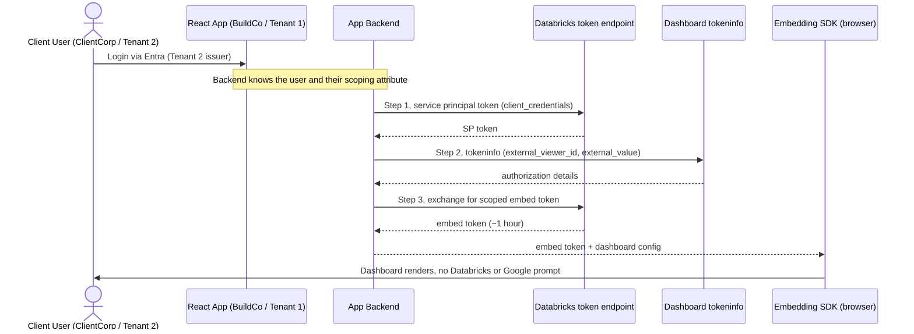
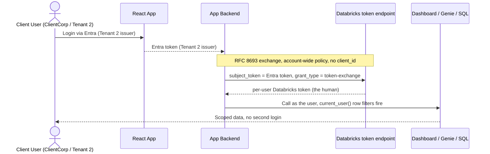
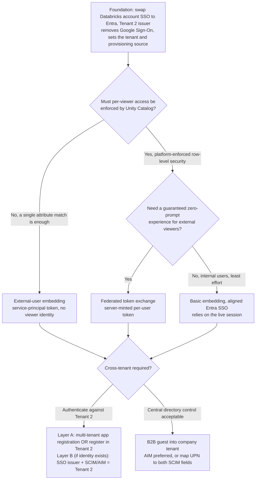

<!--
  Synced from databricks-fieldkit on 2026-07-17
  Sources: auth/cross-tenant-entra-embedding.md, auth/peruser-byoidp-federation.md, auth/token-federation.md, apps/aibi-dashboard-external-embedding.md
  Public docs grounding:
    - https://docs.databricks.com/gcp/en/security/auth/single-sign-on/azure-ad
    - https://docs.databricks.com/aws/en/admin/users-groups/single-sign-on/
    - https://docs.databricks.com/aws/en/dashboards/share/embedding
    - https://docs.databricks.com/aws/en/ai-bi/admin/embed
    - https://docs.databricks.com/aws/en/dev-tools/auth/oauth-federation
    - https://learn.microsoft.com/en-us/entra/identity-platform/single-and-multi-tenant-apps
  This file is auto-prepared and human-reviewed before publish.
  Names (Tenant 1 "BuildCo", Tenant 2 "ClientCorp", users) are illustrative.
-->

# Single Microsoft Identity + Embedded AI/BI, No Second Login, Across Tenants

> **What this is**: A reference design for a common enterprise pattern. A React app embeds an AI/BI dashboard, and the customer wants **one** sign-in, **one** identity technology (Microsoft Entra ID), correct behavior **across two Entra tenants**, and a **B2B posture** that grants external client users access without adding them to the company domain. It applies to Databricks on **AWS and GCP**, both of which support bringing your own IdP for account-level SSO.
>
> **Frame this as configuration.** Every item below is a setup decision or step, not a product defect. Databricks delegates authentication to your IdP by design; these are the choices that make Microsoft-only, single-login, cross-tenant access work.

---

## The scenario, in the customer's words

1. **No double login on embedded assets.** Users log in to the React app once; opening an embedded dashboard on another screen must not prompt again.
2. **No dual authentication technologies.** Everyone authenticates via Microsoft only, removing Google Sign-On so there is a single auth technology.
3. **Cross-tenant authentication.** Products built in Tenant 1 (the build/hosting tenant) must authenticate against the Active Directory in Tenant 2 (where the users actually live).
4. **B2B access posture.** External client users must get access without being added to the company domain, the role traditionally filled by Microsoft's B2B access packages.

All four reduce to **two decisions**, plus how you handle cross-tenant and B2B on top of them.

| # | Requirement | Resolved by |
|---|---|---|
| 1 | No double login | Embedding-model choice (Decision 2) |
| 2 | Microsoft only, drop Google | Account SSO swap to Entra (Decision 1) |
| 3 | Auth against Tenant 2 | Issuer choice (Decision 3) |
| 4 | B2B without domain membership | Embedding model plus provisioning posture (Decision 4) |

---

## Key insight

There are **two authentication surfaces**, and the second login prompt appears whenever they disagree:

- **The React app's login**: the human authenticating to your application (Entra).
- **The Databricks account's SSO**: whoever Databricks trusts to identify users.

If the app authenticates users against Microsoft while Databricks authenticates against Google Cloud Identity (or a different tenant), the viewer is forced through a second, different door. **Align the two, or remove the second door entirely, and both the double-login and the dual-technology problems disappear at once.**

```
App login (Microsoft / Tenant 2)  ──┐
                                     ├─ same identity => one login, one technology
Databricks SSO (Microsoft / Tenant 2)┘

vs.

App login (Microsoft)  ──┐
                          ├─ different doors => second login prompt
Databricks SSO (Google) ─┘
```

---

## Decision 1: make Microsoft Entra the single IdP (foundation)

Databricks on **AWS and GCP** authenticates login against whatever IdP you register in the **account console**. There is no built-in dependency on Google Cloud Identity, and no binding to a specific Entra tenant. Swapping to Entra directly is a supported OpenID Connect or SAML 2.0 configuration, and is what satisfies requirement #2.

| Cloud | Default | What changes |
|---|---|---|
| **GCP** | Google Cloud Identity | Configuring account SSO with Entra **replaces** Google Cloud Identity. Once enabled, all users incl. admins sign in via Entra. See [GCP: SSO with Entra ID](https://docs.databricks.com/gcp/en/security/auth/single-sign-on/azure-ad). |
| **AWS** | Unified login (default-on for accounts created after 2023-06-21) | Register Entra as the OIDC/SAML provider for the account. See [AWS: SSO](https://docs.databricks.com/aws/en/admin/users-groups/single-sign-on/). |
| **Azure** | Home tenant | Binds to its host tenant natively; cross-tenant is a directory concern, not a Databricks SSO toggle. |

### Steps and guardrails (all clouds)

1. Confirm **account-admin** access. This is an **account-level** change applied to the account and all workspaces, not per-workspace.
2. Register Databricks in Entra: an **OIDC app registration** (Client ID, secret, metadata URL) or a **SAML Enterprise Application** (Entity ID, Reply URL, x.509 cert).
3. Enter the values in the account console SSO settings. For OIDC, remove the `/.well-known/openid-configuration` suffix from the issuer URL.
4. **Test before enabling.** Once enabled, everyone, including admins, is forced through Entra. A misconfiguration can lock admins out.
5. **Align the username claim to `email`** so users originally provisioned via Google Cloud Identity map to the same identity and do not fork into duplicates.
6. Configure **provisioning** separately, since SSO is authentication only. Prefer **Automatic Identity Management (AIM)** or SCIM from Entra; just-in-time is the fallback.

**Result:** Google Sign-On leaves the Databricks authentication path entirely, so requirement #2 is satisfied. This also sets the stage for the tenant choice (#3) and the provisioning posture (#4).

---

## Decision 2: pick the embedding model (removes the second login)

The dual-login symptom has one root cause: **the viewer's IdP differs from the Databricks account's SSO IdP.** There are two structurally different embedding models, and they resolve it in opposite ways.

| | **External-user embedding** | **Basic embedding (aligned IdP)** | **Federated (token exchange)** |
|---|---|---|---|
| Who authenticates to Databricks | App **backend**, as a service principal | The **viewer**, via a live Entra session | Backend, exchanging the viewer's Entra token |
| Viewer needs a Databricks identity | **No** | Yes (SCIM/AIM) | Yes (SCIM/AIM) |
| Second-login prompt | **Never** (token injected) | Unlikely (relies on the live session) | **Never** (token minted server-side) |
| Per-viewer data scoping | App parameter matched in the dashboard SQL | Unity Catalog `current_user()` row filters | Unity Catalog `current_user()` row filters |
| "Ask Genie" in the embed | **Not supported** | Supported | Supported |
| Backend effort | Medium | Low | High |
| Reference | [AI/BI external embedding](https://docs.databricks.com/aws/en/ai-bi/admin/embed) | [Basic dashboard embedding](https://docs.databricks.com/aws/en/dashboards/share/embedding) | [OAuth token federation](https://docs.databricks.com/aws/en/dev-tools/auth/oauth-federation) plus [`byoidp-peruser-federation.md`](byoidp-peruser-federation.md) |

**Choosing:**

- External viewers whose data is separated by a single attribute (tenant, client ID, region): **external-user embedding**. No viewer identity anywhere, the strongest fit for the B2B requirement.
- Viewers who need platform-enforced per-user row-level security: **federated** for a guaranteed zero-prompt experience, or **basic aligned** for the least engineering.

### External-user embedding: how the no-login works

The viewer authenticates only to the React app. The app **backend** authenticates as a service principal and mints a short-lived (~1 hour), per-viewer token via a three-step OAuth flow, then hands it to the embedding SDK. The viewer never authenticates to Databricks, so there is no second prompt regardless of which IdP the app uses.



Per-viewer scoping is **application-enforced** in the dashboard SQL, not by Unity Catalog:

```sql
SELECT client_id, region, total_revenue
FROM   sales.client_data
WHERE  department = __aibi_external_value   -- injected per viewer
```

> **Load-bearing caveat.** There is no Unity Catalog backstop in this model. A query that omits the scoping filter exposes everything the service principal can read. Review every query, and grant the service principal only the union of what viewers legitimately need.

### Federated: how the no-login works with a real identity

The backend exchanges the viewer's Entra token for a **per-user** Databricks token (RFC 8693, account-wide policy). The viewer gets a real Databricks identity, so native Unity Catalog row filters fire, and because the token is minted server-side there is no iframe prompt.



This path hinges on **how the IdP signs its tokens** (JWKS availability). The full decision, including the no-JWKS fallback, is in [`byoidp-peruser-federation.md`](byoidp-peruser-federation.md).

---

## Decision 3: cross-tenant, authenticate against Tenant 2

Because Databricks on AWS/GCP has no Azure-subscription tenant binding, "authenticate against Tenant 2" is entirely a question of **which issuer you trust and register against**. Nothing about hosting the app in Tenant 1 forces authentication there.

There are two layers, and cross-tenant applies differently to each:

| Layer | Who authenticates | Cross-tenant handling |
|---|---|---|
| **A. React app login** | Human to React app | The app registration is a Tenant 1 concern; the users live in Tenant 2 |
| **B. Databricks SSO + provisioning** | Human to Databricks (only when the viewer has an identity) | The SSO issuer and SCIM/AIM source must point at Tenant 2 |

**Layer A, three ways** (see [Entra single- vs multi-tenant apps](https://learn.microsoft.com/en-us/entra/identity-platform/single-and-multi-tenant-apps)):

1. **Multi-tenant app registration in Tenant 1.** Mark the app multi-tenant; Tenant 2 users authenticate against their home tenant, so the token issuer is **Tenant 2**. Requires admin consent in Tenant 2. Best fit for "built in Tenant 1, authenticate against Tenant 2".
2. **Register the app directly in Tenant 2.** Simplest if the team can create registrations there.
3. **B2B guest invite into Tenant 1.** Makes the issuer **Tenant 1**, so this does **not** satisfy "authenticate against Tenant 2". See Decision 4.

**Layer B** (only when viewers have Databricks identities): point the Databricks account SSO issuer / SAML metadata at **Tenant 2** and SCIM/AIM-provision from **Tenant 2**. Account SSO trusts a **single** issuer, so designate Tenant 2 explicitly rather than a shared `/common` endpoint.

> **External-user embedding sidesteps Layer B entirely**, because Databricks never sees the human, so cross-tenant reduces to the app login only. It is the most cross-tenant-tolerant option.

---

## Decision 4: B2B posture

The traditional Azure approach invites external client users as **B2B guests** into the company tenant, granting access without a full home-domain account. It works with Databricks, but guest accounts receive a special user principal name (UPN) that differs from their email:

- **UPN**: `bob_clientcorp.com#EXT#@buildco.onmicrosoft.com`
- **mail**: `bob@clientcorp.com`
- **Display name**: Bob Jones

Databricks SCIM requires `userName` and the work email to be the **same value**, which the guest UPN/email mismatch breaks.

**If you use guests**, map both SCIM fields from the same source:

- `userPrincipalName` to `userName` **and** `userPrincipalName` to `emails[type eq "work"].value`. The SCIM connector strips the `#EXT#` portion, so both resolve to `bob@clientcorp.com` and the constraint is satisfied.
- Do **not** map UPN to one field and mail to the other, since that mismatches for guests and fails provisioning.
- Standardize display names (for example, `Bob Jones (ClientCorp)`) and assign permissions to **groups**, not individuals.
- **Automatic Identity Management (AIM) avoids this entirely**, because it keys off the Entra object ID rather than UPN/email equality, so the `#EXT#` fragility never arises. **Prefer AIM over classic guest SCIM.**

> **The tension to resolve explicitly.** B2B guest access and "authenticate against Tenant 2" are **mutually exclusive at the issuer level**. Inviting Tenant 2 users as guests into the company tenant moves the token issuer to the company tenant. If the hard requirement is authentication against Tenant 2, use multi-tenant or direct Tenant 2 registration, not guest invites.

| Posture | Identity lives in | Token issuer | Satisfies "auth against Tenant 2"? | Use when |
|---|---|---|---|---|
| **No Databricks identity** (external-user embedding) | React app IdP only | Not applicable to Databricks | Yes | External viewers, attribute scoping |
| **Multi-tenant / direct Tenant 2** | Tenant 2 | Tenant 2 | Yes | The requirement is literally auth against Tenant 2 |
| **B2B guest** (plus AIM, or the UPN SCIM mapping) | Company tenant | Company tenant | No | Central directory control outweighs the Tenant 2 goal |

---

## Decision flow



---

## Pros and cons

| Option | Pros | Cons |
|---|---|---|
| **External-user embedding** | No second login ever; no Databricks identity, SCIM, or guest management; strongest B2B fit; cross-tenant reduces to app login only | Scoping enforced in app SQL (no Unity Catalog backstop, audit every query); no "Ask Genie"; service principal holds the union of all viewers' access; requires third-party cookies |
| **Federated token exchange** | Real per-user identity and native Unity Catalog row-level security; server-minted, so no prompt; honors authenticate-against-Tenant-2 | Most backend work; viewers must be provisioned; depends on how the IdP signs tokens (JWKS) |
| **Basic embedding, aligned** | Least engineering; real identity and Unity Catalog RLS; "Ask Genie" works | Relies on the live SSO session and third-party cookies (a one-time consent or redirect is possible); viewers need identities |
| **B2B guest provisioning** | Central directory control; familiar Azure pattern | Guest UPN fragility (needs AIM or exact SCIM mapping); breaks authenticate-against-Tenant-2 (issuer becomes the company tenant) |

---

## Recommended design

1. **Do the foundation regardless**: swap the Databricks account SSO to Entra with Tenant 2 as the trusted issuer. This alone delivers "Microsoft only, drop Google Sign-On" and sets the cross-tenant answer.
2. **For external, client-facing dashboards** scoped by a single attribute: **external-user embedding**. It gives the cleanest B2B posture (no domain membership, no guest objects, no SCIM), the most robust cross-tenant behavior, and satisfies the no-second-login requirement outright.
3. **For dashboards needing audit-grade per-user row-level security**: **federated token exchange** for a fully seamless experience, or **basic aligned embedding** where the least engineering is preferred and a live session can be assumed.
4. **Prefer Automatic Identity Management** over classic guest SCIM wherever viewers need real identities, since it removes the `#EXT#` UPN fragility.
5. **Reconcile B2B with cross-tenant up front**: if the requirement is truly "authenticate against Tenant 2", choose multi-tenant or direct Tenant 2 registration, not guest invites.

---

## How this maps back to the four requirements

| Requirement | Outcome |
|---|---|
| No double login | Met by external-user embedding (never prompts) or federated/aligned embedding |
| Single Microsoft technology | Met by the account SSO swap; Google Sign-On leaves the path |
| Authenticate against Tenant 2 | Met by setting the issuer to Tenant 2 (multi-tenant or direct registration), not guest invites |
| B2B without domain membership | Met with no identity at all (external-user embedding), or with AIM / the guest UPN SCIM mapping |

---

## Related

- [Per-User BYO-IdP Federation](byoidp-peruser-federation.md): the token-exchange path in depth, including the JWKS decision and the no-JWKS fallback
- [U2M from External Apps](u2m-external-obo.md): OAuth redirect path when users are provisioned in the workspace
- [Federation Exchange](federation.md): bridging external IdPs to Databricks
- [Authentication](authentication.md) and [Authorization](authorization.md): how authN and authZ compose but never substitute
- Official docs: [GCP SSO with Entra](https://docs.databricks.com/gcp/en/security/auth/single-sign-on/azure-ad) · [AWS SSO](https://docs.databricks.com/aws/en/admin/users-groups/single-sign-on/) · [Dashboard embedding](https://docs.databricks.com/aws/en/dashboards/share/embedding) · [Manage embedding](https://docs.databricks.com/aws/en/ai-bi/admin/embed) · [OAuth token federation](https://docs.databricks.com/aws/en/dev-tools/auth/oauth-federation) · [Entra single- and multi-tenant apps](https://learn.microsoft.com/en-us/entra/identity-platform/single-and-multi-tenant-apps)
