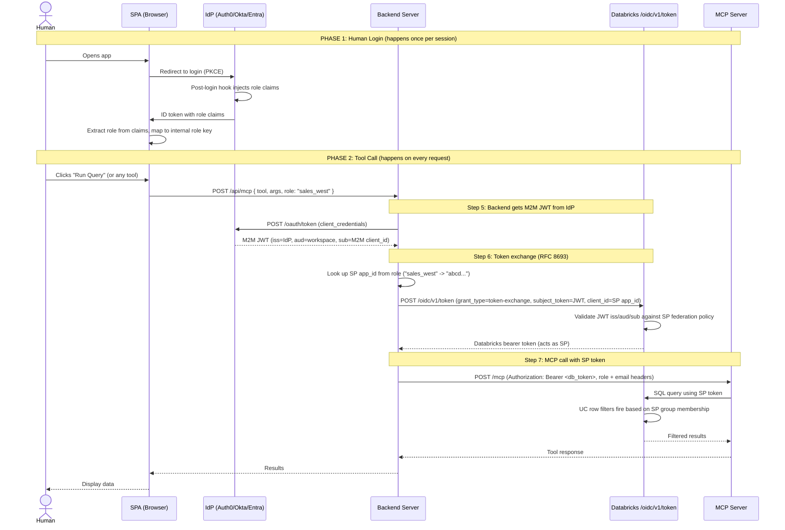

<!--
  Synced from databricks-fieldkit on 2026-07-14
  Sources: auth/token-federation.md
  Public docs grounding:
    - https://docs.databricks.com/aws/en/dev-tools/auth/oauth-federation
    - https://docs.databricks.com/en/dev-tools/auth/oauth-federation.html
  This file is auto-prepared and human-reviewed before publish.
-->

# Federation Token Exchange: Implementation Blueprint

> **What this is**: A step-by-step recipe to let external users (partners, vendors, auditors) use Databricks data and AI tools without ever being provisioned as Databricks users. Their Identity Provider (IdP) handles who they are. Databricks handles what they can see.
>
> **IdP-agnostic**: The pattern works with any OIDC-compliant IdP. IdP-specific setup is in the appendix.
>
> **How it works under the hood**: any application that can obtain a JWT from a trusted IdP can exchange it for a Databricks OAuth token via a single RFC 8693 token-exchange endpoint — no Databricks secrets stored in the application. The same endpoint serves both individually-provisioned users (U2M) and service-to-service calls (M2M).
>
> **Last updated**: 2026-07-14

---

## Federation Types

Databricks supports two federation models. Pick based on **who** is authenticating.

| | Account Token Federation | Workload Identity Federation (WIF) |
|---|---|---|
| Who | Human users and service principals synced via SCIM | Automated workloads running outside Databricks (CI/CD, cloud VMs, Kubernetes) |
| SCIM sync | Required before the exchange works | Not required — the service principal is created directly |
| Issuer limit | Up to 5 federated token issuers per account | No limit (policy is scoped per service principal) |
| Flow types supported | U2M and M2M | M2M only |
| Secrets stored in the app | None | None |

This blueprint implements the **role-mapped service principal pattern**: the backend authenticates to the IdP as itself (M2M, client credentials), then exchanges that token for a Databricks token belonging to whichever service principal maps to the caller's role. It is the right fit when external users should never be individually provisioned in Databricks.

If instead every external human needs their own individually-provisioned Databricks identity (true per-user federation, not a shared per-role service principal), use Account Token Federation with SCIM-synced users and exchange each user's own IdP token directly — see [Appendix E](#appendix-e-direct-token-exchange-reference) for that flow.

---

## The Five Actors

Every deployment has exactly five actors. No more, no less.

| # | Actor | What it is | Example |
|---|---|---|---|
| 1 | **IdP** | The external Identity Provider that owns the users | Auth0, Okta, Entra ID, Ping |
| 2 | **SPA** | Browser app where humans log in and interact | React app, vanilla JS page |
| 3 | **Backend Server** | Server-side component that holds secrets and talks to Databricks | CF Worker, AWS Lambda, Databricks App, any server |
| 4 | **Databricks** | The workspace (token endpoint + APIs + Unity Catalog) | `workspace-host.azuredatabricks.net` |
| 5 | **MCP Server** | The tool server that executes queries/Genie using the SP token | Databricks App running FastAPI |

```
Human ──→ [SPA] ──→ [Backend Server] ──→ [Databricks] ──→ [MCP Server]
              ↕              ↕
           [IdP]          [IdP]
        (login)       (M2M token)
```

---

## Prerequisites: What Must Exist Before You Start

Nothing in this blueprint works without these. Set them up first, verify each one.

### On the IdP side (3 things)

| # | What | Why | How to verify |
|---|---|---|---|
| P1 | **SPA Application** (public client) | Humans log in via browser. PKCE flow, no client secret. | Log in from browser, get an ID token back. |
| P2 | **M2M Application** (confidential client) | Backend server gets JWTs without human interaction. Has a client_id + client_secret. | `curl` the token endpoint with `client_credentials` grant, get a JWT back. |
| P3 | **API Resource Server** | Tells the IdP "when issuing tokens for this audience, include custom claims." The audience value = your Databricks workspace URL. | Decode a token and confirm `aud` = your workspace URL. |

### On the IdP side (2 more things)

| # | What | Why | How to verify |
|---|---|---|---|
| P4 | **Post-login hook** | Injects role claims into the token when a human logs in. Every IdP has a different mechanism (Auth0 Actions, Okta inline hooks, Entra optional claims). | Log in as a test user, decode the ID token, confirm your custom claims are present. |
| P5 | **Test users with role metadata** | Users must have role/group info stored in IdP so the post-login hook can read it. | Check user profile in IdP dashboard, confirm `groups` or `roles` field is populated. |

### On the Databricks side (4 things)

| # | What | Why | How to verify |
|---|---|---|---|
| P6 | **Service Principals (one per role)** | Each role (e.g., `sales_west`, `finance`) maps to a dedicated SP. The SP is the Databricks identity that executes queries. | `databricks service-principals list` shows your SPs. |
| P7 | **Federation policy on each SP** | Tells Databricks "trust JWTs from this IdP for this SP." Each policy specifies the allowed `issuer`, `audience`, and `subject` (the M2M app's client_id). Workload Identity Federation policies are scoped per SP, so there's no cap on how many SPs you federate this way. | Call `/oidc/v1/token` with a valid JWT, get a Databricks token back. If federation policy is wrong, you get a 401. |
| P8 | **SP group memberships** | Each SP belongs to a workspace group. UC row filters use `is_member()` against these groups to control data access. | `databricks groups list` shows group members. Query a filtered table with each SP token, confirm different rows returned. |
| P9 | **SQL Warehouse** (conditional) | Only required if the MCP server executes SQL. Not needed if the MCP server only calls Genie, model serving, or other REST APIs. Serverless recommended. | `databricks warehouses list` shows an active warehouse. |

### On the Backend Server side (3 things)

| # | What | Why | How to verify |
|---|---|---|---|
| P10 | **M2M client_id** (public config) | Identifies the M2M app when requesting tokens from the IdP. Safe to store in config files. | Visible in your deployment config (env var, config file). |
| P11 | **M2M client_secret** (secret store) | Authenticates the M2M app. MUST be in a secret store, never in code or git. | Stored in CF Secrets, AWS Secrets Manager, Databricks Secrets, Azure Key Vault, etc. |
| P12 | **Role-to-SP mapping** | A simple lookup table: role name → Databricks SP application_id. Static config, changes only when you add/remove roles. | JSON object in config, e.g., `{"sales_west": "abcd...", "finance": "efgh..."}`. |

---

## The Flow: 7 Steps

Every request follows these exact 7 steps. No shortcuts, no variations.

### Sequence Diagram



### Step-by-Step Detail

#### Step 1: Human opens the SPA

The browser loads. Nothing authenticated yet.

#### Step 2: SPA redirects to IdP for login

The SPA uses the IdP's browser SDK to start a PKCE authorization code flow. The human sees the IdP's login page (username/password, SSO, MFA, whatever the IdP is configured for).

**What the SPA sends to the IdP:**
- `client_id` = SPA application's client_id (public, no secret)
- `redirect_uri` = where to come back after login
- `audience` = Databricks workspace URL (so the IdP knows which API resource server to use)
- `scope` = `openid profile email` (standard OIDC)
- `code_challenge` = PKCE challenge (prevents auth code interception)

#### Step 3: IdP authenticates and injects claims

The IdP verifies the human's credentials. The post-login hook fires and reads the user's metadata (groups, company, title) from the IdP's user store. It writes these as custom claims into the token.

**Claims injected (example):**
```json
{
  "https://your-namespace.com/groups": ["sales-west"],
  "https://your-namespace.com/role": "sales-west",
  "https://your-namespace.com/company": "PartnerCorp",
  "https://your-namespace.com/email": "user@example.com"
}
```

The namespace (`https://your-namespace.com`) is a collision-safe prefix. It does not need to resolve to a real URL. It just needs to be unique to your application.

#### Step 4: SPA extracts role and maps it

The SPA receives the ID token, reads the custom claims, and maps the IdP's role name to an internal role key.

**Why map?** IdP role names are owned by the IdP admin. Internal role keys are owned by you. The mapping isolates your system from IdP naming changes.

```
IdP claim "sales-west"  -->  internal key "sales_west"
IdP claim "executives"  -->  internal key "executive"
```

The SPA stores the mapped role in memory. On every subsequent tool call, the SPA sends this role to the backend.

**Important**: The SPA does NOT send the IdP token to the backend. The human's IdP token stays in the browser. The backend independently authenticates with the IdP using M2M credentials.

#### Step 5: Backend gets M2M JWT from IdP

When the backend receives a tool call with a role, it first needs a JWT that Databricks will accept. It calls the IdP's token endpoint using the M2M app's credentials.

```
POST https://<idp-domain>/oauth/token
Content-Type: application/json

{
  "client_id": "<M2M app client_id>",
  "client_secret": "<M2M app client_secret>",
  "audience": "https://workspace-host.azuredatabricks.net",
  "grant_type": "client_credentials"
}
```

**Response**: A JWT with:
- `iss` = IdP domain (e.g., `https://dev-xxx.auth0.com/`)
- `aud` = Databricks workspace URL
- `sub` = M2M app's client_id (e.g., `YOUR_M2M_CLIENT_ID@clients`)

These three fields are what Databricks validates. All three must match the federation policy on the target SP.

#### Step 6: Backend exchanges JWT for Databricks SP token

The backend looks up the SP application_id from the role-to-SP map, then calls the Databricks token exchange endpoint.

```
POST https://workspace-host.azuredatabricks.net/oidc/v1/token
Content-Type: application/x-www-form-urlencoded

grant_type=urn:ietf:params:oauth:grant-type:token-exchange
&subject_token=<JWT from Step 5>
&subject_token_type=urn:ietf:params:oauth:token-type:jwt
&client_id=<SP application_id from role-to-SP map>
&scope=all-apis
```

**What Databricks does:**
1. Reads `client_id` to find the target SP
2. Reads the SP's federation policy
3. Validates `iss`, `aud`, `sub` from the JWT against the policy
4. If all match: issues an opaque Databricks bearer token that acts as that SP
5. If any mismatch: returns 401

**Response**:
```json
{
  "access_token": "<opaque Databricks token>",
  "token_type": "Bearer",
  "expires_in": 3600
}
```

`current_user()` for this token returns the SP's application_id. UC governance fires based on the SP's group memberships.

#### Step 7: Backend calls MCP server with SP token

The backend forwards the tool call to the MCP server, attaching the Databricks token and caller metadata.

```
POST https://<mcp-server-url>/mcp
Content-Type: application/json
Authorization: Bearer <databricks_token>
X-Databricks-Token: <databricks_token>
X-Caller-Role: sales_west
X-Caller-Email: user@example.com
X-Request-Id: <uuid>

{
  "jsonrpc": "2.0",
  "method": "tools/call",
  "params": { "name": "query_revenue", "arguments": { "region": "west" } }
}
```

**Why two token headers?**
- `Authorization` is consumed by the Databricks Apps proxy (if MCP server is a Databricks App)
- `X-Databricks-Token` is read by the MCP server code for downstream API calls

The MCP server uses `X-Databricks-Token` for all Databricks API calls (SQL, Genie, etc.). UC row filters fire per the SP's group membership. Same query, different data per role.

---

## Where Federation Tokens Work

A Databricks token obtained via exchange is a standard OAuth Bearer token. It works with:

- All Databricks REST APIs (`/api/2.0/...`)
- Model Serving endpoints (FMAPI, custom models, agents)
- Custom MCP servers hosted on Databricks Apps
- Genie Conversation API (row filters fire as the identity the token represents)
- Vector Search
- Databricks SDK (`WorkspaceClient(token=...)`)

For JDBC/ODBC connections, token exchange is an API-only endpoint. Exchange the token in application code first, then pass the resulting Databricks token to the driver.

---

## Token Lifetime (TTL) Behavior

Critical operational detail: Databricks copies the source JWT's `exp` claim **verbatim** onto the exchanged token.

- `exp` is an absolute UNIX timestamp, not a duration
- If the IdP token has 1 second of validity remaining when exchanged, the resulting Databricks token also expires in 1 second
- **Always exchange a fresh IdP token immediately before use** — don't cache an IdP token and exchange it later
- In-flight queries keep running once started, but polling for results still requires a valid token; if the token expires mid-poll, the client gets a `401`

| Flow | TTL | Who controls it |
|---|---|---|
| In-house M2M (Databricks-issued client credentials, no federation) | Fixed 1 hour | Databricks |
| Federated M2M | IdP-controlled | The IdP's access/session policies set the `exp` |
| Federated U2M | IdP-controlled | The IdP's session/token lifetime policies |

---

## Error Catalog

Every error you will encounter, why it happens, and how to fix it.

| Error | Where | Cause | Fix |
|---|---|---|---|
| Custom claims missing from token | Step 3 | Post-login hook not firing, or token_dialect wrong (Auth0-specific) | Verify hook is deployed AND bound to login flow. For Auth0: set `token_dialect: access_token_authz` on API resource server. |
| `aud` mismatch | Step 6 | JWT audience does not match what the SP federation policy expects | Ensure M2M token request uses `audience` = exact Databricks workspace URL (with `https://`). Decode the JWT to confirm the exact value. |
| `iss` mismatch | Step 6 | JWT issuer does not match federation policy | Check trailing slashes. Auth0 uses `https://domain/`, Okta uses `https://domain/oauth2/default`. Copy exact value from a decoded JWT. |
| `sub` mismatch | Step 6 | JWT subject does not match federation policy | The `sub` in a `client_credentials` JWT is the M2M app's client_id. Auth0 appends `@clients` (e.g., `YOUR_M2M_CLIENT_ID@clients`). Decode a real JWT to get the exact value. |
| `unknown role` from MCP server | Step 7 | Role string sent by SPA does not match any key in role-to-SP map | Check the SPA's role mapping table. Ensure every IdP role has a corresponding entry. |
| 401 from `/oidc/v1/token` | Step 6 | Federation policy not created, or SP not found, or JWT expired | Verify SP exists, federation policy is attached, JWT is fresh (not cached/expired). |
| 401 shortly after a successful exchange | Step 6/7 | The source IdP token was near expiry when exchanged; Databricks copied that `exp` verbatim onto the Databricks token | Always exchange a fresh IdP token immediately before use — see [Token Lifetime (TTL) Behavior](#token-lifetime-ttl-behavior). |
| 403 from SQL/Genie | Step 7 | SP lacks permissions on the SQL warehouse or Genie space | Grant `CAN USE` on the warehouse and `CAN RUN` on Genie to each SP or their group. |
| Row filter returns all/no rows | Step 7 | SP not added to the correct workspace group, or `is_member()` function references wrong group name | Verify `databricks groups list` shows SP in the expected group. Test with `SELECT is_member('group_name')` using each SP token. |
| `No Databricks token available` | Step 7 | Backend did not send `X-Databricks-Token` header, or MCP middleware failed to extract it | Check backend is sending the header. Check MCP server logs for middleware errors. |

---

## Security Invariants

These must always be true. If any is violated, security guarantees no longer hold.

1. **The human's IdP token never leaves the browser.** The backend authenticates independently via M2M.
2. **The M2M client_secret is never in code, config files, or git.** It lives only in the deployment platform's secret store.
3. **The role-to-SP map is the single source of truth** for which roles exist. If a role is not in the map, it cannot access Databricks.
4. **One SP per role, not per user.** You do not create SPs for individual humans. You create SPs for roles.
5. **UC governance is the enforcement layer, not the application.** Even if the MCP server has a bug, the SP token can only see data that UC row filters allow for that SP's groups.
6. **All federation policies use the M2M app's subject, not the human's.** The human identity is carried in metadata headers for audit, not for authentication.

---

## Appendix A: IdP Reference Implementations

The pattern in this blueprint works with any OIDC-compliant IdP. Beyond the three fully documented below, the same approach applies to:

| Identity Provider | Protocols | SCIM Support |
|---|---|---|
| Microsoft Entra ID | SAML, OAuth 2.0, OIDC, WS-Fed, SCIM | Native SCIM |
| Okta | SAML, OAuth 2.0, OIDC, SCIM | Native SCIM |
| Google Identity | SAML, OAuth 2.0, OIDC | No SCIM (Google APIs) |
| OneLogin | SAML, OAuth 2.0, OIDC, SCIM | Native SCIM |
| JumpCloud | SAML, OIDC, SCIM | Native SCIM |
| AWS IAM Identity Center | SAML, OIDC, SCIM | Native SCIM |
| Keycloak | SAML, OAuth 2.0, OIDC | Manual SCIM API |

### Auth0

**SPA App Setup:**
```
Type: Single Page Application
Grant: Authorization Code with PKCE
Callback URLs: https://your-app.com/callback
Token endpoint auth: None (public client)
```

**M2M App Setup:**
```
Type: Machine to Machine
Grant: Client Credentials
Authorized API: "Databricks Federation" (audience = workspace URL)
```

**API Resource Server (critical):**
```
Identifier (audience): https://workspace-host.azuredatabricks.net
Token dialect: access_token_authz    <-- DEFAULT IS WRONG, must change
Signing: RS256
```

**Post-Login Action (Deploy > Triggers > post-login):**
```pseudo
ON post-login(user, api):
    namespace = "https://your-namespace.com"
    groups = user.app_metadata.groups OR []

    hierarchy = ["admin", "executives", "finance", "managers", "sales-east", "sales-west"]
    primary_role = FIRST group IN hierarchy THAT IS IN groups, OR "none"

    SET access_token claim "{namespace}/groups" = groups
    SET access_token claim "{namespace}/role"   = primary_role
    SET access_token claim "{namespace}/email"  = user.email
    SET access_token claim "{namespace}/company" = user.app_metadata.company
```

**M2M Token Endpoint:**
```
POST https://{tenant}.auth0.com/oauth/token
Body: { client_id, client_secret, audience, grant_type: "client_credentials" }
```

**Auth0 notes:**
- `token_dialect` defaults to `access_token`, which drops custom claims. Set it to `access_token_authz` to include them.
- The `sub` claim in M2M tokens has the format `{client_id}@clients`. Your federation policy must match this exact string.
- Trailing slash in `iss`: Auth0 issues `https://{tenant}.auth0.com/` (with slash). The federation policy must include the slash.

---

### Okta

**SPA App Setup:**
```
Type: OIDC - Single Page Application
Grant: Authorization Code with PKCE
Login redirect: https://your-app.com/callback
Trusted origins: https://your-app.com
```

**M2M App Setup:**
```
Type: API Services (Client Credentials)
Grant: Client Credentials
Scopes: Assign custom scope on your Authorization Server
```

**Authorization Server:**
```
Issuer: https://{org}.okta.com/oauth2/{auth-server-id}
Audience: https://workspace-host.azuredatabricks.net   (add as custom audience)
```

**Post-Login Hook (Token Inline Hook or Custom Claims):**
```pseudo
ON token.transform(user, token):
    namespace = "https://your-namespace.com"
    groups = user.profile.groups OR user.getGroups()

    hierarchy = ["admin", "executives", "finance", "managers", "sales-east", "sales-west"]
    primary_role = FIRST group IN hierarchy THAT IS IN groups, OR "none"

    ADD claim to access_token: "{namespace}/role" = primary_role
    ADD claim to access_token: "{namespace}/groups" = groups
    ADD claim to access_token: "{namespace}/email" = user.profile.email
```

Alternative (simpler): Use Okta's built-in **Groups claim** on the Authorization Server:
```
Claims tab > Add Claim:
  Name: https://your-namespace.com/groups
  Include in: Access Token
  Value type: Groups
  Filter: Matches regex .*
```
Then resolve the primary role in the SPA or backend instead of in the hook.

**M2M Token Endpoint:**
```
POST https://{org}.okta.com/oauth2/{auth-server-id}/v1/token
Body: client_id={id}&client_secret={secret}&grant_type=client_credentials&scope=federation
```

**Okta notes:**
- The `iss` value includes the authorization server ID: `https://{org}.okta.com/oauth2/{server-id}`. Do not use just `https://{org}.okta.com/`.
- The `sub` in `client_credentials` tokens is the M2M app's client_id (no suffix, unlike Auth0).
- Okta emits JWTs by default for custom authorization servers. No token_dialect change needed.
- The default `org` authorization server does not emit custom claims. Create a custom authorization server when you need custom claims.

---

### Microsoft Entra ID (Azure AD)

**SPA App Registration:**
```
Type: Single-page application
Redirect URI: https://your-app.com/callback (SPA platform)
Supported account types: Depends on tenant strategy
    - Single tenant for internal, Multi-tenant for external partners
```

**M2M App Registration:**
```
Type: Web application
Client secret: Generate under Certificates & Secrets
API Permissions: Add your custom API scope
```

**Custom API Registration:**
```
App Registration > Expose an API:
  Application ID URI: https://workspace-host.azuredatabricks.net  (or api://{app-id})
  Scope: Add a scope (e.g., "federation.exchange")
```

**Optional Claims (replaces post-login hook):**
```
App Registration > Token Configuration > Add optional claim:
  Token type: Access
  Claims: Add custom claims via claims mapping policy
```

For group-based claims:
```
App Registration > Token Configuration > Add groups claim:
  Select: Security groups (or groups assigned to the application)
  Customize by token type > Access:
    Emit as: sAMAccountName or Group ID
```

**Post-Login Alternative (Claims Mapping Policy):**
```pseudo
# Entra uses Claims Mapping Policies (JSON) attached to Service Principals
# For role injection, use App Roles instead of custom claims:

App Registration > App Roles > Create:
  Display name: "West Sales"
  Value: "sales_west"
  Allowed member types: Users/Groups

Enterprise Application > Users and Groups > Assign:
  Assign user/group to the "West Sales" role
```

The `roles` claim appears automatically in the access token. No hook needed.

**M2M Token Endpoint:**
```
POST https://login.microsoftonline.com/{tenant-id}/oauth2/v2.0/token
Body: client_id={id}&client_secret={secret}&scope=https://workspace-host.azuredatabricks.net/.default&grant_type=client_credentials
```

**Entra notes:**
- The `iss` format depends on token version. v2.0 tokens: `https://login.microsoftonline.com/{tenant-id}/v2.0`. v1.0 tokens: `https://sts.windows.net/{tenant-id}/`. Check your manifest's `accessTokenAcceptedVersion`.
- The `sub` in `client_credentials` tokens is the app registration's Object ID (not the Application/Client ID). Decode a real token to get the exact value.
- Scope format for M2M: `https://{audience}/.default`. The `/.default` suffix is mandatory.
- Groups claim has a limit of 200. If exceeded, Entra returns an `_claim_sources` overage indicator instead. For large orgs, use App Roles instead of groups.
- Entra supports App Roles natively — the `roles` claim in the token is a first-class feature, no custom hook required.

---

## Appendix B: Databricks SP Federation Policy Setup

This is the same regardless of IdP. Repeat for each SP.

```pseudo
FOR EACH role IN ["sales_west", "sales_east", "finance", "executive", "managers", "admin"]:

    sp_app_id = role_to_sp_map[role]

    # Create or update federation policy on the SP
    PUT /api/2.0/accounts/{account_id}/servicePrincipals/{sp_id}/credentials/federation-policies/{policy_name}
    {
        "oidc_federation_policy": {
            "issuer": "<IdP issuer URL>",          # exact iss from decoded JWT
            "audiences": ["<workspace URL>"],       # exact aud from decoded JWT
            "subject": "<M2M app subject>",         # exact sub from decoded JWT
            "subject_claim": "sub"
        }
    }
```

**How to get the exact values:**

```pseudo
# Step 1: Get a real M2M JWT from your IdP
jwt = call_idp_token_endpoint(client_id, client_secret, audience, "client_credentials")

# Step 2: Decode it (do NOT verify, just read)
payload = base64_decode(jwt.split(".")[1])

# Step 3: Copy these exact values into the federation policy
issuer  = payload["iss"]    # e.g., "https://dev-xxx.auth0.com/"
audience = payload["aud"]   # e.g., "https://workspace-host.azuredatabricks.net"
subject  = payload["sub"]   # e.g., "YOUR_M2M_CLIENT_ID@clients"
```

Never guess these values. Always decode a real token. Trailing slashes, `@clients` suffixes, and version paths all matter.

---

## Appendix C: Decision Checklist

Use this before writing any code.

```
[ ] IdP selected and tenant created
[ ] SPA app registered (public client, PKCE)
[ ] M2M app registered (confidential client, client_credentials)
[ ] API resource server created with audience = workspace URL
[ ] Token dialect / token version verified (custom claims appear in decoded JWT)
[ ] Post-login hook deployed and bound (claims appear in ID token)
[ ] Test users created with role metadata
[ ] Databricks SPs created (one per role)
[ ] Federation policy created on each SP (iss/aud/sub from decoded M2M JWT)
[ ] SPs added to workspace groups (one group per role)
[ ] UC row filters reference group membership via is_member()
[ ] SQL warehouse active and accessible by all SP groups (only if MCP server runs SQL)
[ ] Role-to-SP map written (JSON: role_key -> SP application_id)
[ ] M2M client_secret stored in deployment secret store
[ ] MCP server deployed and accessible
[ ] Smoke test passes (Appendix D)
[ ] End-to-end test: login as each persona, run a query, verify different data returned
```

---

## Appendix D: Smoke Test Script

See the companion smoke test script in the repository.

---

## Appendix E: Direct Token Exchange Reference

Use this when a scenario calls for individually-provisioned Databricks users (Account Token Federation, U2M) rather than the role-mapped service principal pattern used in the rest of this blueprint. Both flows exchange a JWT at the same endpoint.

### The Universal Exchange

Regardless of IdP, the exchange is always the same POST:

```bash
POST https://<workspace-hostname>/oidc/v1/token
Content-Type: application/x-www-form-urlencoded

grant_type=urn:ietf:params:oauth:grant-type:token-exchange
&subject_token=<JWT from your IdP>
&subject_token_type=urn:ietf:params:oauth:token-type:jwt
&scope=all-apis
# M2M only — include the SP UUID that maps to your IdP service principal:
&client_id=<databricks-sp-uuid>
```

Response:
```json
{ "access_token": "<databricks-oauth-token>", "token_type": "Bearer", "expires_in": 3600 }
```

### U2M: exchange the user's own token

```python
# PKCE for security (required for public clients)
import hashlib, base64, secrets, urllib.parse, requests

code_verifier = secrets.token_urlsafe(64)
code_challenge = base64.urlsafe_b64encode(
    hashlib.sha256(code_verifier.encode()).digest()
).rstrip(b"=").decode()

# Redirect user to your IdP's authorization endpoint with code_challenge,
# receive an authorization code at your callback, then:

token_resp = requests.post(
    idp_token_endpoint,
    data={
        "grant_type": "authorization_code",
        "code": authorization_code,
        "redirect_uri": "http://localhost:8080/callback",
        "client_id": "<your-app-client-id>",
        "code_verifier": code_verifier,
    },
)
idp_token = token_resp.json()["access_token"]

db_resp = requests.post(
    f"https://{workspace_hostname}/oidc/v1/token",
    data={
        "grant_type": "urn:ietf:params:oauth:grant-type:token-exchange",
        "subject_token": idp_token,
        "subject_token_type": "urn:ietf:params:oauth:token-type:jwt",
        "scope": "all-apis",
    },
    headers={"Content-Type": "application/x-www-form-urlencoded"},
)
databricks_token = db_resp.json()["access_token"]

# Call Databricks as the logged-in user — UC row filters fire as them
from databricks.sdk import WorkspaceClient
w = WorkspaceClient(host=f"https://{workspace_hostname}", token=databricks_token)
```

### M2M: exchange a service token

```python
import requests

def get_databricks_token_m2m(
    idp_token_endpoint: str,
    client_id: str,
    client_secret: str,
    idp_scope: str,
    workspace_hostname: str,
    databricks_sp_uuid: str,
) -> str:
    """Exchange an IdP service-principal token for a Databricks OAuth token."""

    idp_resp = requests.post(
        idp_token_endpoint,
        data={
            "grant_type": "client_credentials",
            "client_id": client_id,
            "client_secret": client_secret,
            "scope": idp_scope,
        },
        headers={"Content-Type": "application/x-www-form-urlencoded"},
    )
    idp_resp.raise_for_status()
    idp_token = idp_resp.json()["access_token"]

    db_resp = requests.post(
        f"https://{workspace_hostname}/oidc/v1/token",
        data={
            "grant_type": "urn:ietf:params:oauth:grant-type:token-exchange",
            "subject_token": idp_token,
            "subject_token_type": "urn:ietf:params:oauth:token-type:jwt",
            "scope": "all-apis",
            "client_id": databricks_sp_uuid,
        },
        headers={"Content-Type": "application/x-www-form-urlencoded"},
    )
    db_resp.raise_for_status()
    return db_resp.json()["access_token"]
```

### Federation Policy Setup for This Flow

Create the trust policy before any exchange works, from the Account Console: **Settings > Security > Authentication > Federation Policies**.

| Field | Account-wide policy (user tokens) | Workload identity policy (M2M / SPs) |
|---|---|---|
| Issuer URL | Your IdP's OIDC issuer (e.g. `https://login.microsoftonline.com/<tenant>/v2.0`) | API scope from IdP |
| Audience | The API scope/audience your IdP token is issued for | Databricks service principal UUID |
| Subject claim | The claim mapping to the user's Databricks identity (e.g. `upn` for Entra, `sub` or `email` for Okta) | Claim identifying the SP (e.g. `sub`) |

A mismatch between the federation policy and the token's claims causes a silent 401 — decode a real token and copy the exact values rather than guessing.

### In-House OAuth vs Token Federation vs Direct Azure AD

| Property | In-House OAuth | Token Federation | Direct Azure AD Integration |
|---|---|---|---|
| App registered at | Databricks | External IdP | Azure AD |
| Secrets stored in Databricks | Yes (M2M) or PKCE (U2M) | No | No |
| Token exchange step | No | Yes (API calls; driver-native exchange is handled in application code per [Where Federation Tokens Work](#where-federation-tokens-work)) | No |
| Bring-your-own-token support | No | Yes | Yes |
| M2M token lifetime | Fixed 1 hour | IdP-controlled | IdP-controlled |
| Re-authentication for U2M | Yes (Databricks login page) | No (IdP handles it) | No (Azure handles it) |

For full parameter and endpoint reference, see the Databricks OAuth token federation documentation: https://docs.databricks.com/aws/en/dev-tools/auth/oauth-federation
