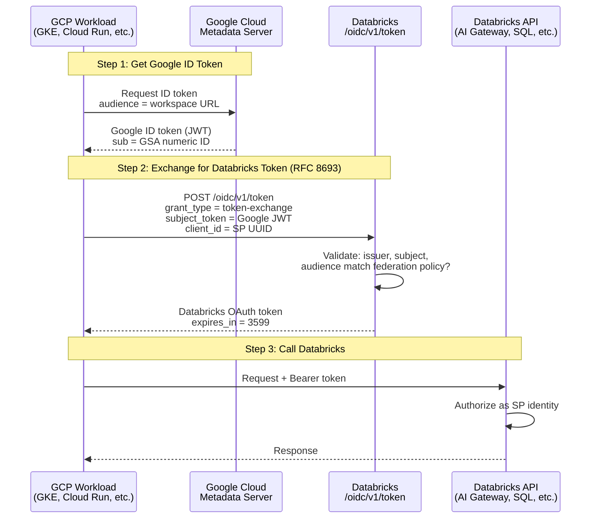

# GCP Workload Identity Federation → Databricks (RFC 8693)

> **TL;DR**: Any GCP workload with a Google Service Account can authenticate to Databricks APIs without storing Databricks secrets. Exchange a Google ID token for a Databricks SP token via RFC 8693. Works from GKE, Cloud Run, Compute Engine, Cloud Functions, Composer, or a developer laptop.

---

## Architecture

```
Any GCP Workload (with GSA identity)
  → Google ID Token (aud: Databricks workspace URL)
  → POST /oidc/v1/token (RFC 8693 exchange + client_id)
  → Databricks OAuth Token (SP identity)
  → Any Databricks API (AI Gateway, SQL, Unity Catalog, Jobs, etc.)
```

The pattern is identical regardless of origin. Only how the Google ID token is obtained varies by compute environment.

### Sequence Diagram



---

## How Google ID Tokens Are Obtained Per Environment

| GCP Environment | How Token Is Obtained | Extra Setup |
|-----------------|----------------------|-------------|
| **GKE** | Workload Identity injects GSA credentials into pod; `GoogleCredentials.getApplicationDefault()` | KSA → GSA binding + KSA annotation |
| **Cloud Run** | Automatic via metadata server; `GoogleCredentials.getApplicationDefault()` | Assign GSA as service identity |
| **Compute Engine** | Automatic via metadata server; `GoogleCredentials.getApplicationDefault()` | Assign GSA as instance service account |
| **Cloud Functions** | Automatic via metadata server; `GoogleCredentials.getApplicationDefault()` | Assign GSA as function identity |
| **Cloud Composer** | Automatic via metadata server; `GoogleCredentials.getApplicationDefault()` | Assign GSA as environment service account |
| **GitHub Actions** | GCP Workload Identity Federation for GitHub; OIDC token exchange | Configure GCP WIF pool for GitHub |
| **Developer laptop** | `gcloud auth print-identity-token --impersonate-service-account=<GSA>` | `roles/iam.serviceAccountTokenCreator` on the GSA |

In every case, the Databricks token exchange (Step 2) is exactly the same.

---

## Quick Proof (5 Minutes)

Before investing in code changes, validate the full chain from your laptop with three commands. If all three pass, the Databricks side is correctly configured and you can proceed with confidence.

**Prerequisites**: `gcloud` CLI authenticated, `roles/iam.serviceAccountTokenCreator` on the GSA, Databricks SP + federation policy already created.

```bash
# Fill in your values
GSA_EMAIL="<your-gsa>@<project>.iam.gserviceaccount.com"
WORKSPACE_URL="https://<workspace>.gcp.databricks.com"
SP_UUID="<databricks-sp-uuid>"

# --- Test 1: Can I get a Google ID token with the right audience? ---
GCP_TOKEN=$(gcloud auth print-identity-token \
  --impersonate-service-account=$GSA_EMAIL \
  --audiences=$WORKSPACE_URL 2>/dev/null)
[ -n "$GCP_TOKEN" ] && echo "PASS: Got Google ID token" || echo "FAIL: Check GSA email and impersonation permissions"

# --- Test 2: Does Databricks accept the token exchange? ---
EXCHANGE=$(curl -s -X POST "$WORKSPACE_URL/oidc/v1/token" \
  -H "Content-Type: application/x-www-form-urlencoded" \
  -d "grant_type=urn:ietf:params:oauth:grant-type:token-exchange" \
  -d "subject_token=$GCP_TOKEN" \
  -d "subject_token_type=urn:ietf:params:oauth:token-type:jwt" \
  -d "scope=all-apis" \
  -d "client_id=$SP_UUID")
DB_TOKEN=$(echo "$EXCHANGE" | python3 -c "import sys,json; print(json.load(sys.stdin).get('access_token',''))" 2>/dev/null)
[ -n "$DB_TOKEN" ] && echo "PASS: Got Databricks token" || echo "FAIL: $EXCHANGE"

# --- Test 3: Can the SP actually call a Databricks API? ---
WHOAMI=$(curl -s "$WORKSPACE_URL/api/2.0/preview/scim/v2/Me" \
  -H "Authorization: Bearer $DB_TOKEN")
echo "$WHOAMI" | python3 -c "
import sys,json
me = json.load(sys.stdin)
name = me.get('displayName', me.get('userName', 'UNKNOWN'))
print(f'PASS: Authenticated as {name}')
" 2>/dev/null || echo "FAIL: $WHOAMI"
```

**Expected output**:
```
PASS: Got Google ID token
PASS: Got Databricks token
PASS: Authenticated as <your-sp-name>
```

If Test 1 fails: check GSA email and impersonation IAM binding.
If Test 2 fails: check federation policy (subject = numeric ID, not email) and that `client_id` is included.
If Test 3 fails: check SP is added to the workspace and has permissions.

Once all three pass, you know the plumbing works. Now go build the real thing.

---

## Setup

### Step 1: Get Your GSA's Numeric ID

```bash
gcloud iam service-accounts describe \
  <GSA_EMAIL> \
  --format='value(uniqueId)'
```

Save this number. It's the `sub` claim in Google ID tokens and what Databricks matches against.

### Step 2: Create Databricks Service Principal

1. **Account console → Identity & access → Service principals → Add new**
2. Name it descriptively (e.g., `gke-pipeline`, `cloud-run-api`, `etl-composer`)
3. Note the **UUID** (Application ID) from the Principal information tab

### Step 3: Add Federation Policy

On the SP: **Credentials & secrets → Federation policies → Create policy**

| Field | Value |
|-------|-------|
| Issuer URL | `https://accounts.google.com` |
| Subject | GSA numeric unique ID (from Step 1) |
| Audiences | Databricks workspace URL (e.g., `https://<workspace>.gcp.databricks.com`) |
| Subject claim | `sub` |

### Step 4: Grant SP Permissions

Grant the SP access to whatever Databricks resources the workload needs:

| Databricks Resource | Grant |
|---------------------|-------|
| AI Gateway / Model Serving endpoint | CAN_QUERY on the endpoint |
| SQL Warehouse | CAN_USE on the warehouse |
| Unity Catalog tables | SELECT/MODIFY on specific tables |
| Jobs | CAN_MANAGE_RUN on specific jobs |
| All APIs | Workspace admin (use sparingly) |

---

## The Token Exchange

This is the same regardless of GCP environment:

```bash
POST https://<workspace-url>/oidc/v1/token
Content-Type: application/x-www-form-urlencoded

grant_type=urn:ietf:params:oauth:grant-type:token-exchange
&subject_token=<Google ID Token>
&subject_token_type=urn:ietf:params:oauth:token-type:jwt
&scope=all-apis
&client_id=<Databricks SP UUID>
```

Response:

```json
{
  "access_token": "eyJ...",
  "issued_token_type": "urn:ietf:params:oauth:token-type:access_token",
  "scope": "all-apis",
  "token_type": "Bearer",
  "expires_in": 3599
}
```

---

## Gotchas (Battle-Tested)

### 1. Token exchange REQUIRES `client_id`

The exchange **must** include `client_id=<SP UUID>`. Without it, Databricks cannot match the federation policy to the SP, even if issuer/subject/audience all match. You'll get:

```
ERROR: TOKEN_INVALID (Ensure a valid federation policy has been configured)
```

### 2. Subject is the numeric ID, not the email

Google ID tokens use the GSA's **numeric unique ID** as the `sub` claim, not the email. The federation policy must match this exactly.

### 3. Federation policy propagation

Allow 1-2 minutes after creating/updating a federation policy before testing.

### 4. Account-level SP required

The SP must be created at the **account level**, not as a workspace-local SP. Workspace-local SPs do not support federation policies.

### 5. AI Gateway needs `model` in request body

The AI Gateway `/mlflow/v1/chat/completions` endpoint requires a `model` field containing the **route name**, not the underlying model name.

---

## Code Examples

### Java

```xml
<!-- Maven dependency -->
<dependency>
    <groupId>com.google.auth</groupId>
    <artifactId>google-auth-library-oauth2-http</artifactId>
    <version>1.23.0</version>
</dependency>
```

```java
import com.google.auth.oauth2.*;
import java.net.URI;
import java.net.http.*;
import org.json.JSONObject;

public class DatabricksWIF {

    static final String WORKSPACE_URL = "https://<workspace>.gcp.databricks.com";
    static final String SP_UUID = "<databricks-sp-uuid>";

    /** Step 1: Get Google ID token (works on any GCP compute) */
    static String getGoogleIdToken() throws Exception {
        GoogleCredentials creds = GoogleCredentials.getApplicationDefault();
        IdTokenCredentials idToken = IdTokenCredentials.newBuilder()
                .setIdTokenProvider((IdTokenProvider) creds)
                .setTargetAudience(WORKSPACE_URL)
                .build();
        idToken.refresh();
        return idToken.getIdToken().getTokenValue();
    }

    /** Step 2: Exchange for Databricks token */
    static String exchangeForDatabricksToken(String gcpToken) throws Exception {
        String body = "grant_type=urn:ietf:params:oauth:grant-type:token-exchange"
                + "&subject_token=" + gcpToken
                + "&subject_token_type=urn:ietf:params:oauth:token-type:jwt"
                + "&scope=all-apis"
                + "&client_id=" + SP_UUID;

        HttpRequest req = HttpRequest.newBuilder()
                .uri(URI.create(WORKSPACE_URL + "/oidc/v1/token"))
                .header("Content-Type", "application/x-www-form-urlencoded")
                .POST(HttpRequest.BodyPublishers.ofString(body))
                .build();

        HttpResponse<String> resp = HttpClient.newHttpClient()
                .send(req, HttpResponse.BodyHandlers.ofString());

        return new JSONObject(resp.body()).getString("access_token");
    }

    /** Step 3: Call any Databricks API */
    static String callDatabricksAPI(String token, String url, String payload) throws Exception {
        HttpRequest req = HttpRequest.newBuilder()
                .uri(URI.create(url))
                .header("Authorization", "Bearer " + token)
                .header("Content-Type", "application/json")
                .POST(HttpRequest.BodyPublishers.ofString(payload))
                .build();

        return HttpClient.newHttpClient()
                .send(req, HttpResponse.BodyHandlers.ofString())
                .body();
    }
}
```

### Python

```python
import google.auth
import google.auth.transport.requests
from google.oauth2 import id_token
import requests

WORKSPACE_URL = "https://<workspace>.gcp.databricks.com"
SP_UUID = "<databricks-sp-uuid>"

# Step 1: Get Google ID token
request = google.auth.transport.requests.Request()
gcp_token = id_token.fetch_id_token(request, WORKSPACE_URL)

# Step 2: Exchange for Databricks token
resp = requests.post(
    f"{WORKSPACE_URL}/oidc/v1/token",
    data={
        "grant_type": "urn:ietf:params:oauth:grant-type:token-exchange",
        "subject_token": gcp_token,
        "subject_token_type": "urn:ietf:params:oauth:token-type:jwt",
        "scope": "all-apis",
        "client_id": SP_UUID,
    },
)
db_token = resp.json()["access_token"]

# Step 3: Call any Databricks API
result = requests.post(
    f"{WORKSPACE_URL}/api/2.0/serving-endpoints/<endpoint>/invocations",
    headers={"Authorization": f"Bearer {db_token}"},
    json={"model": "<route>", "messages": [{"role": "user", "content": "Hello"}]},
)
print(result.json())
```

### bash (local testing)

```bash
# Step 1: Get Google ID token (impersonate GSA from laptop)
GCP_TOKEN=$(gcloud auth print-identity-token \
  --impersonate-service-account=<GSA_EMAIL> \
  --audiences=<WORKSPACE_URL>)

# Step 2: Exchange for Databricks token
DB_TOKEN=$(curl -s -X POST "<WORKSPACE_URL>/oidc/v1/token" \
  -H "Content-Type: application/x-www-form-urlencoded" \
  -d "grant_type=urn:ietf:params:oauth:grant-type:token-exchange" \
  -d "subject_token=$GCP_TOKEN" \
  -d "subject_token_type=urn:ietf:params:oauth:token-type:jwt" \
  -d "scope=all-apis" \
  -d "client_id=<SP_UUID>" | python3 -c "import sys,json; print(json.load(sys.stdin)['access_token'])")

# Step 3: Call any Databricks API
curl -s "<WORKSPACE_URL>/api/2.0/serving-endpoints/<endpoint>/invocations" \
  -H "Authorization: Bearer $DB_TOKEN" \
  -H "Content-Type: application/json" \
  -d '{"model": "<route>", "messages": [{"role": "user", "content": "Hello"}]}'
```

---

## GKE-Specific Setup

GKE requires binding the Kubernetes Service Account to the GCP IAM Service Account:

```bash
# 1. Bind KSA to GSA
gcloud iam service-accounts add-iam-policy-binding <GSA_EMAIL> \
  --role=roles/iam.workloadIdentityUser \
  --member="serviceAccount:<PROJECT>.svc.id.goog[<NAMESPACE>/<KSA_NAME>]"

# 2. Annotate KSA
kubectl annotate serviceaccount <KSA_NAME> \
  --namespace=<NAMESPACE> \
  iam.gke.io/gcp-service-account=<GSA_EMAIL>
```

After this, pods using that KSA automatically get the GSA's identity. `GoogleCredentials.getApplicationDefault()` works without any code changes.

---

## Token Lifecycle

| Property | Value |
|----------|-------|
| Google ID token TTL | 1 hour |
| Databricks token TTL | 1 hour (`expires_in: 3599`) |
| Refresh strategy | Re-exchange before expiry; no refresh token issued |
| Caching | Cache Databricks token, refresh when `expires_in` < 60s |
