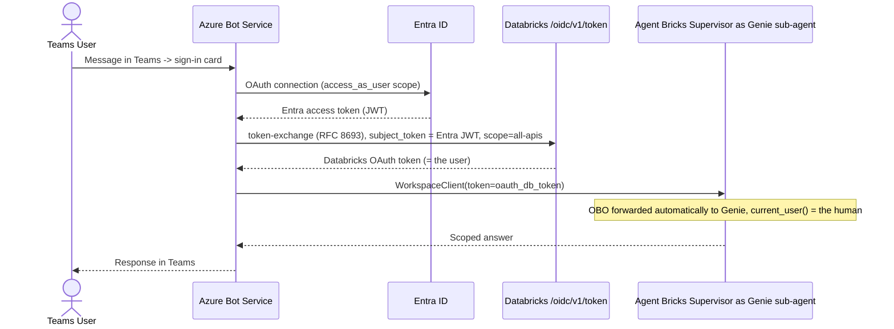

<!--
  Synced from databricks-fieldkit on 2026-07-10
  Sources: apps/teams-agentbricks-obo.md (composes apps/powerbi-agentbricks-obo.md, auth/peruser-byoidp-federation.md, auth/token-federation.md, auth/obo-passthrough.md)
  Public docs grounding:
    - https://learn.microsoft.com/en-us/azure/databricks/generative-ai/agent-framework/teams-agent
    - https://github.com/databricks-solutions/teams-databricks-bot-service
    - https://www.databricks.com/blog/access-genie-everywhere
    - https://docs.databricks.com/aws/en/integrations/msft-teams
    - https://docs.databricks.com/aws/en/integrations/msft-m365-copilot
  One section (Genie space publish mode) is sourced from internal field guidance, not an independently fetched
  citation — the named Confluence source was inaccessible at write time. Flagged inline; re-verify when possible.
  This file is auto-prepared and human-reviewed before publish.
-->

# Microsoft Teams / Copilot Studio → Genie & Agent Bricks with Per-User Identity

> **What this is**: Per-user identity into Genie/Agent Bricks from Microsoft Teams or Copilot Studio is real and supported — but it requires **two independent gates to both be open**, not one. Getting the token-layer auth right and still failing on the second gate is the most common way this silently doesn't work.
>
> **Azure-specific.** Entra ID as the IdP; Azure Bot Service is Azure infrastructure.

This completes the Microsoft-surface picture alongside the sibling pattern:

| Pattern | Front-end | Token exchange | RLS granularity |
|---|---|---|---|
| [Power BI → Agent Bricks OBO](federation-implementation-blueprint.md) | Power BI Embedded (MSAL) | RFC 8693, account-wide | Individual, platform-enforced *(if publish mode allows — see below)* |
| **This doc** — Teams/Copilot Studio → Genie/Agent Bricks | Azure Bot Service or Copilot Studio | RFC 8693, account-wide (custom path) or Copilot Studio's own OAuth | Individual, *gated by publish mode* |

---

## The two gates

1. **Token layer**: the caller used per-user OBO/token-exchange, not a shared SP/M2M credential.
2. **Genie space publish mode**: the space is published as `VIEWER`, not `EMBEDDED_CREDENTIALS`.

**Both must be true.** Get #1 right — a genuine per-user OAuth token reaches Databricks, correctly, with no `client_id` in the exchange — and it still won't enforce per-person access if the space itself is published `EMBEDDED_CREDENTIALS`: the SQL runs as the space's **publisher**, always, regardless of whose token called the API.

| Publish mode | Who the SQL runs as | Per-user RLS possible? |
|---|---|---|
| `VIEWER` | The calling identity (the human, if a per-user token reached the API) | ✅ Yes |
| `EMBEDDED_CREDENTIALS` | The space's publisher, always | ❌ No — every caller executes as the publisher, OBO or not |

This setting lives on the **space**, independent of the client integration. Verify it directly — don't infer it from the Teams bot's or Copilot Studio connector's auth configuration.

---

## Four integration paths, mapped

| Path | Token-layer identity | Confidence | Still gated by publish mode |
|---|---|---|---|
| Custom AI agent + Azure Bot Service + OAuth federation | Per-user OBO — `current_user()` = human | Confirmed, code-traced against the official reference implementation | Yes |
| Copilot Studio via MCP, "End user credentials" | Per-user (U2M) | Confirmed to exist (Databricks blog + internal field guidance) | Yes |
| Copilot Studio via MCP, "Maker credentials" | Shared — everyone runs as the maker's identity | Confirmed M2M by design, not a degraded OBO mode | N/A — already shared |
| Native "Databricks Genie" app (Teams marketplace) | Unknown at token layer | Not disclosed in official docs | Yes, whatever it turns out to be |
| Native "Databricks Genie on Microsoft 365 Copilot" | Unknown at token layer | Not disclosed in official docs | Yes |

The two native marketplace apps are a genuine open question, not a "no" — official docs never state their token-layer identity model one way or the other. The only auth-adjacent detail disclosed (a `User.ReadBasic.All` Graph permission on the Teams app) is for looking up who's asking, not evidence that the query executes as that person in Unity Catalog. Test directly — two users with different UC grants, same question, compare results and `system.access.audit` — before relying on RLS through either native app.

---

## Confirmed path — Custom agent + Azure Bot Service + OAuth federation



The exchange, code-traced from the official reference implementation ([`databricks-solutions/teams-databricks-bot-service`](https://github.com/databricks-solutions/teams-databricks-bot-service)):

```python
url = f"{databricks_host}/oidc/v1/token"
data = {
    "grant_type": "urn:ietf:params:oauth:grant-type:token-exchange",
    "subject_token": provider_oauth_token,      # Entra JWT from the Teams OAuth prompt
    "subject_token_type": "urn:ietf:params:oauth:token-type:jwt",
    "scope": "all-apis",
    # no client_id — omitting it is what keeps this per-user rather than SP
}
response = await http_client.post(url, data=data)
oauth_db_token = response.json()["access_token"]
workspace_client = WorkspaceClient(host=databricks_host, token=oauth_db_token)
```

This is the same account-wide RFC 8693 exchange as [Per-User BYO-IdP Federation](byoidp-peruser-federation.md) — Teams/Azure Bot Service is a new front-end for a pattern already documented here, not a new mechanism.

**Setup, condensed** (full steps: [Connect an AI agent to Microsoft Teams](https://learn.microsoft.com/en-us/azure/databricks/generative-ai/agent-framework/teams-agent)):

1. Deploy an Agent Bricks Supervisor (or any Model Serving agent) with a Genie sub-agent.
2. Create Azure resources: resource group, App Service Plan, Web App, **Azure Bot** (Single Tenant).
3. Configure the Bot's Entra app: redirect URI `https://token.botframework.com/.auth/web/redirect`, optional claim `preferred_username`, exposed scope `access_as_user`, Graph delegated permissions `email`/`openid`/`profile`, `requestedAccessTokenVersion: 2`.
4. Add an OAuth Connection on the Azure Bot (Azure Active Directory v2, scope `api://<app_id>/access_as_user`).
5. Create a Databricks OAuth federation policy (issuer, audience = the Entra app ID, subject claim `preferred_username`).
6. Deploy the bot code with `DATABRICKS_HOST`, `SERVING_ENDPOINT_NAME`, and Microsoft App credentials as env vars.

---

## Copilot Studio via MCP — "End user credentials"

Per [Use Genie Everywhere with Enterprise OAuth](https://www.databricks.com/blog/access-genie-everywhere): the Copilot Studio MCP connector to Genie offers an explicit toggle between shared M2M ("Maker credentials") and per-user ("End user credentials"). Selecting the latter produces the same effect as the custom-bot path above — `current_user()` = the human — subject to the same publish-mode gate.

---

## Gotchas

| Issue | Detail |
|---|---|
| Correct OBO token, wrong publish mode | The most common way this silently fails. A genuine per-user token reaches the API and still doesn't enforce per-person access because the space is `EMBEDDED_CREDENTIALS`. |
| `client_id` in the token exchange | Omit it. Including it selects a service principal and collapses RLS to the SP. |
| `preferred_username` vs other claims | The federation policy's subject claim must match what the exchanged JWT actually carries in your tenant. |
| Two unrelated things named "Genie + Teams" | The native marketplace app and the custom Azure Bot Service pattern are different integrations with different, differently-documented identity models. Confirm which one is in play before answering an RLS question. |
| "Maker credentials" in Copilot Studio | Intentionally shared/M2M by design — not a degraded or broken OBO mode. |

---

## Related

- [Per-User BYO-IdP Federation](byoidp-peruser-federation.md) — the general pattern this specializes for Teams/Copilot Studio
- [Federation blueprint](federation-implementation-blueprint.md) — RFC 8693 exchange recipe this reuses
- [Authorization](authorization.md) — the three token patterns overview
- [Data Governance](../data-governance/uc-governance.md) — where the publish-mode gate ultimately resolves at the SQL layer

## Public References

- [Connect an AI agent to Microsoft Teams](https://learn.microsoft.com/en-us/azure/databricks/generative-ai/agent-framework/teams-agent)
- [Use Genie Everywhere with Enterprise OAuth](https://www.databricks.com/blog/access-genie-everywhere)
- [Databricks Genie app in Microsoft Teams](https://docs.databricks.com/aws/en/integrations/msft-teams)
- [Databricks Genie on Microsoft 365 Copilot](https://docs.databricks.com/aws/en/integrations/msft-m365-copilot)
- Reference implementation: [databricks-solutions/teams-databricks-bot-service](https://github.com/databricks-solutions/teams-databricks-bot-service)
