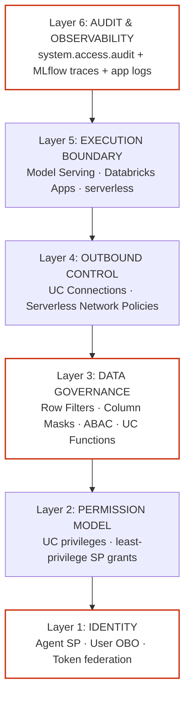
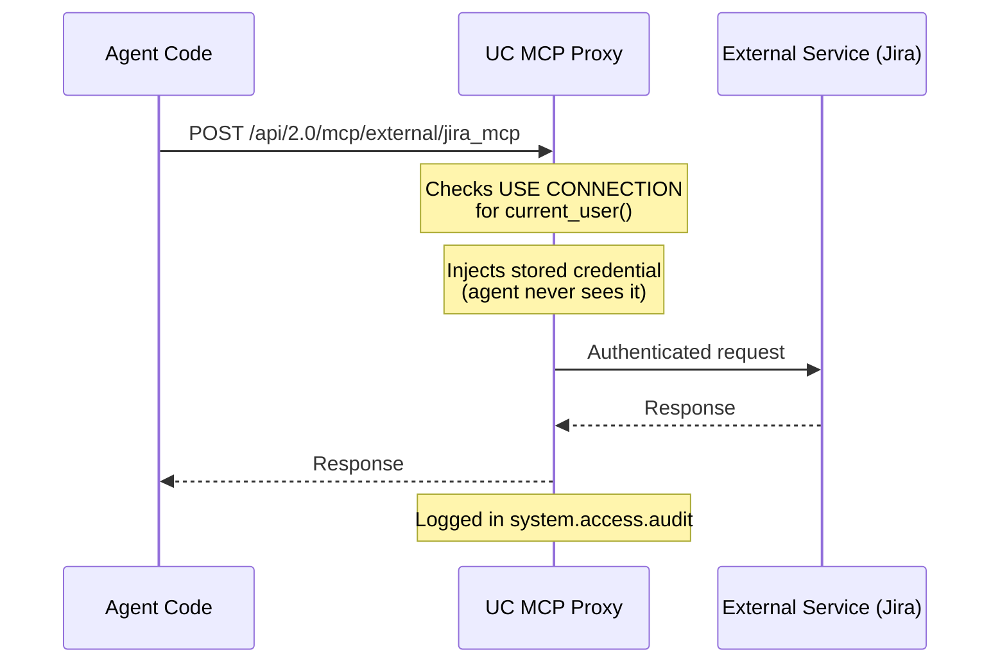

<!--
  Synced from databricks-fieldkit on 2026-09-14
  Sources: ai/agent-framework.md, ai/agent-bricks.md, ai/agent-tool.md, ai/uc-functions.md, ai/genie.md, ai/vector-search.md, governance/agent-permissions-guide.md
  Public docs grounding:
    - https://docs.databricks.com/aws/en/generative-ai/agent-framework/
    - https://docs.databricks.com/aws/en/generative-ai/agent-bricks/
  This file is auto-prepared and human-reviewed before publish.
-->

# MLflow Agent SDK & LangGraph — Building Agents on Databricks

> **TL;DR**: Build agents with MLflow's `ChatAgent` / `ResponsesAgent` or LangGraph. Deploy to **Model Serving** (API endpoint) or **Databricks Apps** (full-stack UI). MLflow tracing auto-instruments tool calls, LLM calls, and retrieval steps. Use `mlflow.evaluate()` for offline evals before promoting.

---

## When to Use What

| Tool | Best For |
|---|---|
| **Agent Bricks (UI)** | Supervisor + sub-agents with no code; OBO passthrough automatic; fastest to demo |
| **`ResponsesAgent` + Databricks Apps** | Full-stack agent with built-in Chat UI, FastAPI backend, user auth via OBO; recommended for new agents |
| **MLflow `ChatAgent`** | Custom Python logic, multi-step reasoning, custom tools, need tracing |
| **LangGraph** | Complex DAGs, human-in-the-loop, cyclical reasoning, state machines |
| **UC Functions as tools** | Reusable SQL/Python logic callable from any agent; governed by UC (legacy — prefer MCP tools) |

---

## Core Concepts

- **`ChatAgent`**: MLflow base class that wraps any Python chatbot into a deployable, traceable artifact
- **`mlflow.pyfunc`**: Generic MLflow model flavor; `langchain` and `openai` flavors also supported
- **Tracing**: Automatic capture of spans for LLM calls, tool calls, retrieval steps, latency, tokens
- **Evaluation**: `mlflow.evaluate()` compares agent outputs to ground truth with LLM judges
- **Model Registry**: Agents are versioned in UC Model Registry; promoted through dev → prod

---

## Building with MLflow ChatAgent

### Minimal Agent

```python
import mlflow
from mlflow.pyfunc import ChatAgent
from mlflow.types.agent import (
    ChatAgentMessage,
    ChatAgentResponse,
    ChatAgentChunk,
)
from databricks.sdk import WorkspaceClient

w = WorkspaceClient()

class SalesAgent(ChatAgent):
    def predict(
        self,
        messages: list[ChatAgentMessage],
        context=None,
        custom_inputs=None,
    ) -> ChatAgentResponse:
        # Build prompt from history
        history = [{"role": m.role, "content": m.content} for m in messages]

        # Call Foundation Model API
        response = w.serving_endpoints.query(
            name="databricks-meta-llama-3-3-70b-instruct",
            messages=history,
            max_tokens=512,
        )
        content = response.choices[0].message.content

        return ChatAgentResponse(
            messages=[ChatAgentMessage(role="assistant", content=content)]
        )

# Log the agent
with mlflow.start_run():
    mlflow.pyfunc.log_model(
        artifact_path="agent",
        python_model=SalesAgent(),
        pip_requirements=["databricks-sdk>=0.40.0", "mlflow>=2.17.0"],
        registered_model_name="main.agents.sales_agent",
    )
```

### Agent with Tools (Tool Calling Loop)

```python
import json
import mlflow
from mlflow.pyfunc import ChatAgent
from mlflow.types.agent import ChatAgentMessage, ChatAgentResponse
from databricks.sdk import WorkspaceClient

w = WorkspaceClient()

# Define tools
TOOLS = [
    {
        "type": "function",
        "function": {
            "name": "get_opportunity",
            "description": "Get details of a sales opportunity by ID",
            "parameters": {
                "type": "object",
                "properties": {
                    "opp_id": {"type": "string", "description": "Opportunity ID"}
                },
                "required": ["opp_id"],
            },
        },
    },
    {
        "type": "function",
        "function": {
            "name": "list_opportunities",
            "description": "List open sales opportunities for a rep",
            "parameters": {
                "type": "object",
                "properties": {
                    "rep_email": {"type": "string"}
                },
                "required": ["rep_email"],
            },
        },
    },
]

def _execute_tool(name: str, args: dict, user_token: str = None) -> str:
    """Execute a tool call and return the result as a string."""
    if name == "get_opportunity":
        # Use OBO token if available, else M2M
        client = w
        rows = list(client.statement_execution.execute(
            statement=f"SELECT * FROM sales.opportunities WHERE opp_id = '{args['opp_id']}' LIMIT 1",
            warehouse_id="your-warehouse-id",
        ).result.data_array or [])
        return json.dumps(rows[0] if rows else {"error": "not found"})

    elif name == "list_opportunities":
        rows = list(w.statement_execution.execute(
            statement=f"SELECT opp_id, name, amount FROM sales.opportunities WHERE owner_email = '{args['rep_email']}' AND stage != 'CLOSED'",
            warehouse_id="your-warehouse-id",
        ).result.data_array or [])
        return json.dumps(rows)

    return json.dumps({"error": f"Unknown tool: {name}"})

class ToolCallingAgent(ChatAgent):
    def predict(self, messages, context=None, custom_inputs=None):
        history = [{"role": m.role, "content": m.content} for m in messages]

        # Agentic loop — keep calling until no more tool calls
        while True:
            response = w.serving_endpoints.query(
                name="databricks-meta-llama-3-3-70b-instruct",
                messages=history,
                tools=TOOLS,
                max_tokens=1024,
            )
            choice = response.choices[0]
            msg = choice.message

            # Add assistant message to history
            history.append({"role": "assistant", "content": msg.content or "",
                           "tool_calls": [tc.__dict__ for tc in (msg.tool_calls or [])]})

            # If no tool calls, we're done
            if not msg.tool_calls:
                break

            # Execute each tool call
            for tc in msg.tool_calls:
                result = _execute_tool(
                    tc.function.name,
                    json.loads(tc.function.arguments),
                )
                history.append({
                    "role": "tool",
                    "tool_call_id": tc.id,
                    "content": result,
                })

        return ChatAgentResponse(
            messages=[ChatAgentMessage(role="assistant", content=msg.content or "")]
        )
```

---

## Building with ResponsesAgent + Databricks Apps

The recommended path for new agents that need a full-stack UI with user authentication.

### Architecture (3 layers)

```
Browser → Chat UI (React/Streamlit) → FastAPI backend → AgentServer → ResponsesAgent → LLM + Tools
                                            ↕
                                    OBO token (X-Forwarded-Email)
```

- **Chat UI**: Built-in Databricks Apps Chat UI (React) or custom Streamlit/Dash
- **FastAPI backend**: Handles `/invocations` (Model Serving compat) or custom routes; manages `AgentServer`
- **ResponsesAgent**: MLflow agent class that uses the OpenAI Responses API format (tools, instructions, model)

### Minimal ResponsesAgent

```python
import mlflow
from mlflow.pyfunc import ResponsesAgent
from mlflow.types.agent import (
    ChatAgentMessage,
    ChatAgentResponse,
)

class SalesBot(ResponsesAgent):
    """ResponsesAgent uses OpenAI Responses API format internally."""

    @property
    def agent_config(self):
        return {
            "model": "databricks-meta-llama-3-3-70b-instruct",
            "instructions": "You are a sales intelligence assistant.",
            "tools": self._get_tools(),
            "max_tokens": 1024,
        }

    def _get_tools(self):
        return [
            {
                "type": "function",
                "function": {
                    "name": "get_pipeline",
                    "description": "Get the rep's current pipeline summary",
                    "parameters": {
                        "type": "object",
                        "properties": {
                            "rep_email": {"type": "string"}
                        },
                        "required": ["rep_email"],
                    },
                },
            }
        ]
```

#### Local development

From the GitHub agent template (`uv run start-app` starts the local FastAPI server; `uv run agent-evaluate` runs evals locally before deploy):

```bash
# Clone agent template
git clone https://github.com/databricks/agent-app-template
cd agent-app-template && uv sync

# Run locally — starts FastAPI on localhost:8000
uv run start-app

# Evaluate agent against a test dataset locally
uv run agent-evaluate
```

Source: https://docs.databricks.com/aws/en/generative-ai/agent-framework/author-agent

---

## Deploying to Databricks Apps (FastAPI + AgentServer)

```python
# app.py — FastAPI backend for Databricks Apps
from fastapi import FastAPI, Request
from databricks.agents import AgentServer
from databricks.sdk import WorkspaceClient

app = FastAPI()
agent_server = AgentServer(model_name="main.agents.sales_bot")

@app.post("/invocations")
async def invocations(request: Request):
    """Model Serving-compatible endpoint. AgentServer handles the agent loop."""
    body = await request.json()
    # OBO: extract user token from App's forwarded headers
    user_token = request.headers.get("X-Forwarded-Access-Token")
    return agent_server.invoke(body, user_token=user_token)
```

```yaml
# app.yaml
command: ["uvicorn", "app:app", "--host", "0.0.0.0", "--port", "8000"]
env:
  - name: DATABRICKS_HOST
    value: "${DATABRICKS_HOST}"
resources:
  - name: serving-endpoint
    serving_endpoint: main.agents.sales_bot
```

### Auth: `get_user_workspace_client()`

Inside tool handlers or agent code running in Databricks Apps, use this to get an OBO-scoped client:

```python
from databricks.agents import get_user_workspace_client

def handle_tool_call(tool_name, args, context):
    # Gets a WorkspaceClient scoped to the calling user (OBO)
    # NEVER call at module level — only inside request handlers
    w = get_user_workspace_client()
    # Now w.statement_execution.execute() runs as the user
```

> **Important**: Call `get_user_workspace_client()` inside request/tool handlers, never at module startup. At startup there is no user context.

---

## Stateful Agents (Memory)

Agents can maintain conversation memory across sessions using **Lakebase** (managed Postgres).

### Short-term vs. Long-term Memory

| Type | Scope | Storage | Use Case |
|---|---|---|---|
| **Short-term** | Single conversation | In-memory (thread state) | Multi-turn context within one session |
| **Long-term** | Cross-session | Lakebase (Postgres) | User preferences, prior interactions, learned facts |

### LangGraph + Lakebase Memory

```python
from langgraph.prebuilt import create_react_agent
from langgraph.store.postgres import PostgresStore
from langgraph.checkpoint.postgres import PostgresSaver
from langchain_databricks import ChatDatabricks

# Lakebase connection (provisioned via workspace UI or API).
# Read the URI from the environment and authenticate with a short-lived
# OAuth token rather than embedding a static password.
LAKEBASE_URI = os.environ["LAKEBASE_URI"]

# Short-term: checkpointer saves thread state between turns
checkpointer = PostgresSaver.from_conn_string(LAKEBASE_URI)

# Long-term: store persists facts across conversations
store = PostgresStore.from_conn_string(LAKEBASE_URI)

llm = ChatDatabricks(endpoint="databricks-meta-llama-3-3-70b-instruct")

agent = create_react_agent(
    model=llm,
    tools=[...],
    checkpointer=checkpointer,    # short-term memory
    store=store,                   # long-term memory
)

# Invoke with thread_id for continuity
result = agent.invoke(
    {"messages": [{"role": "user", "content": "What did we discuss last time?"}]},
    config={"configurable": {"thread_id": "user-123-session-abc"}},
)
```

### OpenAI SDK Template (Stateful)

```python
from openai import OpenAI
from databricks.sdk import WorkspaceClient

w = WorkspaceClient()
client = OpenAI(
    base_url=f"{w.config.host}/serving-endpoints",
    api_key=w.config.token,
)

# previous_response_id chains responses for multi-turn
response = client.responses.create(
    model="databricks-meta-llama-3-3-70b-instruct",
    input="What's my Q1 pipeline?",
    previous_response_id="resp_abc123",  # chains to prior turn
)
```

> **Compute requirement**: Stateful agents require **Medium** or **Large** Model Serving compute. Small compute does not support Lakebase connections.

---

## Streaming

### ResponsesAgent Streaming (`output_text.delta`)

```python
from openai import OpenAI

client = OpenAI(base_url=f"{host}/serving-endpoints", api_key=token)

stream = client.responses.create(
    model="databricks-meta-llama-3-3-70b-instruct",
    input="Summarize my pipeline",
    stream=True,
)

for event in stream:
    if event.type == "response.output_text.delta":
        print(event.delta, end="", flush=True)
    elif event.type == "response.output_item.done":
        # Contains the complete response text for the finished item
        pass
    elif event.type == "response.completed":
        print("\n[Done]")

# Streaming errors: the last token in the stream carries a `databricks_output.error`
# field when an error occurs mid-stream. Check for it explicitly:
# if hasattr(event, "databricks_output") and event.databricks_output.error:
#     handle_stream_error(event.databricks_output.error)
```

### ChatAgent Streaming (MLflow)

```python
class StreamingAgent(ChatAgent):
    def predict_stream(self, messages, context=None, custom_inputs=None):
        history = [{"role": m.role, "content": m.content} for m in messages]
        for chunk in w.serving_endpoints.stream(
            name="databricks-meta-llama-3-3-70b-instruct",
            messages=history,
        ):
            if chunk.choices[0].delta.content:
                yield ChatAgentChunk(
                    delta={"role": "assistant", "content": chunk.choices[0].delta.content}
                )
```

---

## Building with LangGraph

### Simple ReAct Agent

```python
from langgraph.prebuilt import create_react_agent
from langchain_databricks import ChatDatabricks
from langchain_core.tools import tool
from databricks.sdk import WorkspaceClient
import mlflow

mlflow.langchain.autolog()   # enable tracing automatically

w = WorkspaceClient()

# Define tools as LangChain tools
@tool
def get_deal_info(opp_id: str) -> str:
    """Get information about a sales deal by opportunity ID."""
    rows = list(w.statement_execution.execute(
        statement=f"SELECT * FROM sales.opportunities WHERE opp_id = '{opp_id}' LIMIT 1",
        warehouse_id="your-warehouse-id",
    ).result.data_array or [])
    return str(rows[0] if rows else "Deal not found")

@tool
def calculate_attainment(rep_email: str) -> str:
    """Calculate Q1 attainment percentage for a sales rep."""
    result = w.api_client.do(
        "POST",
        "/api/2.0/sql/statements",
        body={
            "statement": f"SELECT .functions.calculate_attainment('{rep_email}') AS attainment",
            "warehouse_id": "your-warehouse-id",
            "wait_timeout": "30s",
        }
    )
    return str(result.get("result", {}).get("data_array", [[None]])[0][0])

# Create agent
llm = ChatDatabricks(
    endpoint="databricks-meta-llama-3-3-70b-instruct",
    temperature=0,
    max_tokens=1024,
)

agent = create_react_agent(
    model=llm,
    tools=[get_deal_info, calculate_attainment],
    state_modifier="You are a sales intelligence assistant. Help reps understand their pipeline and performance.",
)

# Run locally
result = agent.invoke({
    "messages": [{"role": "user", "content": "What's my Q1 attainment?"}]
})
print(result["messages"][-1].content)
```

### Logging LangGraph Agent to MLflow

```python
import mlflow

# Log with LangGraph flavor
with mlflow.start_run():
    model_info = mlflow.langchain.log_model(
        lc_model=agent,                          # the compiled LangGraph graph
        artifact_path="agent",
        pip_requirements=[
            "langgraph>=0.2.0",
            "langchain-databricks>=0.3.0",
            "databricks-sdk>=0.40.0",
        ],
        registered_model_name="main.agents.langgraph_sales_agent",
        input_example={
            "messages": [{"role": "user", "content": "Show me my open deals"}]
        },
    )
    print(f"Model URI: {model_info.model_uri}")
```

---

## MLflow Tracing

### Auto-instrumentation

```python
import mlflow

# Enable for Databricks SDK (FMAPI) calls
mlflow.databricks.autolog()

# Enable for LangChain/LangGraph
mlflow.langchain.autolog()

# Enable for OpenAI SDK
mlflow.openai.autolog()

# Set experiment for grouping traces
mlflow.set_experiment("/Users/me@company.com/sales-agent-traces")
```

### Manual Spans

```python
import mlflow

@mlflow.trace(name="retrieve_deals", span_type="RETRIEVAL")
def retrieve_deals(query: str, rep_email: str) -> list[dict]:
    """Retrieve relevant deals using vector search."""
    results = w.vector_search_indexes.query_index(
        index_name="main.sales.opportunities_idx",
        query_text=query,
        filters_json=f'{{"owner_email": "{rep_email}"}}',
        num_results=5,
    )
    return [{"score": row[-1], "name": row[1]} for row in results.result.data_array]

@mlflow.trace(name="generate_answer", span_type="LLM")
def generate_answer(context: str, question: str) -> str:
    response = w.serving_endpoints.query(
        name="databricks-meta-llama-3-3-70b-instruct",
        messages=[{"role": "user", "content": f"Context:\n{context}\n\nQuestion: {question}"}],
    )
    return response.choices[0].message.content

# Traces are automatically sent to MLflow Tracking (linked to current experiment)
```

### Viewing Traces

```python
import mlflow

# Get recent traces
traces = mlflow.search_traces(
    experiment_ids=["your-experiment-id"],
    max_results=10,
    order_by=["timestamp_ms DESC"],
)
for trace in traces:
    print(f"ID: {trace.info.request_id} | Latency: {trace.info.execution_time_ms}ms")

# Get a specific trace
trace = mlflow.get_trace("your-trace-id")
print(trace.data.spans)
```

---

## Evaluation with mlflow.evaluate()

### Basic LLM Judge Evaluation

```python
import mlflow
import pandas as pd

# Evaluation dataset (questions + expected answers)
eval_data = pd.DataFrame({
    "inputs": [
        "What is my Q1 attainment?",
        "Show me deals in the pipeline worth over $100k",
        "What's the status of deal OPP-123?",
    ],
    "ground_truth": [
        "Your Q1 attainment is 87% based on $870k closed against a $1M quota.",
        "You have 3 deals over $100k: Acme ($200k), Beta Corp ($150k), Gamma Inc ($120k).",
        "Deal OPP-123 (Acme Corp) is in Proposal stage, $200k, close date March 31.",
    ]
})

# Load model from registry
model_uri = "models:/main.agents.sales_agent/1"

with mlflow.start_run():
    results = mlflow.evaluate(
        model=model_uri,
        data=eval_data,
        targets="ground_truth",
        model_type="databricks-agent",   # uses built-in LLM judges
        extra_metrics=[
            mlflow.metrics.genai.answer_similarity(),
            mlflow.metrics.genai.answer_correctness(),
            mlflow.metrics.genai.faithfulness(),
        ],
    )
    print(results.metrics)
    print(results.tables["eval_results_table"].head())
```

### Synthetic Evaluation Data from Traces

```python
# Generate eval dataset from production traces
from mlflow.genai.utils import convert_traces_to_evals

traces = mlflow.search_traces(experiment_ids=["..."], max_results=100)
eval_df = convert_traces_to_evals(traces)
# Review and curate eval_df, add ground_truth column, then use above pattern
```

---

## Deploying an Agent to Model Serving

```python
import mlflow
from databricks.sdk import WorkspaceClient

w = WorkspaceClient()

# Get model version from registry
model_version = mlflow.register_model(
    model_uri="runs:/your-run-id/agent",
    name="main.agents.sales_agent",
)

# Create serving endpoint
w.serving_endpoints.create_and_wait(
    name="sales-agent-endpoint",
    config={
        "served_entities": [
            {
                "entity_name": "main.agents.sales_agent",
                "entity_version": str(model_version.version),
                "workload_size": "Small",
                "scale_to_zero_enabled": True,
            }
        ]
    },
)

# Or use CLI
# databricks serving-endpoints create --json @endpoint.json -p <profile>
```

---

## Agent Evaluation Metrics Reference

| Metric | What it measures | Judge |
|---|---|---|
| `answer_similarity` | Semantic similarity to ground truth | LLM |
| `answer_correctness` | Factual accuracy vs. ground truth | LLM |
| `faithfulness` | Response supported by retrieved context (no hallucination) | LLM |
| `relevance` | Context retrieved is relevant to the question | LLM |
| `toxicity` | Harmful content in response | Built-in model |
| `latency` | Response time in ms | Measured |
| `token_count` | Total input+output tokens | Measured |

---

## Patterns

### External Tools via `databricks-agents` SDK

```python
from databricks.agents.tools import UCFunctionClient

# Call a UC function as a tool (M2M)
uc_client = UCFunctionClient()
result = uc_client.execute(
    ".functions.calculate_attainment",
    {"rep_email": "west.rep@company.com"}
)
print(result.value)
```

### Streaming Responses

```python
class StreamingAgent(ChatAgent):
    def predict_stream(self, messages, context=None, custom_inputs=None):
        history = [{"role": m.role, "content": m.content} for m in messages]

        # Stream from FMAPI
        for chunk in w.serving_endpoints.stream(
            name="databricks-meta-llama-3-3-70b-instruct",
            messages=history,
        ):
            if chunk.choices[0].delta.content:
                yield ChatAgentChunk(
                    delta={"role": "assistant", "content": chunk.choices[0].delta.content}
                )
```

---

## Gotchas

| Issue | Cause | Fix |
|---|---|---|
| `mlflow.langchain.autolog()` traces missing | Called after LangChain objects instantiated | Call autolog BEFORE creating LLM or chain objects |
| Traces not appearing in UI | Wrong experiment set | `mlflow.set_experiment()` before `start_run()` |
| `ChatAgent.predict()` not called | `log_model()` used wrong artifact_path | Ensure `python_model=YourAgent()` not `python_model=YourAgent` (must be instance) |
| Tool call loop infinite | LLM keeps generating tool calls | Add max_iterations guard; use `stop_sequence` |
| Agent evaluation fails with auth error | Model URI needs UC permissions | Grant `EXECUTE` on model version to evaluating SP |
| `create_react_agent` tool errors swallowed | LangGraph default error handling | Pass `handle_tool_errors=True` to surface errors to LLM |
| Streaming not working in Streamlit | `predict_stream` requires special handling | Use `st.write_stream()` with generator |
| Model registered but not queryable | Missing EXECUTE grant on model | `GRANT EXECUTE ON MODEL main.agents.sales_agent TO 'user@company.com'` |
| Stateful agent OOM on Small compute | Lakebase connections need more memory | Use **Medium** or **Large** Model Serving compute for stateful agents |
| `get_user_workspace_client()` returns M2M | Called at module level, not in request handler | Move call inside tool handler or route function — user context only exists during a request |
| No Review App for Apps-deployed agents | Review App only works with Model Serving endpoints | Deploy to Model Serving for eval workflows; use Apps for production UI |
| Streaming errors silently dropped | `output_text.delta` doesn't surface tool errors | Check for `response.error` event type; add error handler in stream loop |
| `databricks bundle run` deploys to new app instead of existing | Missing binding between bundle resource and existing App | Run `databricks bundle deployment bind <resource-key> <existing-app-name>` before first deploy to bind the bundle to an existing App |
| Personal access tokens not accepted | Databricks Apps agents require OAuth | PAT auth is unsupported for Apps-deployed agents; use OAuth (browser SSO or service principal) |
| Medium/Large compute required | Databricks Apps only supports Medium or Large compute sizes | Small compute is  for Apps; configure `workload_size: Medium` minimum in `databricks.yml` |

---

## Retriever Schema Standardization

Use `mlflow.models.set_retriever_schema()` to map custom retriever outputs to standard MLflow fields. This enables automatic groundedness and relevance judges in Agent Evaluation without manual mapping.

```python
import mlflow

mlflow.models.set_retriever_schema(
    primary_key="chunk_id",
    text_column="chunk_text",
    doc_uri="source_doc_url",
)
```

Required fields: `primary_key`, `text_column`, `doc_uri`. Set before logging the model to ensure eval judges can parse retrieval spans.

---

## Declarative Bundle Deployment (Databricks Asset Bundles)

The recommended way to deploy agents to Apps is via DABs (`databricks.yml`). This manages app creation, UC resource grants, and user OAuth scopes in one declarative file.

```yaml
# databricks.yml
resources:
  apps:
    sales_agent_app:
      source_code_path: ./app
      resources:
        - name: 'sales-agent-endpoint'
          serving_endpoint:
            name: sales-agent-endpoint
            permission: CAN_QUERY
      user_api_scopes:
        - sql
        - genie
        - model-serving
```

Deploy with:
```bash
databricks bundle deploy
databricks bundle run sales_agent_app
```

---

## MCP Servers as Agent Tools

The Agent Framework uses MCP as the primary tool connector. Connect to external MCP servers via UC HTTP connections:

```python
from agents import Agent, Runner
from databricks.sdk import WorkspaceClient
from databricks_openai.agents import McpServer

w = WorkspaceClient()

async with McpServer(
    url=f"{w.config.host}/api/2.0/mcp/external/github_mcp",
    name="github",
    workspace_client=w,
) as mcp_server:
    agent = Agent(
        name="DevAgent",
        instructions="You have access to GitHub tools.",
        model="databricks-claude-sonnet-4-5",
        mcp_servers=[mcp_server],
    )
    result = await Runner.run(agent, "List my open PRs")
    print(result.final_output)
```

> Uses **OpenAI Agents SDK**. `McpServer` handles auth via `WorkspaceClient`. For local Python functions, use the `@function_tool` decorator (not `@tool`):

```python
from agents import function_tool

@function_tool
def get_current_time() -> str:
    """Get the current date and time."""
    from datetime import datetime
    return datetime.now().isoformat()
```

---

## Unity AI Gateway Integration

Route agent LLM calls through Unity AI Gateway for centralized governance (rate limiting, PII detection, cost tracking) across all agents.

```python
from databricks_openai import AsyncDatabricksOpenAI
from agents import Agent, set_default_openai_client

# All Agent SDK calls flow through Unity AI Gateway
set_default_openai_client(AsyncDatabricksOpenAI(use_ai_gateway=True))

agent = Agent(
    name="GovernerAgent",
    model="<ai-gateway-endpoint>",   # AI Gateway endpoint name
    instructions="You are a governed agent routed via Unity AI Gateway.",
)
```

**When to use**: Any production agent where you need per-user rate limits, PII redaction, cost attribution by team, or audit logging on LLM calls. AI Gateway sits between the agent and the underlying model; the agent code does not change except for the client setup.

**Auth**: `AsyncDatabricksOpenAI(use_ai_gateway=True)` picks up workspace credentials from `WorkspaceClient` environment. The gateway endpoint must be configured in Unity Catalog > AI Gateway.

---

## Related

- [`ai/agent-bricks.md`](agent-bricks.md) — UI-built agents (no code)
- [`ai/uc-functions.md`](uc-functions.md) — UC Functions as agent tools
- [`ai/model-serving.md`](model-serving.md) — Deploying agents to endpoints
- [`ai/vector-search.md`](vector-search.md) — RAG pattern for agent retrieval
- [`mcp/custom-mcp.md`](../mcp/custom-mcp.md) — MCP server as agent tool provider
- [`mcp/external-connection-tools.md`](../mcp/external-connection-tools.md) — External connection tools via UC HTTP connections

# Agent Bricks — Supervisor Agents

> **TL;DR**: Agent Bricks is a UI-built supervisor agent product that routes queries to sub-agents (Genie, Vector Search, UC Functions). OBO auth passthrough is automatic — the calling user's permissions are enforced end-to-end across all sub-agents. No code to maintain.

---

## When to Use Agent Bricks

| Scenario | Agent Bricks |
|---|---|
| Route NL queries to multiple data sources | Yes |
| Genie + UC Functions in one agent | Yes |
| Demo without writing agent code | Yes |
| Custom tool logic (write, notify, integrate) | No — use custom MCP or LangGraph |
| Need >5 sub-agents with complex routing | Possibly — test first |
| External tool access (GitHub, Salesforce) | No — use External MCP |

---

## Architecture

```
User Query
    ↓
Supervisor Agent (Agent Bricks)
    ├── Genie Space sub-agent       → NL-to-SQL, UC row filters fire
    ├── UC Function sub-agent       → get_rep_quota(), is_member() enforced
    ├── UC Function sub-agent       → calculate_attainment()
    └── Vector Search sub-agent     → semantic search (optional)
         ↓
Each sub-agent enforces calling user's permissions
```

**Key property**: The supervisor forwards the user's OAuth token to each sub-agent. UC row filters, column masks, and function-level access controls all fire as the calling user. Zero extra auth code.

---

## Creating a Supervisor Agent (UI)

1. **Left nav** → **Agents** → **Supervisor Agent tile** → **Build**

2. **Configure basics**:
   - Name: `my-supervisor-agent`
   - Description: explain what it orchestrates

3. **Add sub-agents** (Configure Agents section):

   | Sub-agent type | How to identify | Notes |
   |---|---|---|
   | **Genie Space** | Space ID from URL (`.../genie/spaces/<ID>`) | OBO — row filters fire |
   | **UC Function** | `catalog.schema.function_name` | Access controlled by EXECUTE privilege |
   | **Vector Search** | Index name `catalog.schema.index` | M2M by default |
   | **Custom MCP** | Serving endpoint name | OBO if configured |

4. **Instructions** — tell the supervisor how to route:
   ```
   You are a sales intelligence assistant. Route deal/pipeline/opportunity questions
   to genie_sales. Route quota and attainment questions to get_quota or get_attainment.
   Route next-action requests to next_action. Always use the user's actual email when
   calling functions that require rep_email. If a user lacks permission, explain clearly
   what they can and cannot access.
   ```

5. **Click Create Agent** → endpoint is provisioned (1-3 minutes)

6. **Note the endpoint name** (e.g., `authz-showcase-supervisor-XXXXX`)

---

## Testing in Agent Playground

After creation, test before connecting to your app:

```
Q: "What opportunities do I have?"
→ Routes to Genie → row-filtered by user identity

Q: "What's my Q1 quota?"
→ Routes to get_quota UC Function
→ Rep: access denied (if function has is_member() check)
→ Manager/Exec: returns value

Q: "Recommend next action for deal OPP001"
→ Routes to recommend_next_action UC Function
→ Verifies calling user can see OPP001 (via row filter on opportunities)
```

---

## Calling from Code (OBO)

```python
import requests
import os

SUPERVISOR_ENDPOINT = os.environ.get("SUPERVISOR_ENDPOINT", "")

def supervisor_ask(question: str, user_token: str, history: list[dict] = None) -> str:
    """
    Call Agent Bricks supervisor with user's OBO token.
    Supervisor routes to sub-agents; each enforces the user's UC permissions.
    """
    host = os.environ.get("DATABRICKS_HOST", "").rstrip("/")
    messages = list(history or [])
    messages.append({"role": "user", "content": question})

    r = requests.post(
        f"{host}/serving-endpoints/{SUPERVISOR_ENDPOINT}/invocations",
        headers={
            "Authorization": f"Bearer {user_token}",
            "Content-Type": "application/json",
        },
        json={"messages": messages},
        timeout=120,
    )
    r.raise_for_status()

    data = r.json()
    # Agent Bricks returns OpenAI-compatible response
    # choices[0].message.content OR choices[-1] for some versions
    choices = data.get("choices", [])
    if choices:
        return choices[-1].get("message", {}).get("content", "")
    return "No response from supervisor."
```

> **Note on `choices` indexing**: Some Agent Bricks versions return intermediate reasoning steps in earlier choices. Always use `choices[-1]` (last choice) for the final response, not `choices[0]`.

---

## Granting Permissions

For users to interact with the supervisor:

```bash
# Users need CAN_QUERY on the supervisor serving endpoint
HOST=https://adb-<workspace-id>.azuredatabricks.net
TOKEN=<admin-token>
ENDPOINT_NAME=authz-showcase-supervisor-XXXXX

curl -s -X PATCH \
  "$HOST/api/2.0/preview/serving-endpoints/$ENDPOINT_NAME/permissions" \
  -H "Authorization: Bearer $TOKEN" \
  -H "Content-Type: application/json" \
  -d '{
    "access_control_list": [
      {"group_name": "account users", "permission_level": "CAN_QUERY"}
    ]
  }'
```

For sub-agents, users need:
- **Genie Space**: `CAN_USE` (grant on the space itself)
- **UC Functions**: `EXECUTE` privilege
- **Vector Search Index**: `SELECT` on the underlying Delta table

---

## app.yaml Resource Declaration

```yaml
resources:
  - serving_endpoint:
      name: "authz-showcase-supervisor-XXXXX"
      permission: CAN_QUERY
```

This grants the app SP `CAN_QUERY` on the supervisor endpoint, enabling M2M calls from the app process. For OBO calls, the user's token is passed directly — no app SP resource needed.

---

## OBO Passthrough — How It Works

1. User's browser → Databricks App → `X-Forwarded-Access-Token` header
2. App code extracts token: `user_token = st.context.headers.get("X-Forwarded-Access-Token")`
3. App calls supervisor endpoint: `Authorization: Bearer {user_token}`
4. Supervisor receives request → preserves user token context
5. Supervisor routes to Genie → Genie executes SQL as the user → UC row filter fires
6. Supervisor routes to UC Function → function executes as the user → `is_member()` checks caller
7. Result returned to user → only their data, their permitted functions

**The user never sees data they shouldn't.** The supervisor does not have a "bypass" mode.

---

## Sub-Agent Selection Best Practices

### Genie Space descriptions (shown to supervisor LLM)
```
"Answers natural language questions about sales opportunities, customers,
pipeline, and forecasting. Row-level filters enforced — reps see own deals,
managers see region, execs see all. Use for any question about deal data."
```

### UC Function descriptions
```
"Returns Q1 quota for a sales rep by email. Only accessible to managers,
finance, and executives — reps cannot query quotas. Requires rep_email parameter."
```

**The description is the routing signal.** Write it from the perspective of "when should the supervisor call this?" — be specific about what questions it answers and what parameters it needs.

---

## Gotchas

| Issue | Cause | Fix |
|---|---|---|
| Supervisor routes to wrong sub-agent | Ambiguous or overlapping descriptions | Make descriptions mutually exclusive; specify parameter requirements |
| `choices[0].message.content` empty | Intermediate reasoning step in first choice | Use `choices[-1]` not `choices[0]` |
| Row filters not firing | Passing SP token instead of user token | Always use user's `X-Forwarded-Access-Token` for OBO |
| UC Function returns "access denied" | `is_member()` check fails for caller | Expected behavior — tell user what's needed |
| Supervisor endpoint not found | App SP not granted CAN_QUERY | Add to `app.yaml resources:` or grant manually |
| Supervisor times out | Sub-agent slow (Genie NL-to-SQL + execution) | Increase timeout to 120s; show spinner to user |
| Agent Bricks not available | Workspace preview not enabled | Enable: Workspace Settings → Previews → Agent Bricks Beta |

---

## Related

- [`ai/uc-functions.md`](uc-functions.md) — UC Functions as sub-agents
- [`ai/genie.md`](genie.md) — Genie as sub-agent
- [`auth/obo-passthrough.md`](../auth/obo-passthrough.md) — OBO token forwarding
- [`apps/streamlit-patterns.md`](../apps/streamlit-patterns.md) — Calling supervisor from Streamlit

# Agent Tools in the Databricks Agent Framework

> **Cloud**: Agnostic
> **Status**: GA (core tool types); Public Preview (external connection tools, code interpreter)
> **Last verified**: 2026-05-11

---

## TL;DR

Agent tools are the capabilities you give to an Agent Framework agent. **MCP-first** is the recommended strategy: prefer managed MCP servers → external MCP (UC HTTP connections) → custom MCP → UC functions → custom Python. Tool types include: **UC functions**, **retriever tools** (Vector Search), **code interpreter** (`system.ai.python_exec` for dynamic Python execution), **agent-as-tool** (sub-agents), **external connection tools** (UC HTTP connections to third-party MCP servers), and **custom Python functions**. Each tool type has a different auth model and governance mechanism.

### Tool Selection Priority (MCP-First)

```
1. Managed MCP server     → Built-in (UC Functions, Vector Search, Unity Catalog)
2. External MCP server    → Third-party via UC HTTP connection (GitHub, Glean, Jira)
3. Custom MCP server      → Your own MCP server for internal APIs
4. UC Function             → SQL/Python functions for deterministic logic
5. Custom Python function → Last resort — ungoverned, you manage auth
```

> **Why MCP-first?** MCP servers provide standardized tool discovery, schema validation, and auth delegation. Agents can dynamically discover available tools at runtime instead of hardcoding tool definitions.

---

## Tool types at a glance

| Tool type | What it does | Auth model | Governance | Best for |
|---|---|---|---|---|
| **Managed MCP server** ★ | Built-in MCP for UC Functions, Vector Search, UC discovery | OBO or SP (auto) | UC privileges | Default choice — dynamic tool discovery with governance |
| **External MCP server** ★ | Third-party MCP servers via UC HTTP connection | `USE CONNECTION` + stored creds | `USE CONNECTION` privilege | GitHub, Glean, Jira, any SaaS with MCP support |
| **Custom MCP server** | Your own MCP server for internal APIs | Custom (your server's auth) | Code-level + connection privilege | Internal APIs, custom integrations not in managed/external MCP |
| **UC Function** | Execute a SQL/Python function registered in Unity Catalog | Caller's identity (OBO) or SP | `EXECUTE` privilege on function | Deterministic computations, data lookups, validated business logic |
| **Retriever tool** | Query a Vector Search index for RAG | SP (M2M) or OBO | `SELECT` on VS index + source table | Document Q&A, semantic search, knowledge base |
| **Code interpreter** | Run dynamic Python via `system.ai.python_exec` | Caller's identity (OBO) or SP | `EXECUTE` on `system.ai.python_exec` | Calculation, plotting, data wrangling at runtime |
| **Agent-as-tool** | Call another agent (sub-agent) as a tool | Inherits parent's auth | Same as parent agent's serving endpoint | Multi-agent orchestration, specialized sub-tasks |
| **Custom Python function** | Arbitrary Python code as a tool | Defined in code (SP, OBO, or custom) | Code-level | Custom integrations, multi-step workflows, side effects |

★ = **Recommended** (MCP-first strategy)

---

## 1. UC Function Tools

UC functions are the most governed tool type. They run within the Unity Catalog execution environment with full privilege enforcement.

### Defining a UC function

```sql
CREATE OR REPLACE FUNCTION prod.tools.lookup_customer(
    customer_id STRING COMMENT 'The  to look up'
)
RETURNS TABLE (name STRING, tier STRING, arr DECIMAL(12,2))
COMMENT 'Look up  by ID. Returns name, tier, and ARR.'
LANGUAGE SQL
AS
SELECT name, tier, arr
FROM prod.crm.customers
WHERE id = customer_id;
```

### Registering as an agent tool

```python
from databricks.sdk import WorkspaceClient

w = WorkspaceClient()

# UC functions are auto-discovered via the managed MCP server
# Just point your agent to the UC Functions MCP endpoint:
uc_functions_url = f"{w.config.host}/api/2.0/mcp/functions/{catalog}/{schema}"
```

### Key properties

- **EXECUTE privilege** controls who can call the function
- **`current_user()`** inside the function reflects the caller (OBO) or SP (M2M)
- Functions can reference tables — caller needs `SELECT` on those tables too (via the function's definer or invoker rights)
- **Deterministic**: Same inputs produce same outputs — LLM can cache/retry safely

### Gotchas

- UC function parameters must have `COMMENT` annotations — the LLM uses these as tool parameter descriptions
- Return type `TABLE(...)` is preferred for structured results; scalar return for simple values
- Function body cannot do HTTP calls or side effects — UC functions are SQL-only (or Python UDFs for compute, but no network access)

---

## 2. Retriever Tools (Vector Search / AI Search)

Retriever tools query Vector Search indexes for RAG (retrieval-augmented generation). In recent Databricks UI and docs this capability is also called **AI Search** — both terms refer to the same underlying Vector Search index infrastructure.

### Defining a retriever

```python
from databricks.agents.tools import VectorSearchRetrieverTool

retriever = VectorSearchRetrieverTool(
    index_name="prod.knowledge.docs_index",
    num_results=5,
    columns=["content", "source_url", "title"],
    filters={"category": "product_docs"},  # Optional static filter
)
```

### Auth model

- **M2M (SP)**: The agent's serving endpoint SP needs `SELECT` on the VS index and its source table
- **OBO**: If the agent runs with user token forwarding, VS respects the user's table grants
- Vector Search indexes inherit row-level security from the source table

---

## 3. Code Interpreter (`system.ai.python_exec`)

Built-in UC function that lets agents execute arbitrary Python code at runtime — calculations, data transformation, plotting, ad-hoc analysis. Lower governance overhead than registering a custom UC function for each operation.

### Registering as an agent tool

```python
from databricks_mcp import DatabricksMCPClient
from databricks.sdk import WorkspaceClient

w = WorkspaceClient()

# system.ai.python_exec is exposed via the system.ai managed MCP endpoint
system_ai_tools = DatabricksMCPClient(
    server_url=f"{w.config.host}/api/2.0/mcp/functions/system/ai",
    workspace_client=w,
)
```

### Auth and governance

- `EXECUTE` on `system.ai.python_exec` controls who can use the tool
- Code runs in a UC-isolated Python sandbox — no network, no filesystem outside the sandbox
- `current_user()` reflects the caller (OBO) or SP (M2M), same as any UC function
- Use for runtime computation; prefer explicit UC functions for repeatable, validated business logic

### When to use vs alternatives

| Scenario | Use Code Interpreter | Alternative |
|---|---|---|
| Agent needs to compute on the fly (e.g., `sum * tax`) | Yes — `system.ai.python_exec` | Custom UC function (overkill) |
| Deterministic data lookup or business rule | No | UC function with COMMENT-annotated params |
| HTTP calls to external service | No | External MCP / UC HTTP connection |
| Stateful multi-step workflow | No | Custom Python tool with proper context handling |

---

## 4. Agent-as-Tool (Sub-agents)

Call a deployed agent (Model Serving endpoint) as a tool within a parent agent.

### Defining an agent-as-tool

```python
from databricks.agents.tools import AgentTool

sub_agent = AgentTool(
    endpoint_name="prod-sql-analyst-agent",
    description="A specialized SQL analyst agent. Use this when the user asks data analysis questions that require writing and executing SQL queries.",
    input_schema={
        "type": "object",
        "properties": {
            "question": {"type": "string", "description": "The data analysis question"}
        },
        "required": ["question"],
    },
)
```

### Key properties

- Sub-agent runs on its own serving endpoint with its own auth (SP or OBO)
- Parent agent decides when to delegate based on the tool description
- Supports multi-turn: parent can call sub-agent multiple times in one conversation
- **Latency**: Each sub-agent call adds network round-trip + inference time

### Auth model

- Parent agent's token is passed to sub-agent endpoint (OBO chain)
- Sub-agent's SP permissions are independent of parent's SP
- Grant `CAN_QUERY` on sub-agent's serving endpoint to parent's SP

---

## 5. External Connection Tools

Call third-party MCP servers through UC HTTP connections. The UC proxy manages credentials and enforces `USE CONNECTION`.

### Setup

1. Create a UC HTTP connection (see `governance/http-connections.md`)
2. Mark as MCP connection (`isMcpConnection: true`)
3. Grant `USE CONNECTION` to the agent's SP or calling users
4. Point agent to the proxy URL

```python
from databricks_mcp import DatabricksMCPClient

github_tools = DatabricksMCPClient(
    server_url=f"{host}/api/2.0/mcp/external/github_mcp",
    workspace_client=w,
)
```

### Auth model

- **Calling identity** needs `unity-catalog` scope + `USE CONNECTION` on the connection
- **Stored credentials** (in the UC connection) are injected by the proxy — agent code never sees them
- Four auth methods: Bearer Token, OAuth M2M, OAuth U2M Shared, OAuth U2M Per User

See `mcp/external-connection-tools.md` for full details.

---

## 6. Custom Python Function Tools

Arbitrary Python functions wrapped as tools. Most flexible, least governed.

### Defining a custom tool

```python
from mlflow.pyfunc import ChatAgent
from mlflow.entities import ChatMessage

class MyAgent(ChatAgent):
    def _get_tools(self):
        return [
            {
                "type": "function",
                "function": {
                    "name": "create_jira_ticket",
                    "description": "Create a JIRA ticket for tracking an issue",
                    "parameters": {
                        "type": "object",
                        "properties": {
                            "title": {"type": "string", "description": "Ticket title"},
                            "description": {"type": "string", "description": "Ticket description"},
                            "priority": {"type": "string", "enum": ["P1", "P2", "P3"]},
                        },
                        "required": ["title", "description"],
                    },
                },
            }
        ]

    def _execute_tool(self, tool_name, tool_args):
        if tool_name == "create_jira_ticket":
            return self._create_jira_ticket(**tool_args)

    def _create_jira_ticket(self, title, description, priority="P3"):
        # Custom HTTP call with stored credentials
        import httpx
        resp = httpx.post(
            "https://your-jira.atlassian.net/rest/api/3/issue",
            auth=("bot@example.com", self.jira_api_token),
            json={...},
        )
        return {"ticket_id": resp.json()["key"]}
```

### Auth model

- **Completely custom** — you manage credentials, access control, and audit
- Store secrets in Databricks Secrets or environment variables
- No UC governance on the tool itself (only on data it accesses via UC)
- **Prefer UC functions or external connection tools** when possible for governance

---

## Authentication patterns for tools

### Decision tree

```
Does the tool access Databricks data?
├── Yes → Does per-user filtering matter?
│   ├── Yes → OBO (user token passthrough)
│   │   └── UC row filters on current_user() work correctly
│   └── No → M2M (SP credentials)
│       └── current_user() = SP identity; use explicit WHERE or group-based filters
├── Does the tool call an external service?
│   ├── Yes → Is there a UC HTTP connection?
│   │   ├── Yes → External connection tool (USE CONNECTION governance)
│   │   └── No → Custom Python function (you manage credentials)
│   └── No → UC function (pure computation)
```

### Token precedence in Agent Framework

When an agent runs on Model Serving:

1. **`ModelServingUserCredentials()`** — extracts OBO token from Model Serving request context (works in Model Serving only, NOT in Databricks Apps)
2. **`WorkspaceClient()`** (no args) — M2M via `DATABRICKS_CLIENT_ID`/`SECRET` env vars
3. **`WorkspaceClient(token=user_token)`** — explicit OBO (use with httpx/requests for SQL; avoid SDK env var conflicts)

---

## 7. MCP Server Tools (Managed, External, Custom)

MCP (Model Context Protocol) is the recommended way to provide tools to agents. Three flavors:

### Managed MCP Servers

Built into Databricks — no setup required. Available for:
- **Unity Catalog Functions** — auto-exposes UC functions as MCP tools
- **AI Search (Vector Search)** — retriever tools via MCP (also surfaced as "AI Search" in the UI)
- **Unity Catalog** — schema/table discovery
- **Genie** — natural-language-to-SQL over Genie Spaces; enables structured data Q&A without writing SQL
- **Databricks SQL** — direct SQL execution via MCP; complements Genie for ad-hoc queries

```python
# Agent discovers tools dynamically from managed MCP
from databricks_mcp import DatabricksMCPClient

uc_tools = DatabricksMCPClient(
    server_url=f"{host}/api/2.0/mcp/functions/prod/tools",
    workspace_client=w,
)
# Returns list of tools matching UC functions in prod.tools schema
available_tools = uc_tools.list_tools()

# Genie MCP — natural language → SQL over a Genie Space
genie_tools = DatabricksMCPClient(
    server_url=f"{host}/api/2.0/mcp/genie",
    workspace_client=w,
)

# Databricks SQL MCP — direct warehouse SQL execution
sql_tools = DatabricksMCPClient(
    server_url=f"{host}/api/2.0/mcp/sql",
    workspace_client=w,
)
```

### External MCP Servers

Third-party SaaS tools exposed via UC HTTP connections (see `../mcp/external-connection-tools.md`):

```python
# GitHub MCP — governed by USE CONNECTION privilege
github_tools = DatabricksMCPClient(
    server_url=f"{host}/api/2.0/mcp/external/github_mcp",
    workspace_client=w,
)

# Glean MCP — enterprise search
glean_tools = DatabricksMCPClient(
    server_url=f"{host}/api/2.0/mcp/external/glean_mcp",
    workspace_client=w,
)
```

### UC Connections Proxy Pattern

Use native SDKs pointed at the UC proxy URL instead of wrapping calls in UC functions or custom Python. The proxy injects stored credentials and enforces `USE CONNECTION`.

**Slack SDK via UC proxy**:

```python
from slack_sdk import WebClient
from databricks.sdk import WorkspaceClient

w = WorkspaceClient()
client = WebClient(
    token=w.config.authenticate()["Authorization"].split(" ")[1],
    base_url=f"{w.config.host}/api/2.0/unity-catalog/connections/slack_connection/proxy/",
)
result = client.chat_postMessage(channel="C123456", text="Hello from Databricks!")
```

**OpenAI SDK via UC proxy**:

```python
from databricks_openai import DatabricksOpenAI
from databricks.sdk import WorkspaceClient

w = WorkspaceClient()
client = DatabricksOpenAI(
    workspace_client=w,
    base_url=f"{w.config.host}/api/2.0/unity-catalog/connections/openai_connection/proxy/",
)
response = client.chat.completions.create(
    model="gpt-4o",
    messages=[{"role": "user", "content": "Hello!"}],
)
```

### OpenAI Agents SDK with MCP

Use `McpServer` from `databricks_openai.agents` to connect an OpenAI Agents SDK agent to external MCP servers via UC connections:

```python
from agents import Agent, Runner
from databricks.sdk import WorkspaceClient
from databricks_openai.agents import McpServer

workspace_client = WorkspaceClient()
host = workspace_client.config.host

async with McpServer(
    url=f"{host}/api/2.0/mcp/external/<connection-name>",
    name="external-service",
    workspace_client=workspace_client,
) as external_server:
    agent = Agent(
        name="Connected agent",
        instructions="You are helpful with external service access.",
        model="databricks-claude-sonnet-4-5",
        mcp_servers=[external_server],
    )
    result = await Runner.run(agent, "Send Slack message about deployment")
```

### LangGraph with MCP

Use `DatabricksMCPServer` and `DatabricksMultiServerMCPClient` from `databricks_langchain` to connect a LangGraph agent:

```python
from databricks.sdk import WorkspaceClient
from databricks_langchain import ChatDatabricks, DatabricksMCPServer, DatabricksMultiServerMCPClient
from langgraph.prebuilt import create_react_agent

workspace_client = WorkspaceClient()
host = workspace_client.config.host

mcp_client = DatabricksMultiServerMCPClient([
    DatabricksMCPServer(
        name="external-service",
        url=f"{host}/api/2.0/mcp/external/<connection-name>",
        workspace_client=workspace_client,
    ),
])

async with mcp_client:
    tools = await mcp_client.get_tools()
    agent = create_react_agent(
        ChatDatabricks(endpoint="databricks-claude-sonnet-4-5"),
        tools=tools,
    )
```

### Custom MCP Servers

For internal APIs not covered by managed/external MCP:

```python
# Custom MCP server running as a Databricks App or external service
from mcp import Server, tool

server = Server("internal-crm")

@server.tool()
def get_customer(customer_id: str) -> dict:
    """Look up  ID from internal CRM."""
    return crm_client.get(customer_id)

# Deploy as Databricks App, then register as external connection
```

### Connection access in databricks.yml

Declare connection permissions for Databricks Apps using `uc_securable` in the bundle config:

```yaml
resources:
  apps:
    my_agent_app:
      resources:
        - name: 'my_connection'
          uc_securable:
            securable_full_name: '<connection-name>'
            securable_type: 'CONNECTION'
            permission: 'USE_CONNECTION'
```

---

## Managed OAuth

Azure Databricks manages OAuth credentials for select providers, so no OAuth app registration or secret management is required. Recommended for development/testing; for production use cases that require custom OAuth credentials, consult the provider's docs.

Source: https://learn.microsoft.com/en-us/azure/databricks/generative-ai/agent-framework/agent-tool

| Provider | Supported scopes (read-only) |
|---|---|
| **Google Drive API** | `drive.readonly`, `documents.readonly`, `spreadsheets.readonly` |
| **Gmail API** | `gmail.readonly` |
| **Google Calendar API** | `calendar.readonly` |
| **SharePoint / Microsoft Graph** | Files, Mail, Calendar, Teams chats/channels/meetings, OnlineMeetings (all read-only) |

Setup: create a UC HTTP connection with auth type **OAuth User to Machine Per User** and select the provider from the **OAuth Provider** drop-down. Provider prompts each user to authorize on first use.

Redirect URIs to allowlist if required:

| Cloud | Redirect URI |
|---|---|
| AWS | `https://oregon.cloud.databricks.com/api/2.0/http/oauth/redirect` |
| Azure | `https://westus.azuredatabricks.net/api/2.0/http/oauth/redirect` |
| GCP | `https://us-central1.gcp.databricks.com/api/2.0/http/oauth/redirect` |

For providers that publish an MCP server (Glean, GitHub, Atlassian, Slack), Databricks can also manage OAuth credentials when you register the server as an MCP Service.

---

## Key Packages

| Package | Provides |
|---|---|
| `databricks-mcp` | `DatabricksMCPClient` — managed and external MCP tool discovery |
| `databricks_openai` | `DatabricksOpenAI` (UC proxy SDK), `McpServer` (OpenAI Agents SDK integration) |
| `databricks_langchain` | `ChatDatabricks`, `DatabricksMCPServer`, `DatabricksMultiServerMCPClient` |

---

## Gotchas

| Issue | Detail |
|---|---|
| **"MCP Services" = External MCP Servers** | The Databricks UI and recent docs (mid-2026+) renamed "External MCP servers" to **MCP Services**. They are registered as Unity Catalog securables, not just HTTP connections. The underlying API paths and governance model (`USE CONNECTION`) remain the same. |
| **UC function COMMENT required** | Parameters without COMMENT annotations show as unnamed in the LLM's tool schema. Always add COMMENT to every parameter. |
| **`ModelServingUserCredentials()` not in Apps** | Only works in Model Serving request context. In Databricks Apps, silently falls back to M2M. Use `X-Forwarded-Email` pattern instead. |
| **Sub-agent latency** | Each agent-as-tool call adds 2-10s (network + inference). Avoid deep nesting. |
| **Custom tools are ungoverned** | No UC privilege checks on custom Python tools. Implement your own access control or prefer governed tool types. |
| **External tool token expiration** | Bearer tokens in UC HTTP connections expire (~1hr for Databricks App targets). Use OAuth methods for auto-refresh. |
| **Tool description quality matters** | The LLM chooses tools based on descriptions. Vague descriptions lead to wrong tool selection. Be specific about when to use each tool. |
| **MCP tool discovery is dynamic** | Agent fetches available tools at runtime. If a UC function is dropped or connection revoked, the tool disappears. Handle `tool_not_found` gracefully. |
| **Prefer managed MCP over UC function direct** | UC functions called via managed MCP get schema validation and auth delegation automatically. Direct UC function calls bypass MCP benefits. |
| **UC function tools wrapping `http_request()` deprecated** | UC functions that wrap `http_request()` for external API calls are no longer the recommended approach per official docs ("no longer the recommended approach"). Prefer MCP Services or the UC connections proxy endpoint instead. Legacy walkthrough still at `create-custom-tool` if needed. |

---

## Related

- [`agent-framework.md`](agent-framework.md) — Agent Framework overview: building, tracing, evaluation, serving
- [`uc-functions.md`](uc-functions.md) — UC Functions: create, EXECUTE privilege, identity functions
- [`vector-search.md`](vector-search.md) — Vector Search indexes: create, query, RAG pattern
- [`agent-bricks.md`](agent-bricks.md) — Agent Bricks: supervisor + sub-agents
- [`../mcp/external-connection-tools.md`](../mcp/external-connection-tools.md) — External connection tools: setup, governance, code examples
- [`../governance/http-connections.md`](../governance/http-connections.md) — UC HTTP connections deep dive

# UC Functions

> **TL;DR**: UC Functions are SQL/Python functions registered in Unity Catalog. They can be called by agents, MCP servers, and SQL. `EXECUTE` privilege controls access. `is_member()` checks group membership of the CALLING user. `current_user()` returns caller identity. Use for parameterized business logic enforced at the data layer.

---

## When to Use UC Functions

| Scenario | UC Functions |
|---|---|
| Business metrics callable by agents (quota, attainment) | Yes |
| Access-controlled logic (`is_member()` checks) | Yes |
| AI-generated recommendations / LLM calls inside SQL | Yes |
| Parameterized queries as tools for LLMs | Yes |
| Row-level operations on tables | Possible (but use row filters for filtering) |
| Complex ETL pipelines | No — use Spark Declarative Pipelines |
| Write operations (INSERT/UPDATE) | Yes, but carefully |

---

## Creating UC Functions

### Python-based Function

```sql
-- Create a Python UC function (requires serverless SQL warehouse or Serverless compute)
CREATE OR REPLACE FUNCTION .functions.get_rep_quota(rep_email STRING)
RETURNS TABLE (rep_email STRING, quota DOUBLE, currency STRING, period STRING)
LANGUAGE PYTHON
AS $$
  import pandas as pd
  # Simulate quota lookup — in production, query a UC table
  quotas = {
    "alice.chen@showcase.demo":  150000.0,
    "bob.martinez@showcase.demo": 120000.0,
  }
  q = quotas.get(rep_email, 0.0)
  return pd.DataFrame([{
    "rep_email": rep_email,
    "quota": q,
    "currency": "USD",
    "period": "Q1-2026"
  }])
$$;
```

### SQL-based Function

```sql
-- Scalar function
CREATE OR REPLACE FUNCTION .functions.calculate_attainment(
  rep_email STRING
)
RETURNS DOUBLE
LANGUAGE SQL
COMMENT 'Returns Q1 attainment percentage for a rep based on closed deals'
AS (
  SELECT COALESCE(
    (SELECT SUM(amount) / MAX(q.quota) * 100
     FROM .sales.opportunities o
     JOIN (SELECT quota FROM .sales.quotas WHERE email = rep_email) q
     WHERE o.owner_email = rep_email AND o.stage = 'CLOSED_WON'),
    0.0
  )
);

-- Table-valued function (returns multiple rows)
CREATE OR REPLACE FUNCTION .functions.get_pipeline_by_region(
  region STRING
)
RETURNS TABLE (opp_id STRING, name STRING, amount DOUBLE, stage STRING)
LANGUAGE SQL
AS (
  SELECT opp_id, name, amount, stage
  FROM .sales.opportunities
  WHERE region = region
  ORDER BY amount DESC
);
```

### Python function calling Foundation Model API

```sql
CREATE OR REPLACE FUNCTION .functions.recommend_next_action(
  opp_id STRING
)
RETURNS STRING
LANGUAGE PYTHON
COMMENT 'Returns AI-generated next action recommendation for an opportunity'
AS $$
  import mlflow.deployments

  # Look up deal context
  # In practice, query UC tables; here we return a mock
  prompt = f"""You are a sales coach. For opportunity {opp_id} in PROPOSAL stage,
  recommend the single most important next action to close the deal.
  Be specific and actionable. One sentence."""

  client = mlflow.deployments.get_deploy_client("databricks")
  response = client.predict(
    endpoint="databricks-meta-llama-3-1-70b-instruct",
    inputs={"messages": [{"role": "user", "content": prompt}], "max_tokens": 150}
  )
  return response["choices"][0]["message"]["content"]
$$;
```

---

## Custom Dependencies (Public Preview)

Python UDFs can declare external PyPI packages, volume-hosted wheels, or public URLs via the `ENVIRONMENT` clause. Source: https://docs.databricks.com/aws/en/udf/unity-catalog/

```sql
CREATE OR REPLACE FUNCTION my_catalog.my_schema.process_json(data STRING)
RETURNS STRING
LANGUAGE PYTHON
ENVIRONMENT (
  dependencies = '["simplejson==3.19.3", "/Volumes/catalog/schema/vol/pkg.whl"]',
  environment_version = '3'
)
AS $$
import simplejson as json
return json.dumps(data)
$$;
```

Supported sources: PyPI packages, Unity Catalog volumes (`.whl`), public URLs. Serverless warehouses may run on different CPU architectures; ensure packages support all possible architectures.

---

## Isolation and Performance

By default, UDFs with the same owner/session share environments (better cold-start performance). Add `STRICT ISOLATION` for UDFs that execute code, modify files, or access environment variables:

```sql
CREATE OR REPLACE FUNCTION my_catalog.fn.risky_op(input STRING)
RETURNS STRING
LANGUAGE PYTHON
STRICT ISOLATION
AS $$
import os
return os.environ.get("MY_VAR", "default")
$$;
```

Mark pure functions with `DETERMINISTIC` to let the optimizer cache results:

```sql
CREATE OR REPLACE FUNCTION my_catalog.fn.bmi(weight DOUBLE, height DOUBLE)
RETURNS DOUBLE
LANGUAGE SQL
DETERMINISTIC
RETURN weight / (height * height);
```

---

## Access Control

### Granting EXECUTE

```sql
-- Grant to specific group
GRANT EXECUTE ON FUNCTION .functions.get_rep_quota
  TO `_manager`;

GRANT EXECUTE ON FUNCTION .functions.get_rep_quota
  TO `_finance`;

-- Grant to all workspace users
GRANT EXECUTE ON FUNCTION .functions.calculate_attainment
  TO `account users`;

-- Grant to a service principal (for agent/MCP use)
GRANT EXECUTE ON FUNCTION .functions.recommend_next_action
  TO `b05684ad-974c-4252-a9be-ec4982e000df`;  -- SP application UUID

-- Revoke
REVOKE EXECUTE ON FUNCTION .functions.get_rep_quota
  FROM `_west`;
```

### Identity Functions in UC Functions

```sql
-- current_user() returns the email of the calling user
-- is_member() checks if the calling user is in a workspace group

-- Example: function that restricts access to managers/finance
CREATE OR REPLACE FUNCTION .functions.get_all_quotas()
RETURNS TABLE (rep_email STRING, quota DOUBLE)
LANGUAGE SQL
AS (
  SELECT email AS rep_email, quota
  FROM .sales.quotas
  WHERE is_member('_manager')  -- only managers can see all quotas
     OR is_member('_finance')
     OR is_member('_exec')
);

-- If calling user is not in those groups, returns empty result
-- (is_member() returns FALSE, WHERE clause eliminates all rows)
```

### `is_member()` vs `current_user()`

| Function | Returns | Context |
|---|---|---|
| `current_user()` | Email of calling user | Works in SQL context |
| `is_member('group')` | TRUE/FALSE | Checks **workspace** group membership only |

> **Critical limitation**: `is_member()` checks **workspace-level groups** not account-level groups. If your groups are defined at the account level (as is best practice), `is_member()` may always return FALSE. Use workspace groups, or define account groups that mirror workspace groups, or use `current_user()` with explicit email allowlists.

---

## Calling UC Functions

### From SQL

```sql
-- Scalar function
SELECT .functions.calculate_attainment('alice@example.com');

-- Table-valued function
SELECT * FROM .functions.get_rep_quota('alice@example.com');

-- In agent context (UC Function tool call)
SELECT * FROM .functions.recommend_next_action('OPP001');
```

### From Python SDK

```python
from databricks.sdk import WorkspaceClient

w = WorkspaceClient()

# Execute a UC function via statement execution
result = w.statement_execution.execute_statement(
    warehouse_id="<warehouse-id>",
    statement="SELECT * FROM .functions.get_rep_quota('alice@example.com')",
    wait_timeout="30s",
    disposition="INLINE",
)
rows = result.result.data_array or []
```

### From LLM Agent (Python)

```python
from databricks.sdk import WorkspaceClient
from databricks.sdk.service.uc import FunctionParameterInfo

w = WorkspaceClient()

# List available functions
functions = list(w.functions.list(
    catalog_name="",
    schema_name="functions"
))

# Get function metadata (for LLM tool description)
fn = w.functions.get(".functions.get_rep_quota")
print(fn.comment)         # description for LLM
print(fn.input_params)    # parameter names and types
print(fn.full_name)       # .functions.get_rep_quota

# Execute function
result = w.statement_execution.execute_statement(
    warehouse_id="<warehouse-id>",
    statement=f"SELECT * FROM {fn.full_name}('{rep_email}')",
    wait_timeout="30s",
)
```

### As MCP Tool (Managed MCP)

UC Functions are automatically exposed as tools via the Managed MCP server:

```
{WORKSPACE_HOST}/api/2.0/mcp/uc-functions/{catalog}/{schema}
```

Users only see functions they have `EXECUTE` privilege on — access control is automatic.

---

## Function Patterns

### Pattern 1: Access-Gated Lookup

```sql
CREATE OR REPLACE FUNCTION my_catalog.fn.get_salary(emp_email STRING)
RETURNS DOUBLE
LANGUAGE SQL
AS (
  SELECT CASE
    WHEN is_member('hr_team') OR is_member('executives')
         THEN (SELECT salary FROM hr.employees WHERE email = emp_email)
    ELSE NULL  -- or raise error
  END
);
```

### Pattern 2: Caller-Scoped Result

```sql
CREATE OR REPLACE FUNCTION my_catalog.fn.my_open_cases()
RETURNS TABLE (case_id STRING, title STRING, status STRING)
LANGUAGE SQL
AS (
  SELECT case_id, title, status
  FROM support.cases
  WHERE assigned_to = current_user()  -- always scoped to caller
    AND status != 'CLOSED'
);
```

### Pattern 3: LLM-powered Enrichment

```sql
CREATE OR REPLACE FUNCTION my_catalog.fn.summarize_deal(opp_id STRING)
RETURNS STRING
LANGUAGE PYTHON
AS $$
  import mlflow.deployments
  # Query deal notes from UC, summarize with LLM
  client = mlflow.deployments.get_deploy_client("databricks")
  # ... query notes, call LLM, return summary
  return "Deal summary..."
$$;
```

### Pattern 4: Multi-parameter Tool for Agent

```sql
CREATE OR REPLACE FUNCTION my_catalog.fn.search_customers(
  name_fragment STRING DEFAULT '',
  region STRING DEFAULT '',
  tier STRING DEFAULT ''
)
RETURNS TABLE (customer_id STRING, name STRING, region STRING, tier STRING, contract_value DOUBLE)
COMMENT 'Search customers by name, region, or tier. All parameters optional.'
LANGUAGE SQL
AS (
  SELECT customer_id, name, region, tier, contract_value
  FROM my_catalog.sales.customers
  WHERE (name_fragment = '' OR name LIKE CONCAT('%', name_fragment, '%'))
    AND (region = '' OR region = region)
    AND (tier = '' OR tier = tier)
  LIMIT 50
);
```

---

## Listing and Discovering Functions

```bash
# List all functions in a schema
databricks functions list --catalog-name my_catalog --schema-name functions --profile <profile>

# Get function details
databricks functions get my_catalog.functions.get_rep_quota --profile <profile>

# Delete function
databricks functions delete my_catalog.functions.old_function --profile <profile>
```

---

## Gotchas

| Issue | Cause | Fix |
|---|---|---|
| `is_member()` always returns FALSE | Groups are account-level, not workspace-level | Use workspace groups; or use `current_user()` with allowlists |
| Python function fails silently | Python errors become NULL return | Add try/except and return error message as string |
| Function not visible to agents | Missing EXECUTE grant | `GRANT EXECUTE ON FUNCTION ... TO ...` |
| Python function slow | Cold start on serverless SQL | Expected; warm up with a dummy call or use scalar SQL functions |
| `mlflow.deployments` import fails | MLflow not available in function context | Check runtime; use `requests` as fallback |
| Function visible but returns nothing | `is_member()` filter eliminates all rows | Expected for unauthorized users — document this behavior |
| Agent passes wrong parameter type | LLM hallucination | Add strong typing and validation in function body |
| Max 5 UDFs per query | Platform limit (Public Preview) | Split complex queries or use SQL UDFs that call Python UDFs internally |
| Classic SQL warehouse cannot run views with Python UDFs | Architecture limitation | Use serverless or pro SQL warehouse, or Databricks Runtime 13.3 LTS+ cluster |
| `TIMESTAMP` loses `tzinfo` in Python UDF (Runtime 18.0+) | `tzinfo` attribute stripped before passing to Python | Explicitly restore: `date = date.replace(tzinfo=timezone.utc)` inside the UDF |
| Custom dependency on serverless fails with arch error | Serverless may use ARM or x86 | Ensure PyPI packages publish wheels for all architectures, or use pure-Python packages |

---

## Related

- [`ai/agent-bricks.md`](agent-bricks.md) — UC Functions as supervisor sub-agents
- [`mcp/managed-mcp.md`](../mcp/managed-mcp.md) — UC Functions as MCP tools
- [`governance/row-filters.md`](../governance/row-filters.md) — `current_user()` and `is_member()` in row filters
- [`auth/obo-passthrough.md`](../auth/obo-passthrough.md) — How caller identity flows through

# Genie Spaces

> **TL;DR**: Genie converts natural language to SQL and queries your UC data. Auth is OBO — queries run as the calling user, so UC row filters and column masks apply automatically. Use the Conversation API (REST polling loop) for programmatic access.

---

## When to Use Genie

| Scenario | Genie |
|---|---|
| NL-to-SQL over structured UC tables | Yes |
| Business users asking "how many deals did I close?" | Yes |
| Agent sub-tool for data retrieval | Yes |
| Semantic search over unstructured docs | No — use Vector Search |
| Complex multi-step reasoning | No — wrap Genie in an agent |
| Write operations (INSERT/UPDATE) | No — Genie is read-only |

---

## Key Concepts

- **Genie Space**: A configured NL-to-SQL assistant scoped to specific UC tables, with instructions and sample questions
- **Conversation**: Stateful session where follow-up questions have context
- **Message**: A single question-response pair within a conversation
- **Auth**: Always OBO — the caller's token is used to execute the generated SQL
- **Row filters and column masks**: Fire automatically (the generated SQL runs as the user)
- **Genie is stateless for conversation context**: Each new `start-conversation` call starts fresh; there is no server-side conversation history across sessions

---

## Prerequisites

- Genie Space created in UI (Databricks left nav → Genie)
- Space ID (from URL: `.../genie/spaces/<SPACE_ID>`)
- Calling user must have `CAN_USE` permission on the Genie Space
- Calling user must have `SELECT` on the underlying UC tables
- If using Databricks Apps: declare the Genie Space in `app.yaml resources:`
- OAuth integration scopes: **both** `genie` AND `dashboards.genie` must be enabled on the app's custom integration (the UI only shows `dashboards.genie` but the Genie API checks for `genie`)

---

## Conversation API — Full Polling Loop

```python
import os
import time
import requests
import pandas as pd

GENIE_SPACE_ID = os.environ.get("GENIE_SPACE_ID", "")

def genie_ask(question: str, token: str, host: str) -> str:
    """
    Send a question to Genie and return the response as text or markdown table.

    Args:
        question: Natural language question
        token: User's OAuth token (OBO — row filters fire as this user)
        host: Workspace URL (https://...)

    Returns:
        Text response or markdown-formatted query results
    """
    headers = {
        "Authorization": f"Bearer {token}",
        "Content-Type": "application/json",
    }
    base = f"{host}/api/2.0/genie/spaces/{GENIE_SPACE_ID}"

    # 1. Start conversation (or continue existing one by using conversation_id)
    r = requests.post(
        f"{base}/start-conversation",
        headers=headers,
        json={"content": question},
        timeout=30,
    )
    r.raise_for_status()
    data = r.json()
    conversation_id = data["conversation_id"]
    message_id = data["message_id"]

    # 2. Poll until COMPLETED or FAILED
    for attempt in range(60):
        time.sleep(2)
        r = requests.get(
            f"{base}/conversations/{conversation_id}/messages/{message_id}",
            headers=headers,
            timeout=10,
        )
        r.raise_for_status()
        msg = r.json()
        status = msg.get("status", "EXECUTING_QUERY")

        if status in ("FAILED", "QUERY_RESULT_EXPIRED", "CANCELLED"):
            return f"Genie error: {msg.get('error', {}).get('message', status)}"

        if status == "COMPLETED":
            return _extract_genie_response(msg, headers, base, conversation_id, message_id)

    return "Timeout: Genie did not respond in 120 seconds."

def _extract_genie_response(msg: dict, headers: dict, base: str,
                             conversation_id: str, message_id: str) -> str:
    """Extract text or query results from a completed Genie message."""
    for attachment in msg.get("attachments", []):
        # Text response (interpretation, explanation)
        if "text" in attachment:
            return attachment["text"].get("content", "")

        # Query result
        if "query" in attachment:
            query_att = attachment["query"]

            # Fetch full result if not inline
            result = query_att.get("result")
            if not result:
                r = requests.get(
                    f"{base}/conversations/{conversation_id}"
                    f"/messages/{message_id}/query-result",
                    headers=headers,
                    timeout=10,
                )
                if r.ok:
                    result = r.json().get("statement_response", {})

            # Build DataFrame
            columns = []
            rows_data = []
            if result:
                stmt = result.get("statement_response", result)
                schema = stmt.get("manifest", {}).get("schema", {})
                columns = [c["name"] for c in schema.get("columns", [])]
                data_array = stmt.get("result", {}).get("data_array", [])
                rows_data = data_array or []

            if columns and rows_data:
                df = pd.DataFrame(rows_data, columns=columns)
                return df.to_markdown(index=False)

            # Return the SQL if no result rows
            return f"```sql\n{query_att.get('query', '')}\n```"

    return "No response content found."

def genie_followup(conversation_id: str, question: str, token: str, host: str) -> str:
    """Send a follow-up question in an existing conversation."""
    headers = {
        "Authorization": f"Bearer {token}",
        "Content-Type": "application/json",
    }
    base = f"{host}/api/2.0/genie/spaces/{GENIE_SPACE_ID}"

    r = requests.post(
        f"{base}/conversations/{conversation_id}/messages",
        headers=headers,
        json={"content": question},
        timeout=30,
    )
    r.raise_for_status()
    message_id = r.json()["message_id"]

    for _ in range(60):
        time.sleep(2)
        r = requests.get(
            f"{base}/conversations/{conversation_id}/messages/{message_id}",
            headers=headers,
            timeout=10,
        )
        r.raise_for_status()
        msg = r.json()
        if msg.get("status") == "COMPLETED":
            return _extract_genie_response(msg, headers, base, conversation_id, message_id)
        if msg.get("status") in ("FAILED", "CANCELLED"):
            return f"Error: {msg.get('error', {}).get('message', 'unknown')}"

    return "Timeout."
```

---

## NL-to-SQL Prompt Engineering

Genie works best with precise natural language. Common patterns:

```
# ✅ Works reliably
"Show me all open opportunities in the West region"
"What are my deals in PROPOSAL stage?"
"Which customers have contract value over $500,000?"

# ⚠️ "My" requires Genie to know calling user = owner_email
# Genie resolves "my" via current_user() in the generated SQL
"Show me my opportunities"   ← works when Genie knows your identity column

# ❌ Too vague
"Show me stuff"
"What's happening with sales?"

# ✅ Better with context
"Show the total pipeline amount grouped by stage"
"List deals that need manager approval (status = PROPOSAL or NEGOTIATION)"
```

In Genie Space instructions, add:
```
When the user says "my deals" or "my opportunities", filter by owner_email = current_user().
When the user says "my customers", filter by account_manager = current_user().
```

---

## Setting Up a Genie Space (UI)

1. Left nav → **Genie** → **New Genie Space**
2. Select tables (UC tables the space can query)
3. Add **Instructions** (context about the data, naming conventions, common filters)
4. Add **Sample questions** (helps Genie understand intent)
5. Add **Verified answers** (pre-built SQL for common questions)
6. Set permissions: Grant `CAN_USE` to the groups/users who need access
7. Note the space ID from the URL

---

## Genie as MCP Managed Server

Genie is available as a Managed MCP server at:
```
{WORKSPACE_HOST}/api/2.0/mcp/genie/{SPACE_ID}
```

This is often simpler than calling the Conversation API directly. Auth is handled by the MCP client.

---

## Granting Permissions

```bash
# Grant CAN_USE via REST API
HOST=https://adb-<workspace-id>.azuredatabricks.net
TOKEN=<your-token>
SPACE_ID=<genie-space-id>

# Get permission levels
curl -s "$HOST/api/2.0/preview/dashboards/genie/spaces/$SPACE_ID/permissions/permissionLevels" \
  -H "Authorization: Bearer $TOKEN"

# Set permissions
curl -s -X PATCH "$HOST/api/2.0/preview/dashboards/genie/spaces/$SPACE_ID/permissions" \
  -H "Authorization: Bearer $TOKEN" \
  -H "Content-Type: application/json" \
  -d '{
    "access_control_list": [
      {"group_name": "account users", "permission_level": "CAN_USE"}
    ]
  }'
```

---

## OAuth Scopes (Critical for Databricks Apps)

If your app calls the Genie API, the app's OAuth integration must include BOTH scopes:

| Scope | Required |
|---|---|
| `genie` | Yes — Genie Conversation API checks for this |
| `dashboards.genie` | Yes — shown in UI settings |

The UI typically only shows `dashboards.genie`. Add `genie` via API:

```bash
# Get app's OAuth client ID
APP_OAUTH_CLIENT_ID=$(databricks apps get my-app --profile <profile> \
  | python3 -c "import sys,json; print(json.load(sys.stdin).get('oauth_client',{}).get('client_id',''))")

# Update OAuth integration scopes (Account Console → App integrations → Edit)
# Add both: genie, dashboards.genie, all-apis (or specific scopes)
```

See `databricks-apps-gotchas.md` (in `~/.claude/projects/.../memory/`) for the full fix.

---

## Gotchas

| Issue | Cause | Fix |
|---|---|---|
| Genie returns "Access denied" or empty | Calling user lacks `CAN_USE` on space | Grant `CAN_USE` to user/group |
| Row filter not firing | Wrong auth — using SP token instead of user token | Pass user's `X-Forwarded-Access-Token`, not `DATABRICKS_TOKEN` |
| "my deals" returns nothing | Genie doesn't know which column = current user | Add instruction: "Filter by owner_email = current_user()" |
| No conversation history between sessions | Genie is stateless | Store conversation history client-side; pass as context |
| Genie returns SQL but no results | Empty result set | Normal — display the SQL and "no data found" message |
| `401 Unauthorized` on Genie API | Missing `genie` OAuth scope | Add `genie` scope to app integration (not just `dashboards.genie`) |
| `status` stuck at `EXECUTING_QUERY` | Long-running query | Increase poll timeout; check warehouse is running |
| Markdown table shows `$` as LaTeX | Dollar signs in values | Escape with `\$` before passing to `st.markdown()` |

---

## Genie Governance Tiers

When multiple teams need Genie with different data access policies, choose a tier based on complexity:

| Tier | Pattern | When to use |
|---|---|---|
| **Simple Multi-Team** | One shared Genie space + row filters per team | Small org, homogeneous schema, teams trust each other's questions |
| **Enterprise Scale** | Space-per-team + UC grants scoped to team catalog/schema | Regulated data, audit requirements, teams own their data domains |
| **Multi-Agent Supervisor (MAS)** | Supervisor agent routes to per-team Genie spaces | Complex routing logic, different Genie instructions per team, multi-domain queries |

### Critical Gotcha: `is_member()` Under Genie OBO

Row filters that use `is_member('group')` behave unexpectedly under Genie OBO:

- `current_user()` — always resolves to the human's email in the OBO chain. **Safe to use.**
- `is_member('group')` — evaluates the SQL execution identity's group membership. Under Genie OBO, this is the **Genie service context**, not the human user. Group checks will fail silently.

**Fix**: Replace `is_member()` checks in row filter functions with `current_user()` + an allowlist lookup table:

```sql
-- Instead of: is_member('')
-- Use:
CREATE FUNCTION main.access._filter(region STRING)
RETURNS BOOLEAN
RETURN current_user() IN (SELECT email FROM main.access.region_allowlist WHERE access_region = region);
```

For the full governance framework including row filter design patterns, see [Applied AI Governance — UC Governance](https://github.com/bhavink/applied-ai-governance/blob/main/data-governance/uc-governance.md).

---

## Genie One (Consumption UI)

Genie One is the simplified UI layer for business users — a single entry point for dashboards, Genie Spaces, and Databricks Apps without requiring knowledge of compute, notebooks, or SQL. Source: [docs.databricks.com/aws/en/genie-one/](https://docs.databricks.com/aws/en/genie-one/)

### Access scopes

| Scope | URL | Who can use |
|---|---|---|
| Workspace | `<workspace-url>/one?o=<WORKSPACE_ID>` | Workspace members with Consumer entitlement |
| Account | `https://accounts.cloud.databricks.com/one` | Any user with Consumer entitlement on at least one workspace |

Account-level Genie One shows a unified view across all workspaces in the Databricks account. Users see only assets explicitly shared with them.

### Key capabilities

- **Chat interface**: Unified full-screen search across dashboards, queries, and Genie Spaces; integrates external sources (Google Drive, SharePoint)
- **Domains** (Public Preview): Browse assets organized by business context
- **Scheduled Tasks**: Create recurring chat queries
- **Document Generation**: Draft shareable documents from chat conversations
- **Personalization**: "For you" section shows recently opened assets, favorites, recently shared, and trending content
- **Front-end Private Link** (Beta): VPC/on-premises users can access account-level resources privately

### Admin controls

- Workspace admins: customize homepage branding, logos, welcome messages, pinned content
- Account admins: disable account-level Genie One via Settings → Feature enablement
- Workspaces with compliance security profiles are excluded from account-level aggregation

### Data residency note

Account-level Genie One may process Databricks-generated metadata (identifiers, usage signals, audit events) in the US, regardless of workspace region. Customer data stays in the workspace region.

---

## Related

- [`mcp/managed-mcp.md`](../mcp/managed-mcp.md) — Genie as MCP server
- [`apps/streamlit-patterns.md`](../apps/streamlit-patterns.md) — Calling Genie from Streamlit
- [`auth/obo-passthrough.md`](../auth/obo-passthrough.md) — OBO token forwarding
- [`governance/row-filters.md`](../governance/row-filters.md) — How row filters interact with Genie

# Vector Search (Databricks AI Search)

> **TL;DR**: Databricks AI Search (product name as of 2026; formerly Vector Search) is a managed vector database built on Delta tables. Create an index on a UC table, query it with embeddings or natural language. Auth is M2M by default (app SP). For OBO, pass user token directly in HTTP requests. Available as a Managed MCP server.

---

## When to Use Vector Search

| Use Case | Vector Search |
|---|---|
| Semantic search over documents/PDFs/notes | Yes |
| RAG (Retrieval-Augmented Generation) | Yes |
| Similarity search for recommendations | Yes |
| NL-to-SQL over tabular data | No — use Genie |
| Full-text keyword search | Partial (combine with Delta full-text search) |
| Real-time feature serving | No — use Feature Store |

---

## Core Concepts

- **Endpoint**: A serverless compute instance that hosts one or more indexes. Two types: Standard and Storage-Optimized (see below).
- **Index**: A searchable index backed by a Delta table in UC
  - **Delta Sync Index**: syncs automatically from a Delta table (recommended)
  - **Direct Vector Access Index**: you manage the data directly (for custom pipelines)
- **Embeddings**: Convert text to vectors either via Databricks-managed embedding model or bring your own
- **Chunking**: For documents, split text into chunks before embedding
- **Search algorithms**: Similarity uses HNSW (L2 distance); for cosine similarity you must normalize embeddings before indexing. Keyword search uses Okapi BM25. Hybrid search combines both via Reciprocal Rank Fusion (RRF, param=60).

### Endpoint types

| Feature | Standard | Storage-Optimized |
|---|---|---|
| Capacity | ~320M vectors at 768 dims | ~1B vectors at 768 dims |
| Indexing speed | Baseline | 10-20x faster |
| Query latency | Baseline | ~250ms higher |
| Sync mode | Triggered or Continuous | Triggered only |
| Full-text search | No | Yes (Beta, BM25) |
| Min embedding dim divisor | Any | Must divide evenly by 16 |
| Customer-managed keys | Yes (endpoints created after 2024-05-08) | No |

Source: [docs.databricks.com/aws/en/generative-ai/vector-search/](https://docs.databricks.com/aws/en/generative-ai/vector-search/)

---

## Creating a Vector Search Endpoint

```python
from databricks.sdk import WorkspaceClient

w = WorkspaceClient()

# Create endpoint (takes 15-20 minutes first time)
endpoint = w.vector_search_endpoints.create_endpoint_and_wait(
    name="my-vs-endpoint",
    endpoint_type="STANDARD",
)
print(endpoint.endpoint_status)

# List endpoints
for ep in w.vector_search_endpoints.list_endpoints():
    print(ep.name, ep.endpoint_status.state)
```

---

## Creating a Delta Sync Index

### Step 1: Prepare Source Delta Table

```sql
-- Source table must have a primary key and text column(s) to embed
CREATE TABLE IF NOT EXISTS my_catalog.rag.documents (
  doc_id    STRING NOT NULL,    -- must be a primary key
  title     STRING,
  content   STRING,             -- column to embed
  source    STRING,
  created_at TIMESTAMP
)
TBLPROPERTIES ('delta.enableChangeDataFeed' = 'true');  -- required for sync index

-- Insert some documents
INSERT INTO my_catalog.rag.documents VALUES
  ('doc1', 'Delta Live Tables Overview', 'DLT is a declarative ETL framework...', 'internal', current_timestamp()),
  ('doc2', 'Unity Catalog Guide', 'UC provides unified governance...', 'internal', current_timestamp());
```

### Step 2: Create the Index

```python
from databricks.sdk.service.vectorsearch import (
    DeltaSyncVectorIndexSpecRequest,
    EmbeddingSourceColumn,
    VectorIndexType,
    PipelineType,
)

index = w.vector_search_indexes.create_index(
    name="my_catalog.rag.documents_idx",                # UC three-level name
    endpoint_name="my-vs-endpoint",
    primary_key="doc_id",
    index_type=VectorIndexType.DELTA_SYNC,
    delta_sync_index_spec=DeltaSyncVectorIndexSpecRequest(
        source_table="my_catalog.rag.documents",
        pipeline_type=PipelineType.TRIGGERED,           # or CONTINUOUS
        embedding_source_columns=[
            EmbeddingSourceColumn(
                name="content",                         # column to embed
                embedding_model_endpoint_name="databricks-gte-large-en",  # managed model
            ),
        ],
    ),
)
print(index.status.ready)

# Wait for index to be ready
import time
while True:
    idx = w.vector_search_indexes.get_index("my_catalog.rag.documents_idx")
    if idx.status.ready:
        print("Index ready")
        break
    print(f"Status: {idx.status.index_url}")
    time.sleep(30)
```

### Step 3: Trigger a Sync (Triggered pipeline)

```python
w.vector_search_indexes.sync_index("my_catalog.rag.documents_idx")
```

---

## Querying the Index

### Similarity Search (text query)

```python
from databricks.sdk.service.vectorsearch import QueryType

results = w.vector_search_indexes.query_index(
    index_name="my_catalog.rag.documents_idx",
    query_text="What is Delta Live Tables?",              # text query → auto-embedded
    columns=["doc_id", "title", "content", "source"],   # columns to return
    num_results=5,
    query_type=QueryType.ANN,                            # approximate nearest neighbor
)

for row in results.result.data_array:
    print(f"Score: {row[-1]:.3f} | {row[1]}: {row[2][:100]}...")
    # Last column is always the similarity score
```

### Filtered Search

```python
results = w.vector_search_indexes.query_index(
    index_name="my_catalog.rag.documents_idx",
    query_text="authentication patterns",
    columns=["doc_id", "title", "content"],
    num_results=5,
    filters_json='{"source": "internal"}',    # only search internal docs
)
```

### Hybrid Search (text + vector)

```python
results = w.vector_search_indexes.query_index(
    index_name="my_catalog.rag.documents_idx",
    query_text="row level security",
    columns=["doc_id", "title", "content"],
    num_results=5,
    query_type=QueryType.HYBRID,              # combines semantic + keyword search
)
```

### Using LangChain Integration

```python
from databricks.vector_search.client import VectorSearchClient

client = VectorSearchClient()
index = client.get_index("my_catalog.rag.documents_idx")

# Direct similarity search
results = index.similarity_search(
    query_text="Delta Live Tables overview",
    columns=["doc_id", "title", "content"],
    num_results=3,
)

# As a LangChain retriever
from langchain_community.vectorstores import DatabricksVectorSearch

vs = DatabricksVectorSearch(
    endpoint="my-vs-endpoint",
    index_name="my_catalog.rag.documents_idx",
    text_column="content",
)
retriever = vs.as_retriever(search_kwargs={"k": 3})
docs = retriever.invoke("authentication patterns")
```

---

## RAG Pattern (Retrieval-Augmented Generation)

```python
from databricks.sdk import WorkspaceClient
from databricks.sdk.service.vectorsearch import QueryType

w = WorkspaceClient()

def rag_answer(question: str, user_token: str = None) -> str:
    """
    Retrieve relevant documents, then generate an answer with an LLM.
    user_token: if provided, use OBO for vector search (inherits any access controls)
    """
    # Step 1: Retrieve relevant chunks
    results = w.vector_search_indexes.query_index(
        index_name="my_catalog.rag.documents_idx",
        query_text=question,
        columns=["title", "content"],
        num_results=5,
        query_type=QueryType.HYBRID,
    )

    # Step 2: Build context from retrieved chunks
    context_pieces = []
    for row in results.result.data_array:
        title, content = row[0], row[1]
        context_pieces.append(f"**{title}**\n{content}")

    context = "\n\n---\n\n".join(context_pieces)

    # Step 3: Generate answer with LLM
    prompt = f"""Answer the question based on the following context.
If the context doesn't contain enough information, say so.

Context:
{context}

Question: {question}

Answer:"""

    response = w.serving_endpoints.query(
        name="databricks-meta-llama-3-1-70b-instruct",
        messages=[{"role": "user", "content": prompt}],
        max_tokens=500,
    )
    return response.choices[0].message.content
```

---

## Managed MCP Server

Vector Search is available as a Managed MCP server:

```
{WORKSPACE_HOST}/api/2.0/mcp/vector-search/{endpoint_name}/{index_name}
```

Tools exposed:
- `similarity_search` — find semantically similar documents
- `get_document` — retrieve a specific document by ID

Auth: M2M by default (using the app SP token). See [`mcp/managed-mcp.md`](../mcp/managed-mcp.md).

---

## app.yaml Resource Declaration

```yaml
resources:
  - vector_search_index:
      name: "my_catalog.rag.documents_idx"
      permission: CAN_USE
```

This grants the app SP `CAN_USE` on the index.

---

## UC Grants

```sql
-- Grant SP access to the index (via the underlying Delta table)
GRANT USE CATALOG ON CATALOG my_catalog TO `<SP_UUID>`;
GRANT USE SCHEMA  ON SCHEMA  my_catalog.rag TO `<SP_UUID>`;
GRANT SELECT      ON TABLE   my_catalog.rag.documents TO `<SP_UUID>`;

-- Grant to users/groups for direct query
GRANT SELECT ON TABLE my_catalog.rag.documents TO `knowledge_base_users`;
```

---

## Index Management

```python
# List all indexes on an endpoint
for idx in w.vector_search_indexes.list_indexes(endpoint_name="my-vs-endpoint"):
    print(idx.name, idx.status.ready)

# Get index details
idx = w.vector_search_indexes.get_index("my_catalog.rag.documents_idx")
print(idx.status)

# Sync (for TRIGGERED pipeline type)
w.vector_search_indexes.sync_index("my_catalog.rag.documents_idx")

# Delete index
w.vector_search_indexes.delete_index("my_catalog.rag.documents_idx")

# Delete endpoint
w.vector_search_endpoints.delete_endpoint("my-vs-endpoint")
```

---

## Direct Vector Access Index (Custom Embeddings)

For when you compute embeddings yourself (custom model, non-text data):

```python
from databricks.sdk.service.vectorsearch import (
    DirectAccessVectorIndexSpec,
    VectorIndexType,
)

index = w.vector_search_indexes.create_index(
    name="my_catalog.rag.custom_idx",
    endpoint_name="my-vs-endpoint",
    primary_key="id",
    index_type=VectorIndexType.DIRECT_ACCESS,
    direct_access_index_spec=DirectAccessVectorIndexSpec(
        schema_json='{"id":"string","text":"string","embedding":"array<float>"}',
        embedding_vector_columns=[{
            "name": "embedding",
            "embedding_dimension": 1024,  # must match your model's output
        }],
    ),
)

# Upsert data (you provide the vectors)
w.vector_search_indexes.upsert_data_vector_index(
    index_name="my_catalog.rag.custom_idx",
    inputs_json='[{"id":"1","text":"Hello","embedding":[0.1,0.2,...]}]'
)
```

---

## Gotchas

| Issue | Cause | Fix |
|---|---|---|
| Index sync takes long | Large source table or first sync | Wait; monitor with `get_index()` |
| `TRIGGERED` pipeline doesn't auto-sync | Requires manual `sync_index()` or scheduled job | Call `sync_index()` after source table updates, or switch to `CONTINUOUS` |
| `CONTINUOUS` pipeline high cost | Runs a cluster constantly | Use `TRIGGERED` for batch ingestion; `CONTINUOUS` only for near-real-time |
| Similarity scores seem wrong | Wrong embedding model used | Ensure query and index use the same embedding model |
| Index returns stale results | Source table updated but index not synced | Call `sync_index()` or use CONTINUOUS pipeline |
| `CAN_USE` permission denied | App SP not granted access | Declare in `app.yaml resources:` or grant manually |
| Change Data Feed not enabled | Required for Delta Sync Index | Add `TBLPROPERTIES ('delta.enableChangeDataFeed' = 'true')` |
| `num_results` returns fewer items | Insufficient documents meeting filter | Lower filter threshold or increase `num_results` |
| Cosine similarity not working | HNSW uses L2 distance, not cosine | Normalize all embeddings to unit length before indexing and querying |
| Storage-optimized: continuous sync not available | Triggered sync mode only on storage-optimized endpoints | Use batch sync jobs; continuous pipeline requires standard endpoint |
| Storage-optimized: embedding dim error | Dimension must divide evenly by 16 | Adjust model output dimension or use standard endpoint |
| Hybrid search returns fewer than expected | Hybrid/full-text hard limit is 200 results | Cannot exceed 200 results on hybrid queries (vs 10,000 for ANN) |
| `_id` column name conflict | Column `_id` is reserved by AI Search | Rename the column before creating the index |
| Row/column-level permissions unsupported | AI Search does not enforce UC row filters or column masks | Implement access controls via query-time filters at the application layer |

---

## Limits Reference

| Limit | Value |
|---|---|
| Endpoints per workspace | 500 |
| Indexes per endpoint | 50 |
| Columns per index | 50 |
| Max embedding dimension | 4096 |
| Metadata fields per index | 50 |
| Direct Vector Access (standard endpoint) | ~2M vectors max |
| ANN query results | 10,000 max |
| Hybrid/full-text query results | 200 max |
| Hybrid search query token limit | 1,024 tokens |
| Max row size (Delta Sync) | 100 KB |
| Max query text length | 32,764 characters |
| Response size cap | 10 MB |
| Filter condition elements | 1,024 max |

Source: [docs.databricks.com/aws/en/generative-ai/vector-search/](https://docs.databricks.com/aws/en/generative-ai/vector-search/)

---

## Related

- [`mcp/managed-mcp.md`](../mcp/managed-mcp.md) — Vector Search as MCP server
- [`ai/agent-bricks.md`](agent-bricks.md) — VS as Agent Bricks sub-agent
- [`governance/unity-catalog.md`](../governance/unity-catalog.md) — UC grants for VS

# Agent Execution Permissions Guide

> **Cloud**: Agnostic
> **Status**: Synthesized from fieldkit (living page, updated as questions come in)
> **Last verified**: 2026-04-08

---

## TL;DR

Agent scope on Databricks is enforced through 6 layers working together, not a single mechanism. The agent gets a dedicated Service Principal with explicit UC grants. Data governance (row filters, column masks) fires regardless of caller. External service access goes through UC HTTP Connections with `USE CONNECTION` privilege. Audit joins MLflow traces + system.access.audit on SP UUID. No one layer is sufficient alone.

---

## The Six Enforcement Layers



Every AI architecture decision maps to one or more layers. Never accept a design that relies on a single layer.

---

## How Each Layer Restricts Agent Scope

### Layer 1: Identity

Every deployed agent is a **Service Principal**. One SP per capability boundary. An agent for read-only deal analysis and an agent for deal approvals must have different SPs.

```sql
-- Verify what an agent SP is actually permitted to do
SHOW GRANTS ON CATALOG my_catalog TO `<agent-sp-uuid>`;
-- If this returns anything beyond USE CATALOG, USE SCHEMA,
-- and specific object-level grants, the SP is over-privileged.
```

### Layer 2: Permissions

New principals start with zero access. Grant explicitly, scoped to what is needed.

```
sales-agent-sp (UUID: abc-123)
  USE CATALOG     → prod
  USE SCHEMA      → prod.sales
  SELECT          → prod.sales.opportunities
  SELECT          → prod.sales.reps
  EXECUTE         → prod.functions.get_rep_quota
  CAN_USE         → SQL warehouse
  CAN_QUERY       → serving endpoint
  USE CONNECTION  → jira_mcp
```

That's the complete grant set. Nothing else.

### Layer 3: Data Governance

Row filters and column masks fire regardless of how data is accessed. Platform enforces, code documents.

- **OBO mode**: `current_user()` = the human. Row filters see the human's identity.
- **M2M mode**: `current_user()` = the SP UUID. Use `is_member()` or explicit allowlist tables.
- **Write gating**: No agent has raw INSERT/UPDATE/DELETE. All writes go through UC Functions that enforce invariants and record attribution.

### Layer 4: Outbound Control

External calls (Jira, GitHub, Salesforce, Slack) go through UC HTTP Connections.



Agent code never holds raw API keys. Credentials live in UC Connections or Databricks Secrets (Principle P6).

### Layer 5: Execution Boundary

Agent runs on Model Serving or Databricks Apps, isolated serverless compute. No shell access, no network access beyond declared connections (Serverless Network Policies for FQDN allowlisting).

** response**: Revoke `CAN_QUERY` on the serving endpoint and all agent calls immediately fail.

### Layer 6: Audit

Two audit streams. Neither is complete alone. Together they form the chain of custody.

| Plane | Source | Shows | Misses |
|---|---|---|---|
| **Data Plane** | `system.access.audit` | What was accessed, by whom, when | What the agent was doing, the user who initiated it |
| **Application Plane** | MLflow Traces | What the agent decided, what tools it called, what it returned | The low-level UC data plane events |

**Join key**: SP application UUID + time window.

```sql
WITH agent_sessions AS (
  SELECT trace_id, start_time, end_time,
    attributes:tags.user_email AS initiating_user,
    attributes:tags.agent_sp_id AS agent_sp_id
  FROM mlflow.traces
  WHERE start_time >= current_timestamp() - INTERVAL 24 HOURS
),
data_access AS (
  SELECT event_time,
    JSON_VALUE(identity_token, '$.email') AS accessor_identity,
    JSON_VALUE(request_params, '$.resource') AS resource_accessed,
    action_name
  FROM system.access.audit
  WHERE event_time >= current_timestamp() - INTERVAL 24 HOURS
)
SELECT s.trace_id, s.initiating_user, d.event_time,
  d.accessor_identity, d.resource_accessed, d.action_name
FROM agent_sessions s
JOIN data_access d
  ON d.accessor_identity IN (s.initiating_user, s.agent_sp_id)
  AND d.event_time BETWEEN s.start_time AND s.end_time
ORDER BY s.trace_id, d.event_time;
```

---

## Common Scenarios

### Agent calls Jira via MCP

1. UC HTTP Connection stores Jira credential, marked `isMcpConnection: true`
2. Agent SP gets `GRANT USE CONNECTION ON CONNECTION jira_mcp`
3. Agent calls proxy endpoint, Databricks checks permission + injects credential
4. To restrict operations (read-only): scope the OAuth token at Jira side, or wrap in UC Function

### Agent queries data on behalf of user

1. User's token forwarded via OBO (`X-Forwarded-Access-Token` or `ModelServingUserCredentials()`)
2. UC row filters fire with `current_user()` = the human
3. Agent sees only what the user is allowed to see
4. MLflow trace tags include `user_email` for audit

### Agent writes to a table

1. Agent SP has `EXECUTE` on a UC Function, NOT `MODIFY` on the table
2. UC Function validates inputs, enforces invariants, records `current_user()` attribution
3. Write succeeds only through the governed function interface

### Agent calls multiple external services

Each external service = separate UC HTTP Connection with separate `USE CONNECTION` grant:

```sql
GRANT USE CONNECTION ON CONNECTION jira_mcp TO `<agent-sp>`;
GRANT USE CONNECTION ON CONNECTION github_mcp TO `<agent-sp>`;
-- Revoke one without affecting the other
REVOKE USE CONNECTION ON CONNECTION jira_mcp FROM `<agent-sp>`;
```

---

## Demo Flow (End-to-End Governance Story)

| Step | What to show | Layer | Impact |
|---|---|---|---|
| 1 | `SHOW GRANTS` on agent SP, only specific objects | L1+L2 | Agent can't access what it wasn't granted |
| 2 | Query as OBO user, row filters restrict results | L3 | Same agent, different users see different data |
| 3 | `GRANT/REVOKE USE CONNECTION` on Jira MCP | L4 | Agent can/can't call Jira, live toggle |
| 4 | Agent writes through UC Function (not raw INSERT) | L2+L3 | Function enforces invariants, logs attribution |
| 5 | Chain of custody query: MLflow trace + audit join | L6 | Full trail: who asked, what agent decided, what data was touched |
| 6 | Revoke `CAN_QUERY` on serving endpoint | L5 | Agent immediately stops, all calls fail |

---

## Design Considerations for Builders

The platform provides the governance primitives; you own how they are assembled for a multi-agent system. Each row pairs a consideration with the pattern to implement.

| Area | Priority | What to implement | How |
|---|---|---|---|
| OBO capability scoping | High | Constrain what an OBO agent can write even when the user holds WRITE | Use UC Functions as the exclusive write interface |
| Unified audit view | High | A single view joining MLflow traces with audit logs | Build the join query (see above), materialize it as a Delta table. See OTel analysis below. |
| Agent registry | Medium | A central catalog of which agents exist and what they do | Convention: UC table `registry.agent_service_principals` |
| Governed instructions | Medium | Versioned, governed system prompts | Store in UC Volumes, log the version in MLflow traces |
| Prompt injection defense | High | Validation of tool inputs and responses | Tool response validation in custom MCP middleware |
| Agent-to-agent trust | Emerging | A way for one agent to verify a call came from another | Document the approved topology, validate via `X-Forwarded-Email` |

### Can OTel (Apps Telemetry) close ?

Partially. OTel and the chain of custody solve different problems:

| What | OTel (Apps Telemetry) | Chain of Custody () |
|---|---|---|
| **Captures** | App-level traces, logs, metrics (HTTP requests, latency, errors) | Agent decision traces (what tool was called, why, what was returned) |
| **Identity** | `service_name` = app name | `user_email` + `agent_sp_id` from MLflow trace tags |
| **Data access** | Not captured | `system.access.audit` (what UC objects were read/written) |
| **Storage** | `otel_logs`, `otel_spans`, `otel_metrics` in UC Delta | MLflow traces + `system.access.audit` (separate tables) |

OTel tells you "the app received 500 requests and 3 errored." The chain of custody tells you "Alice asked the sales agent to look up Q4 deals, the agent called get_rep_quota and queried the opportunities table, and Alice saw 47 rows (not 200, because row filters)."

**What would actually close the gap**: A materialized view joining three sources:
1. **MLflow traces** — agent decisions (what tool, what params, what response)
2. **system.access.audit** — data plane events (what UC objects accessed, by which SP)
3. **OTel spans** (optional enrichment) — request-level context (which HTTP request triggered this agent session)

OTel spans can add the **request context** layer (correlating an HTTP request to an agent session), but they don't replace the MLflow + audit join. All three together give the complete picture.

See `governance/ai-governance.md` for full gap details, mitigations, and the build list.

---

## Related

- [`ai-governance.md`](ai-governance.md) — Full 6-layer framework, 10 principles, 8 gaps,  response
- [`../ai/agent-tool.md`](../ai/agent-tool.md) — Tool types, auth models, MCP-first strategy
- [`http-connections.md`](http-connections.md) — UC HTTP connections, USE CONNECTION, 4 auth methods
- [`row-filters.md`](row-filters.md) — Row filter patterns for OBO vs M2M
- [`column-masks.md`](column-masks.md) — Column mask patterns
- [`best-practices.md`](best-practices.md) — SP grant minimization, treat grants as code
- [`../auth/overview.md`](../auth/overview.md) — OBO vs M2M vs PAT decision tree
- [`../apps/proxy-architecture.md`](../apps/proxy-architecture.md) — Two-proxy problem, header flow
