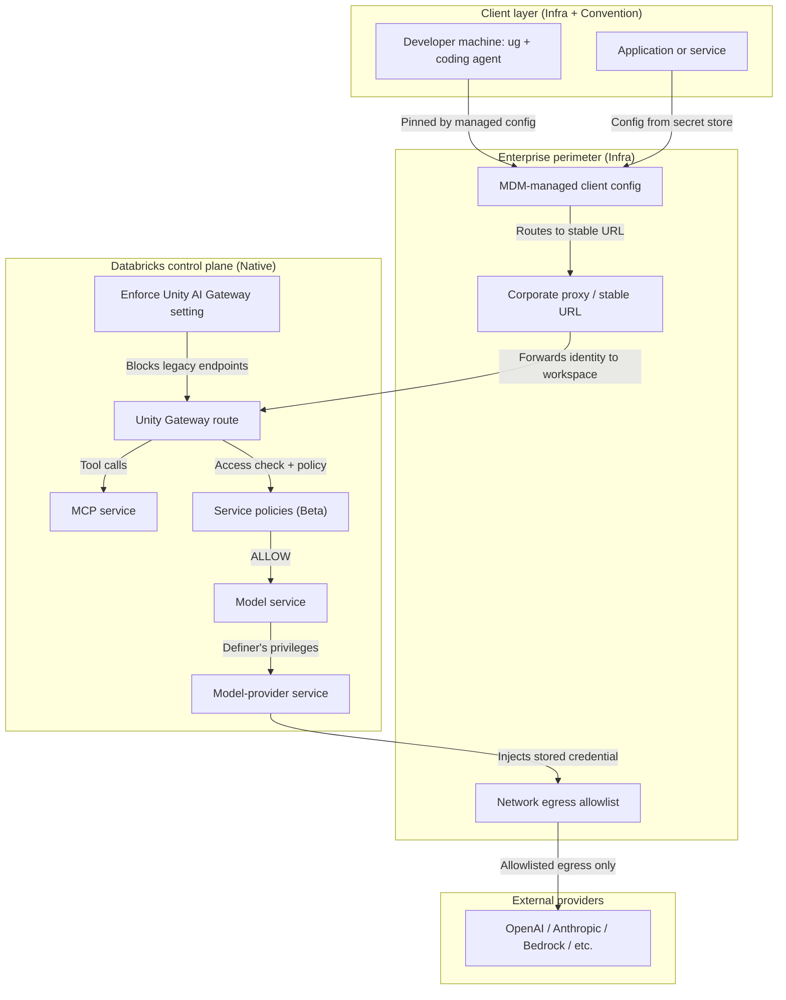
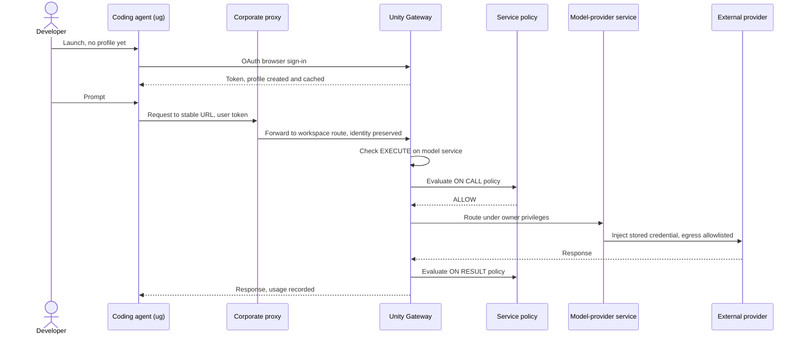

# Enforcing Unity Gateway Across the Enterprise

> **Pillar 4 companion.** How to make Unity Gateway the sanctioned path for model, MCP, and
> provider traffic, how close a rollout can get to immutable, and where the enforcement
> boundary actually sits.

The goal here is a standardized, locked-down setup where developers and applications reach
external models only through enterprise-approved Unity Gateway services. "Immutable" is
treated as a security objective, not a product switch. No single toggle delivers it. You get
close by layering three kinds of control, and this document labels every control by which
layer owns it.

**Jump to:** [Four distinctions](#1-four-things-people-conflate) · [Reference architecture](#2-reference-architecture-cloud-neutral) · [Straight answers](#3-straight-answers) · [Implementation blueprint](#4-implementation-blueprint) · [Threat model](#5-threat-model) · [Confidence and sources](#6-confidence-and-sources)

### How controls are labeled

| Tag | Meaning |
|-----|---------|
| **[Native]** | Native Databricks enforcement. The platform allows or blocks it. |
| **[Infra]** | Enterprise infrastructure enforcement. Your network, identity, device, and secret controls do the work. |
| **[Convention]** | Operational convention only. A default or process that a user or admin can still change. |

Feature status is marked **[GA]** or **[Beta]** as observed in the documentation in
September 2026. Re-check status before you rely on a Beta capability for a compliance
control. See [Confidence and sources](#6-confidence-and-sources).

---

## 1. Four things people conflate

A durable rollout depends on keeping these four apart. Each is owned by a different layer,
and a gap in one is not fixed by strengthening another.

| Concern | The question it answers | Primary owner |
|---------|-------------------------|---------------|
| **Enforcing the gateway within Databricks** | Does Databricks compute route model traffic through Unity Gateway rather than legacy endpoints? | **[Native]** |
| **Distributing client configuration** | Do developer machines and apps point at the right workspace and gateway route without manual wiring? | **[Infra]** + **[Convention]** |
| **Preventing bypass** | Can a user reach an external model without going through the gateway at all? | **[Infra]** (mostly) |
| **Central governance across workspaces** | Are services, permissions, budgets, and audit managed once and applied everywhere? | **[Native]** (metastore) + **[Infra]** (multi-account) |

The common mistake is to assume that enforcing the gateway *inside* Databricks also prevents
bypass *outside* it. It does not. Databricks controls traffic that originates on Databricks
compute. Traffic that originates on a laptop or a non-Databricks VM with a personal API key
never touches the platform, so only your network and identity layers can see it.

---

## 2. Reference architecture (cloud-neutral)

The core is identical on AWS, Azure, and GCP because it is built on Unity Catalog service
objects that live at the metastore level. Cloud differences are isolated to the perimeter
(network egress, DNS, provider IAM) and to regional availability. See
[Multi-workspace and multi-cloud](#28-multi-workspace-and-multi-cloud).



### 2.1 Unity Catalog service objects and permissions **[Native, GA]**

Unity Gateway introduces three securable object types, each addressed by a three-level name
`catalog.schema.name` and governed by standard Unity Catalog grants ([model services][models],
[model-provider services][providers], [MCP services][mcp]):

| Object | What it is | Purpose |
|--------|-----------|---------|
| **Model service** | A Unity Catalog securable that references one or more destinations with routing and fallback between them. | The stable endpoint consumers call. Example: `main.ai_gateway.chat_default`. |
| **Model-provider service** | A Unity Catalog securable that stores an external provider's connection details and encrypted credentials. | Centralizes provider keys. "Databricks does not return credentials on read." ([docs][providers]) |
| **MCP service** | A Unity Catalog securable that provides a Databricks-hosted tool or registers an external MCP server. | Governs agent-to-tool traffic with tool filtering. |

The privilege set on all three is small and explicit ([privileges reference][priv]):

| Privilege | Grants the holder | Withhold from consumers? |
|-----------|-------------------|--------------------------|
| `EXECUTE` | Invoke or query the service | No, this is what consumers need |
| `READ METADATA` | View configuration without invoking | Optional |
| `MANAGE` | Modify, delete, grant and revoke on the service | **Yes** |
| `APPLY TAG` | Apply governed tags | Usually |
| `ALL PRIVILEGES` | All of the above | **Yes** |
| `CREATE SERVICE` (on schema or catalog) | Create new services in that scope | **Yes** |
| `USE CATALOG`, `USE SCHEMA` | Traverse to the parent objects | Only on the sanctioned namespace |

Two behaviors matter for enforcement:

- **Definer's privileges.** "Model services use definer's privileges. Databricks evaluates a
  query against the owner's privileges rather than the caller's." ([docs][models]) A consumer
  with only `EXECUTE` reaches destinations they cannot see directly, because the service owner
  holds the destination grants. This is the mechanism that lets you hand out one governed
  endpoint while hiding provider credentials and raw models.
- **No SQL DDL for creation.** Creating and managing services with SQL is not supported;
  management uses the UI, Catalog Explorer, the REST API, CLI, SDK, or Terraform
  ([docs][models]). That narrows the create surface to paths you can gate in CI.

### 2.2 The Enforce Unity AI Gateway setting **[Native, GA]**

This is the one native switch that makes the gateway mandatory for traffic on a workspace.
Per the migration guide ([KB][mig]):

> "Turn on the **Enforce Unity AI Gateway** setting at the workspace level. This disables
> legacy Gateway experiences so all GenAI traffic can be centrally managed through Unity
> Catalog."

> "Enabling enforcement stops traffic to active legacy endpoints."

Clients change their `base_url` from `/serving-endpoints` to `/ai-gateway/mlflow/v1` and pass
a fully qualified model service name instead of an endpoint name ([KB][mig]). Governance does
not migrate automatically: "Governance configured on legacy Gateway endpoints does not
automatically carry over," so permissions, rate limits, budgets, service policies, and
inference logging must be recreated on the new services before you flip enforcement.

**Scope and limit.** The setting is per workspace. There is no single account-wide toggle, so
in a multi-workspace estate you apply it to every workspace and track that with drift
detection ([§4.5](#45-policy-as-code-and-drift-detection)). It governs traffic that
originates on that workspace's compute. It does not reach a laptop or an external VM.

### 2.3 A stable corporate URL and bootstrap service **[Infra, Convention]**

Each workspace exposes its gateway under its own host, for example
`https://<workspace-host>/ai-gateway/...`. To give clients one durable contract, front the
workspace routes with a stable corporate URL such as `https://ai-gateway.example-corp.com`,
resolved by internal DNS to a reverse proxy that forwards to the correct workspace.

This is advisable for three reasons: clients gain a single name that survives workspace
moves, DNS becomes a central kill switch and routing point, and onboarding no longer bakes a
workspace host into every machine. Weigh three caveats. The proxy is a critical-path
component that needs its own availability and audit story. It must forward the caller's
identity to Databricks unchanged rather than collapse everyone onto one service principal, or
you lose per-user attribution and grants. And it adds no enforcement by itself; a user who
knows a workspace host can still reach it directly unless egress control
([§2.6](#26-enterprise-perimeter)) prevents that.

A lightweight bootstrap service can pair with the URL: on first run a client fetches its
sanctioned config (workspace, model service name, request tags) from an internal endpoint
rather than reading a checked-in file. Keep the bootstrap read-only and unauthenticated only
for non-secret config; credentials still come from OAuth ([§2.4](#24-authentication-and-credential-issuance)).

### 2.4 Authentication and credential issuance **[Native + Infra]**

- **User to machine (U2M), the default for developers.** Agents authenticate with the user's
  Databricks credentials over OAuth rather than long-lived provider keys ([ug quickstart][ug]).
  The gateway checks the caller's Unity Catalog grants on the service. First use triggers a
  browser sign-in that creates the local profile and token cache; refresh is automatic
  thereafter ([§4.2](#42-request-flow)). **[Native]** for the grant check, **[Convention]**
  for which profile is default unless a managed config pins it.
- **Machine to machine (M2M), for apps and jobs.** Use a service principal per service with
  client-credentials OAuth, credentials held in a secret store, never a personal key. See
  [SP and M2M identity](../identity/sp-m2m-identity.md). **[Infra]**
- **Provider credentials stay server-side.** The external key lives inside the model-provider
  service, encrypted, injected gateway-side, and not returned on read ([docs][providers]).
  Consumers never hold it. **[Native]**

### 2.5 Guardrails, rate limits, budgets, routing, monitoring, and audit **[Native]**

| Capability | What it does | Status | Source |
|-----------|--------------|--------|--------|
| **Rate limits** | Per-minute request and token limits at service, user, and group scope; returns HTTP 429 when exceeded. Enforced approximately, so short bursts can exceed the limit before it converges. | **[GA]** | [docs][rate] |
| **Budgets** | Account-level spend thresholds, shared or per user, with alert or block actions. Block is enforced against a near-real-time estimate, so it bounds spend approximately rather than as a hard billed ceiling. Pair with rate limits for a firmer stop. | **[GA]** | [docs][budgets] |
| **Service policies (guardrails)** | Content checks that return ALLOW, DENY, or ASK, evaluated on request (ON CALL) and on response (ON RESULT). Built-ins: `system.ai.block_unsafe_content`, `block_jailbreak`, `block_hallucination`, `detect_sensitive_data`. Custom policies are SQL UDFs. | **[Beta]** | [docs][policies] |
| **Routing** | Traffic splitting across destinations and ordered fallback on 429 or 5xx. | **[GA]** | [docs][models] |
| **Usage monitoring** | `system.ai_gateway.usage` records one row per request with tokens, latency, requester, destination, routing, and request tags. `system.ai_gateway.external_model_spend` estimates external spend. | **[GA]** | [docs][usage] |
| **Payload logging** | Inference tables capture request and response payloads to a Delta table, up to 10 MiB each. | **[GA]** | [docs][inference] |
| **Audit** | `system.access.audit` records access events; `system.billing.usage` is billing truth. | **[GA]** | [docs][usage] |

Because service policies are Beta, treat them as a strong supplementary control rather than
the sole compliance guardrail today, and confirm their status before you depend on them.

### 2.6 Enterprise perimeter **[Infra]**

These controls live outside Databricks and are what actually prevent bypass. They are the
enterprise's responsibility on every cloud, and their mechanics differ by cloud.

| Control | What it enforces | Cloud note |
|---------|------------------|-----------|
| **Serverless egress control** | Restricts outbound connections from Databricks serverless compute to an allowlist, so a notebook cannot call a provider directly. | Native to Databricks serverless; configuration differs per cloud. ([network security][egress]) |
| **Network egress allowlist / firewall** | On corporate networks and non-Databricks VMs, blocks direct egress to provider API domains except through the sanctioned proxy. | Your firewall, cloud NACLs, or SASE. Fully enterprise-owned. |
| **DNS / forward proxy** | Resolves provider domains only through the corporate proxy; sinkholes direct lookups. | Enterprise DNS and proxy. |
| **MDM-managed client config** | Pins the workspace and gateway route on managed devices so the agent cannot be repointed without admin rights. See [§4.4](#44-automation-cli-rest-terraform). | Jamf, Kolide, Intune, per OS. |
| **Secret management** | Holds M2M credentials; developers never see provider keys. | Cloud secret manager or vault. |
| **Provider-side IAM** | At the provider, restrict which source identities and networks may use the corporate account, so a leaked key used from an unknown network is rejected. | Provider console, per provider. |

### 2.7 Separating platform-admin and consumer privileges **[Native]**

The separation is the heart of "users cannot create alternative gateways."

- **Consumers** receive `EXECUTE` on the specific sanctioned services, plus `USE CATALOG` and
  `USE SCHEMA` only on the namespace that holds them. Nothing else.
- **Withhold from consumers:** `CREATE SERVICE` (at both schema and catalog scope), `MANAGE`,
  `ALL PRIVILEGES`, and metastore or account admin roles. Without `CREATE SERVICE` a user
  cannot register a new model, provider, or MCP service; without `MANAGE` they cannot rotate
  a credential, change a destination, or re-grant access ([privileges reference][priv]).
- **Deployers** (a CI service principal) hold `CREATE SERVICE` and `MANAGE` on the gateway
  catalog so that all creation flows through reviewed automation, not ad hoc user action.
- **Default access to `system.ai`.** Remove broad default `EXECUTE` on the `system.ai` schema
  from the account users group and grant it selectively on approved models, so consumers reach
  only sanctioned models rather than every foundation model. Confirm the current default on
  your metastore before and after ([foundation model permissions][fmperm]).

### 2.8 Multi-workspace and multi-cloud

- **One definition, many workspaces.** Model services are metastore-level: "Define an LLM
  endpoint once and use it from any workspace attached to the same metastore." ([docs][models])
  Grants and services are shared across those workspaces automatically. **[Native, GA]**
- **The Enforce setting is per workspace**, so apply it to each workspace on the metastore and
  detect drift centrally ([§4.5](#45-policy-as-code-and-drift-detection)).
- **Multiple metastores or accounts** (common across clouds) do not share services. You
  replicate the service definitions and grants per metastore through the same Terraform, and
  treat budgets, which are account-level, per account. **[Infra]** for the cross-account glue.
- **Cloud parity.** The service model, privileges, routing, budgets, and rate limits are
  documented on AWS, Azure, and GCP. Differences concentrate in regional availability, in the
  perimeter mechanics of [§2.6](#26-enterprise-perimeter), and in government regions. Unity
  Gateway and system tables are not available in AWS GovCloud or Azure Government regions. Do
  not assume a feature is present in a given region; confirm on the cloud-specific region
  support page ([region support][region]).

---

## 3. Straight answers

**Can Databricks natively force every client to use one gateway URL?**
Partly, and within a boundary. The **Enforce Unity AI Gateway** setting makes the gateway
mandatory for traffic that originates on a given workspace and stops legacy endpoints
([KB][mig]). **[Native, GA]** It is per workspace, not one global URL, and it does not reach
traffic that starts off-platform. A single corporate URL for clients is an enterprise pattern
you build with DNS and a proxy ([§2.3](#23-a-stable-corporate-url-and-bootstrap-service)),
**[Infra]**, not a native Databricks object.

**Can users create or configure alternative Unity Gateway services?**
Only if they hold `CREATE SERVICE` or `MANAGE`. Withhold both from consumers and grant them
only to a deployer service principal, and users cannot register or reconfigure services
([privileges reference][priv]). **[Native, GA]**

**Which privileges must be withheld?**
From consumers: `CREATE SERVICE` (schema and catalog scope), `MANAGE`, `ALL PRIVILEGES`,
`APPLY TAG`, broad default `EXECUTE` on `system.ai`, and metastore or account admin roles.
Grant consumers only `EXECUTE` on named services plus `USE CATALOG` and `USE SCHEMA` on the
sanctioned namespace ([§2.7](#27-separating-platform-admin-and-consumer-privileges)). **[Native, GA]**

**Can direct calls to external model providers be blocked?**
Not by Databricks alone, and this is expected: the platform governs traffic on its own
compute, where serverless egress control can restrict outbound connections **[Native]**. Calls
that start on a laptop or a non-Databricks VM are blocked only by your network egress
allowlist, DNS or forward proxy, and provider-side IAM
([§2.6](#26-enterprise-perimeter)). **[Infra]** Blocking bypass is an enterprise-perimeter job.

**What remains outside Databricks' enforcement boundary?**
Unmanaged devices, personal provider API keys used off-platform, workloads running in
networks Databricks does not control, and any direct egress from arbitrary compute to a
provider. Databricks cannot see or stop traffic that never reaches it. These are covered by
[§2.6](#26-enterprise-perimeter) or accepted as residual risk in the
[threat model](#5-threat-model).

**Is a stable corporate proxy URL in front of workspace gateway URLs supported and advisable?**
Supported, because clients call an ordinary HTTPS endpoint and a reverse proxy can forward to
it. Advisable when you want one durable client contract, central DNS control, and a kill
switch. Do it only if the proxy forwards caller identity unchanged, carries its own
availability and audit, and is paired with egress control so it cannot be sidestepped
([§2.3](#23-a-stable-corporate-url-and-bootstrap-service)). **[Infra]**

---

## 4. Implementation blueprint

### 4.1 Control-plane components

| Component | Layer | Role |
|-----------|-------|------|
| Gateway catalog and schema, e.g. `main.ai_gateway` | [Native] | Holds all sanctioned services under one governed namespace. |
| Model-provider services | [Native] | Encrypted provider credentials, one per provider or environment. |
| Model services | [Native] | The stable endpoints consumers call, with routing and fallback. |
| MCP services | [Native] | Governed external tool access. |
| Service policies | [Native, Beta] | Content guardrails on request and response. |
| Deployer service principal | [Native] + [Infra] | The only identity with `CREATE SERVICE` and `MANAGE`; used by CI. |
| Terraform + CI pipeline | [Infra] | Source of truth for services, grants, and enforcement. |
| Corporate URL, DNS, reverse proxy | [Infra] | Stable client contract and routing kill switch. |
| MDM client-config profiles | [Infra] | Pin workspace and route on managed devices. |
| Egress allowlist, forward proxy, secret store | [Infra] | Prevent bypass, hold M2M credentials. |
| System tables and dashboards | [Native] | Usage, spend, and audit. |

### 4.2 Request flow



### 4.3 Example access model

| Group | Services | Privileges | Can create or change services? |
|-------|----------|-----------|--------------------------------|
| `ai-platform-admins` | All | Owner or `MANAGE` on the gateway catalog | Yes, by role |
| `ai-gateway-deployers` (CI SP) | All | `CREATE SERVICE`, `MANAGE` on `main.ai_gateway` | Yes, through reviewed automation only |
| `ai-gateway-consumers` | Named services | `EXECUTE` on the service, `USE CATALOG` + `USE SCHEMA` on `main.ai_gateway` | No |
| Everyone else | None | None on `main.ai_gateway`; reduced default on `system.ai` | No |

### 4.4 Automation: CLI, REST, Terraform

**Create services and grants (confirmed CLI and REST).** SQL DDL for creation is not
supported; use these paths ([create model services][create]):

```bash
# 1. Model-provider service (holds the encrypted external key)
databricks ai-gateway create-model-provider-service schemas/main.ai_gateway openai_prod \
  --json '{ "config": { "provider_type": "openai", "auth_config": { "api_key": "..." } } }'

# 2. Model service consumers call (references the provider, adds routing + fallback)
databricks ai-gateway create-model-service schemas/main.ai_gateway chat_default \
  --json '{ "config": { "routing": { "destinations": [ /* provider or foundation model */ ] } } }'

# 3. Least-privilege grant to consumers (withhold CREATE SERVICE and MANAGE)
databricks grants update model_service main.ai_gateway.chat_default \
  --json '{ "changes": [ { "principal": "ai-gateway-consumers", "add": ["EXECUTE"] } ] }'
```

REST equivalents live under `/api/2.1/unity-catalog/model-services` (and the
`model-provider-services`, `mcp-services` siblings), with grants under
`/api/2.1/unity-catalog/permissions/...` ([docs][create]). The Python SDK exposes the same
under `w.ai_gateway.create_model_service(...)` and `w.grants.update(...)`.

**Terraform (confirmed resource names).** These resources exist in the Databricks provider:
`databricks_ai_gateway_model_service`, `databricks_ai_gateway_model_provider_service`,
`databricks_ai_gateway_mcp_service`, and `databricks_grant` / `databricks_grants`
([provider docs][tfmodel]). A minimal shape, with the credential passed from a variable, never
hard-coded:

```hcl
resource "databricks_ai_gateway_model_provider_service" "openai_prod" {
  parent  = "main.ai_gateway"
  name    = "openai_prod"
  comment = "Central OpenAI credential, injected gateway-side"
  # config { ... } — confirm the exact schema against the provider docs for your version
}

resource "databricks_ai_gateway_model_service" "chat_default" {
  parent  = "main.ai_gateway"
  name    = "chat_default"
  comment = "Stable endpoint consumers call"
  # config { routing { ... } }
}

resource "databricks_grant" "consumers_execute" {
  model_service = databricks_ai_gateway_model_service.chat_default.id
  principal     = "ai-gateway-consumers"
  privileges    = ["EXECUTE"]
  # Confirm the service securable attribute name for your provider version.
}
```

Pin the provider version and confirm the nested `config` and grant securable attributes
against the provider docs, because the resource names are confirmed but the full argument
schema evolves. Asset Bundles also support a `grants` block on a model service resource, so
consumer grants can ship with the bundle that defines the service ([create model services][create]).

**Pin the client on managed devices (Infra, the real enforcement of "use this workspace").**
The workspace is encoded in each agent's provider `base_url`, and each agent CLI honors an
admin-managed config that outranks user config and environment variables. Push these with MDM
and let MDM own the file so a reconfigure cannot quietly drop the pin. Verify the exact flags
and paths on your `ug` build, since every build reports the same version string; check
`ug --help`.

Codex, `/etc/codex/managed_config.toml` (root-owned):

```toml
model_provider = "Databricks"

[model_providers.Databricks]
name     = "Databricks"
base_url = "https://<pinned-workspace-host>/ai-gateway/codex/v1"
wire_api = "responses"

[model_providers.Databricks.auth]
command             = "ug"
args                = ["auth-token", "--host", "https://<pinned-workspace-host>", "--profile", "<profile>"]
refresh_interval_ms = 900000
```

Claude Code, `/Library/Application Support/ClaudeCode/managed-settings.json` (macOS):

```json
{
  "env": { "ANTHROPIC_BASE_URL": "https://<pinned-workspace-host>/ai-gateway/anthropic" },
  "apiKeyHelper": "~/.databricks/model-serving-token.json"
}
```

Command-based auth means the token refreshes automatically, and first use with no profile
triggers the browser OAuth sign-in that creates the profile. The convention-level fallback,
for machines without MDM, is a one-time `ug configure --workspace https://<pinned-workspace-host>`,
which authenticates if needed and saves the workspace as the default so later launches skip
the picker. A user can still change that default, which is why the managed config is the
control you rely on. See [ug quickstart][ug] for client setup.

### 4.5 Policy-as-code and drift detection

Keep the desired state in Terraform and verify reality against it on a schedule:

1. **Plan as a gate.** Run `terraform plan -detailed-exitcode` in CI. A nonzero diff means
   someone changed a service or grant out of band; fail the build and alert.
2. **Enumerate services and diff.** List services per schema through the REST API or CLI and
   compare against the sanctioned set in Terraform. Any service not in the set is unsanctioned
   and is investigated or removed.
3. **Assert the privilege invariant.** Read grants on the gateway catalog and fail if any
   consumer group holds `CREATE SERVICE`, `MANAGE`, or `ALL PRIVILEGES`, or if a broad default
   `EXECUTE` returned to `system.ai`.
4. **Confirm enforcement per workspace.** For each workspace on the metastore, verify the
   Enforce Unity AI Gateway setting is on, and alert on any workspace where it is off.
5. **Watch usage for the tell.** Query `system.ai_gateway.usage` for calls whose destination
   or requester falls outside the sanctioned pattern, and reconcile spend against
   `system.billing.usage` ([docs][usage]).

### 4.6 Phased rollout and migration

| Phase | Action | Exit criterion |
|-------|--------|----------------|
| 1. Inventory | Find every current model, external-model, and legacy endpoint in use, from `system.ai_gateway.usage` and serving endpoints. | A complete map of who calls what. |
| 2. Stand up | Create provider and model services under `main.ai_gateway` via Terraform; attach routing, rate limits, and logging. | Sanctioned services exist and are tested. |
| 3. Least privilege | Grant consumers `EXECUTE` only; move `CREATE SERVICE` and `MANAGE` to the deployer SP; reduce default `system.ai` access. | The privilege invariant holds in CI. |
| 4. Pilot | Repoint a pilot group's clients (managed config), keep legacy paths open. | Pilot traffic flows through the gateway with correct attribution. |
| 5. Enforce | Turn on Enforce Unity AI Gateway per workspace after governance is recreated on the new services. | Legacy endpoints stop serving; clients use `/ai-gateway/...`. |
| 6. Perimeter | Apply serverless egress control and network egress allowlists so direct provider calls are blocked. | Direct egress to providers is denied except through the proxy. |
| 7. Scale and hold | Roll the same Terraform to every workspace and metastore; run drift detection continuously. | All workspaces enforced; drift alerts are green. |

Recreate permissions, rate limits, budgets, policies, and inference logging before Phase 5,
because none of it carries over from legacy endpoints ([KB][mig]).

### 4.7 Break-glass

Keep one audited, time-boxed escape path so an incident does not force people to disable
governance broadly:

- **Preferred:** a dedicated break-glass model service with a direct provider destination,
  granted to a small on-call group only for the duration of an incident, then revoked. Every
  call is still recorded in `system.ai_gateway.usage`.
- **Last resort:** a platform admin turns off the Enforce setting on a single workspace. This
  is high blast radius, so it is logged, approved, alarmed, and reverted on a fixed timer.
- Never distribute a shared personal provider key as break-glass; it defeats attribution and
  outlives the incident.

### 4.8 Known limitations

- The Enforce setting is per workspace, so multi-workspace enforcement is your drift-detection
  responsibility, not a single switch.
- Budgets and rate limits are enforced approximately against near-real-time estimates, so they
  bound spend and rate rather than guaranteeing a hard ceiling; pair them for a firmer stop
  ([budgets][budgets], [rate limits][rate]).
- Service policies are **[Beta]**; confirm status before relying on them for compliance
  ([docs][policies]).
- Databricks cannot enforce anything off-platform. Bypass prevention depends on the enterprise
  perimeter ([§2.6](#26-enterprise-perimeter)).
- Client pinning depends on each agent CLI's managed-config mechanism and on MDM ownership of
  the file; `ug` itself has no server-enforced "lock workspace" flag, and its build version
  string is not a reliable feature signal.
- GCP, AWS, and Azure differ in region availability and perimeter mechanics, and government
  regions do not support Unity Gateway; confirm per cloud ([region support][region]).

---

## 5. Threat model

| # | Threat | Vector | Controls | Type | Residual risk |
|---|--------|--------|----------|------|---------------|
| 1 | Direct provider credentials | An app embeds the corporate provider key and calls the provider directly | Keep keys only in model-provider services, never returned on read; provider-side IAM restricts source identity and network | [Native] + [Infra] | Low if keys never leave the provider service and provider IAM is scoped |
| 2 | Personal API keys | A developer uses their own paid key from a laptop | Network egress allowlist and forward proxy block provider domains; MDM removes stored keys; policy and expense controls | [Infra] | Medium on unmanaged or off-network devices |
| 3 | Alternate gateway URLs | A client is repointed at a non-sanctioned workspace or endpoint | MDM-managed client config pins the route; corporate DNS resolves only the sanctioned URL; egress allowlist | [Infra] | Low on managed devices, higher on unmanaged |
| 4 | Users with CREATE SERVICE or MANAGE | A user registers their own service or rehomes a credential | Withhold both from consumers; grant only to the deployer SP; CI drift detection asserts the invariant | [Native] | Low while the privilege invariant is enforced in CI |
| 5 | Unmanaged devices | A personal machine with no managed config | Conditional access requires a managed, compliant device before it reaches the workspace or proxy; network segmentation | [Infra] | Medium; this is the classic gap, reduce it with device posture checks |
| 6 | Workloads outside governed networks | A VM in an ungoverned subnet or another cloud | Cloud egress controls, private connectivity to Databricks, provider IAM by source network | [Infra] | Medium; depends on how completely you own the network |
| 7 | Configuration drift | Enforce turned off, a rogue service, or a widened grant | Terraform as source of truth, `terraform plan` gate, service enumeration diff, per-workspace enforcement check, usage anomaly queries | [Native] + [Infra] | Low with continuous drift detection, higher if checks are periodic only |

The recurring pattern: threats that live on Databricks compute (4, and 1 in part) are closed
by native controls; threats that originate off-platform (2, 3, 5, 6) are closed only by the
enterprise perimeter; drift (7) needs both.

---

## 6. Confidence and sources

Confirmed items were verified against official documentation in September 2026. Items marked
Medium rest on documentation that was read but not re-verified line by line here, or on
behavior that is version-dependent.

| Claim | Confidence | Basis |
|-------|-----------|-------|
| Enforce Unity AI Gateway setting exists, disables legacy experiences, stops legacy traffic; route changes to `/ai-gateway/mlflow/v1`; governance does not carry over | High | [Migration guide][mig], quoted directly |
| Three service object types are Unity Catalog securables with the stated privilege set | High | [Model services][models], [providers][providers], [MCP][mcp], [privileges reference][priv] |
| Definer's privileges on model services; no SQL DDL for creation; metastore-level scope | High | [Model services][models], quoted directly |
| Provider credentials encrypted, not returned on read; supported provider list | High | [Model-provider services][providers], quoted directly |
| Service privileges: EXECUTE, MANAGE, READ METADATA, APPLY TAG, ALL PRIVILEGES; CREATE SERVICE at schema or catalog | High | [Privileges reference][priv], quoted directly |
| Terraform resource names `databricks_ai_gateway_model_service`, `..._model_provider_service`, `..._mcp_service`, `databricks_grant(s)` exist | High | Provider `docs/resources` listing; nested schema not re-verified |
| CLI `databricks ai-gateway create-model-service`, REST `/api/2.1/unity-catalog/model-services`, SDK `w.ai_gateway.create_model_service` | High | [Create model services][create] |
| Service policies: Beta, four built-ins, ON CALL / ON RESULT, ALLOW/DENY/ASK, SQL UDF custom | High | [Service policies][policies], quoted directly |
| Budgets account-level, alert or block, enforced approximately; rate limits QPM/TPM, HTTP 429, enforced approximately | Medium to High | [Budgets][budgets], [rate limits][rate] |
| System tables `system.ai_gateway.usage`, `..._external_model_spend`; inference tables 10 MiB payload cap | Medium to High | [Usage tracking][usage], [inference tables][inference] |
| Serverless egress control restricts outbound from serverless compute | Medium | [Network security][egress]; configuration differs per cloud |
| Not available in AWS GovCloud or Azure Government; region availability varies by cloud | Medium | [Region support][region] |
| Client pinning via each agent CLI's managed config outranks user config and env vars; command-based auth auto-refreshes; first use creates the profile | Medium to High | Agent-CLI managed-config behavior and [ug quickstart][ug]; version-dependent, verify on your build |

Do not assume feature parity across AWS, Azure, and GCP for regional availability or perimeter
mechanics. The service and governance model is common; the perimeter and region details are
not. Confirm on the cloud-specific pages before you commit a control.

<!-- Reference links -->
[overview]: https://docs.databricks.com/aws/en/ai-gateway/
[gov]: https://docs.databricks.com/aws/en/ai-gateway/ai-governance
[mig]: https://kb.databricks.com/en_US/unity-catalog/migration-guide-moving-to-unity-ai-gateway
[models]: https://docs.databricks.com/aws/en/ai-gateway/model-services
[providers]: https://docs.databricks.com/aws/en/ai-gateway/model-provider-services
[mcp]: https://docs.databricks.com/aws/en/agents/mcp-tools/mcp-services
[create]: https://docs.databricks.com/aws/en/ai-gateway/create-model-services
[priv]: https://docs.databricks.com/aws/en/data-governance/unity-catalog/manage-privileges/privileges
[policies]: https://docs.databricks.com/aws/en/data-governance/unity-catalog/service-policies
[budgets]: https://docs.databricks.com/aws/en/ai-gateway/budgets
[rate]: https://docs.databricks.com/aws/en/ai-gateway/rate-limits
[usage]: https://docs.databricks.com/aws/en/ai-gateway/usage-tracking
[inference]: https://docs.databricks.com/aws/en/ai-gateway/inference-tables
[fmperm]: https://docs.databricks.com/aws/en/machine-learning/foundation-model-apis/model-uc-permissions
[egress]: https://docs.databricks.com/aws/en/security/network/
[region]: https://docs.databricks.com/aws/en/resources/feature-region-support
[tfmodel]: https://registry.terraform.io/providers/databricks/databricks/latest/docs
[ug]: ug-quickstart.md
