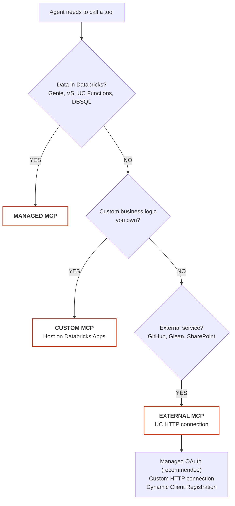

<!--
  Synced from databricks-fieldkit on 2026-09-14
  Sources: mcp/overview.md, mcp/managed-mcp.md, mcp/custom-mcp.md, mcp/external-mcp.md, mcp/external-connection-tools.md
  Public docs grounding:
    - https://docs.databricks.com/aws/en/generative-ai/mcp/
  This file is auto-prepared and human-reviewed before publish.
-->

# MCP Overview — Which Type, When, and How

> **Cloud**: Agnostic (cloud-specific notes inline where they differ)
> **Status**: Public Preview (Managed + External); GA (Custom via Databricks Apps)
> **Databricks docs**: https://docs.databricks.com/aws/en/generative-ai/mcp/
> **Last verified**: 2026-03-06

---

## TL;DR

Databricks supports three MCP server types. All use the same `DatabricksMCPClient` API and the same `{workspace}/api/2.0/mcp/...` URL namespace. Unity Catalog enforces permissions on every call regardless of server type.

| Type | What it is | Auth model | Use when |
|---|---|---|---|
| **Managed** | Databricks-hosted MCP wrapping built-in data services | OBO or M2M via `DatabricksMCPClient` | Your agent needs Genie, Vector Search, UC Functions, or DBSQL |
| **Custom** | Your own MCP server hosted as a Databricks App | OAuth only (OBO or M2M); no PATs | You have custom business logic to expose as tools |
| **External** | Third-party MCP servers (GitHub, Glean, etc.) proxied through a UC HTTP connection | Managed OAuth / Custom HTTP / DCR | You need external services; want UC to govern access |

---

## Decision Tree



---

## URL Patterns (Cheatsheet)

```
# Managed MCP — Databricks-hosted servers
Genie:          {host}/api/2.0/mcp/genie/{genie_space_id}
Vector Search:  {host}/api/2.0/mcp/vector-search/{catalog}/{schema}/{index_name}
UC Functions:   {host}/api/2.0/mcp/functions/{catalog}/{schema}/{function_name}
              OR {host}/api/2.0/mcp/functions/{catalog}/{schema}   ← entire schema
DBSQL:          {host}/api/2.0/mcp/sql

# External MCP — proxied through UC HTTP connection
External proxy: {host}/api/2.0/mcp/external/{uc_connection_name}
  GitHub:       {host}/api/2.0/mcp/external/github_connection
  Glean:        {host}/api/2.0/mcp/external/glean_connection

# Custom MCP — your server hosted on Databricks Apps
Custom:         https://{app-url}/mcp
```

---

## Auth Comparison

| Scenario | Token type | How to obtain |
|---|---|---|
| Local dev / Claude Code | User OAuth (PKCE) | `mcp-remote` with `--static-oauth-client-info` |
| Databricks App (OBO) | User's forwarded token | `ModelServingUserCredentials()` from databricks.sdk |
| Databricks App (M2M) | App SP credentials | `WorkspaceClient()` with no args (SDK auto-discovers) |
| External Azure app (federation) | Databricks OAuth token | Exchange Azure MI token via RFC 8693 token exchange |
| PAT (dev/testing only) | Personal Access Token | `--header "Authorization: Bearer <PAT>"` in mcp-remote |

> **Key rule**: Custom MCP servers hosted on Databricks Apps do NOT support PATs — OAuth only.
> PATs work only for Managed and External MCP servers.

---

## Standard Client Pattern (same for all server types)

```python
from databricks_mcp import DatabricksMCPClient
from databricks.sdk import WorkspaceClient

# Works for managed, custom, and external MCP
workspace_client = WorkspaceClient()               # auto-discovers credentials
mcp_client = DatabricksMCPClient(
    server_url="https://<workspace>/api/2.0/mcp/...",
    workspace_client=workspace_client,
)

tools  = mcp_client.list_tools()                   # discover available tools
result = mcp_client.call_tool("tool_name", {"param": "value"})
```

### Dependencies

```bash
pip install "mcp>=1.9" "databricks-sdk[openai]" "mlflow>=3.1.0" \
            "databricks-agents>=1.0.0" "databricks-mcp"
```

---

## UC Permissions enforced at every layer

| Server type | What UC enforces |
|---|---|
| Managed — Genie | `CAN_USE` on Genie space; row filters + column masks on underlying tables |
| Managed — Vector Search | `CAN_SELECT` on the VS index |
| Managed — UC Functions | `EXECUTE` privilege on each function |
| Managed — DBSQL | Full UC table/schema/catalog privileges |
| External | `USE CONNECTION` on the UC HTTP connection |
| Custom | Whatever your tool code enforces (OBO → user identity propagated; M2M → SP identity) |

---

## Viewing all configured MCP servers

Workspace UI → **Agents** → **MCP Servers** tab. Shows endpoint URLs for all managed and external servers.

---

## Transport requirement

**All Databricks MCP servers use Streamable HTTP transport.** WebSocket and stdio-based MCP servers are  in this context.

---

## Related files

- [`managed-mcp.md`](managed-mcp.md) — detailed setup for Genie, VS, UC Functions, DBSQL
- [`custom-mcp.md`](custom-mcp.md) — build and deploy your own MCP server
- [`external-mcp.md`](external-mcp.md) — UC HTTP connections, Managed OAuth, DCR
- [`connect-external-clients.md`](connect-external-clients.md) — Claude Code, Cursor, Claude Desktop
- [`../auth/obo-passthrough.md`](../auth/obo-passthrough.md) — OBO auth deep-dive

# Managed MCP Servers

> **Cloud**: Agnostic
> **Status**: Public Preview
> **Databricks docs**: https://docs.databricks.com/aws/en/generative-ai/mcp/managed-mcp
> **Last verified**: 2026-03-06

---

## TL;DR

Databricks-hosted MCP servers that wrap built-in platform services. Your agent calls them exactly like any MCP server — no extra infrastructure. UC permissions are always enforced; agents can only access data the calling user (or app SP) is authorized to see.

**Five server types**: Genie One (Beta) · Genie Agent · AI Search · UC Functions · Databricks SQL

---

## Prerequisites

- Workspace with **Managed MCP Servers** preview enabled
- Python 3.12+
- Serverless compute enabled
- OAuth auth: `databricks auth login --host https://<workspace-hostname>`

```bash
pip install "mcp>=1.9" "databricks-sdk[openai]" "mlflow>=3.1.0" \
            "databricks-agents>=1.0.0" "databricks-mcp"
```

---

## Server Types

### 1. Genie One (Beta)

Workspace-wide agentic analytics using Genie Ontology. Supports inline visualization via MCP App.

```
URL: {host}/api/2.0/mcp/genie
OAuth scope: genie
Access: Read-only
```

**UC permissions required**: User must have access to the Genie Ontology resources for the workspace.

> Source: https://docs.databricks.com/aws/en/generative-ai/mcp/managed-mcp

---

### 2. Genie Agent (was "Genie Space MCP")

Exposes a single Genie Agent as an MCP tool. Agent sends natural language → Genie runs NL-to-SQL → returns results.

```
URL: {host}/api/2.0/mcp/genie/{genie_space_id}
OAuth scope: genie
Access: Read-only
```

**UC permissions required**:
- `CAN_USE` on the Genie space (granted via Genie UI or API)
- Underlying table row filters and column masks are enforced per `current_user()`

**Known limitation**: History is NOT passed to Genie API when invoked as an MCP tool. Each call is stateless. For conversational Genie in an agent, use "Genie in a multi-agent system" pattern instead.

**Long-running queries**: Genie queries that exceed the MCP timeout require polling. Handle `tool_call` responses that return a polling token.

---

### 3. AI Search (formerly Vector Search)

Exposes an AI Search index as an MCP tool. Agent sends a query string → returns ranked document chunks. Requires Databricks managed embeddings.

```
URL: {host}/api/2.0/mcp/ai-search/{catalog}/{schema}/{index_name}
OAuth scope: ai-search  (legacy alias: vector-search — still works)
Access: Read-only
```

> **Breaking rename**: The server was called "Vector Search MCP" with URL prefix `/api/2.0/mcp/vector-search/`. Both the name and recommended URL have changed. Legacy URL prefixes remain functional. Update OAuth scopes to `ai-search` for new integrations.
> Source: https://docs.databricks.com/aws/en/generative-ai/mcp/managed-mcp

**UC permissions required**:
- `CAN_SELECT` on the VS index

---

### 4. UC Functions MCP

Exposes one function or an entire schema of functions as MCP tools. Each function becomes a separately callable tool.

```
URL (single function): {host}/api/2.0/mcp/functions/{catalog}/{schema}/{function_name}
URL (entire schema):   {host}/api/2.0/mcp/functions/{catalog}/{schema}
Access: Determined by function definition
```

**UC permissions required**:
- `EXECUTE` on each function
- `USE SCHEMA` on the schema
- `USE CATALOG` on the catalog

---

### 5. Databricks SQL MCP

Exposes a SQL execution interface. Agent generates and runs SQL against any table the user or service principal has access to.

```
URL: {host}/api/2.0/mcp/sql
Access: Read and Write (table privileges enforced per caller)
```

**Use case**: Best for Claude Code and Cursor workflows where the developer wants to query data directly via natural language SQL generation. Not recommended for production agents (schema mutation risk).

**Long-running queries**: Same polling pattern as Genie.

---

## Standard Usage Pattern

```python
from databricks_mcp import DatabricksMCPClient
from databricks.sdk import WorkspaceClient

host = "https://<workspace-hostname>"
workspace_client = WorkspaceClient()           # auto-discovers from env / profile

# Connect to a managed server
mcp_client = DatabricksMCPClient(
    server_url=f"{host}/api/2.0/mcp/genie/{GENIE_SPACE_ID}",
    workspace_client=workspace_client,
)

# Discover tools
tools = mcp_client.list_tools()
print([t.name for t in tools])

# Call a tool
result = mcp_client.call_tool(
    "query_genie",
    {"question": "What are the top 5 deals by amount?"},
)
print(result)
```

---

## Single-turn agent pattern (LLM + MCP tools)

```python
from openai import OpenAI
from databricks.sdk import WorkspaceClient
from databricks_mcp import DatabricksMCPClient
import json

host = "https://<workspace-hostname>"
w = WorkspaceClient()
mcp = DatabricksMCPClient(server_url=f"{host}/api/2.0/mcp/functions/my_catalog/my_schema", workspace_client=w)

# 1. Fetch tool specs
tools = mcp.list_tools()
openai_tools = [t.to_openai_tool() for t in tools]   # DatabricksMCPClient converts format

# 2. Initial LLM call
client = OpenAI(base_url=f"{host}/serving-endpoints/databricks-claude-3-7-sonnet/v1", api_key="token")
messages = [{"role": "user", "content": "What is the attainment for alice@example.com?"}]
response = client.chat.completions.create(model="databricks-claude-3-7-sonnet", messages=messages, tools=openai_tools)

# 3. Execute tool calls
for tool_call in response.choices[0].message.tool_calls or []:
    tool_result = mcp.call_tool(tool_call.function.name, json.loads(tool_call.function.arguments))
    messages.append({"role": "tool", "tool_call_id": tool_call.id, "content": str(tool_result)})

# 4. Follow-up LLM call with tool results
final_response = client.chat.completions.create(model="databricks-claude-3-7-sonnet", messages=messages)
print(final_response.choices[0].message.content)
```

---

## MLflow deployment — declaring resources

When logging an agent that uses managed MCP servers, declare the resources at log time:

```python
import mlflow
from mlflow.models.resources import (
    DatabricksFunction, DatabricksVectorSearchIndex, DatabricksApp
)

with mlflow.start_run():
    mlflow.pyfunc.log_model(
        "agent",
        python_model=MyAgent(),
        resources=[
            DatabricksFunction("my_catalog.my_schema.my_function"),
            DatabricksVectorSearchIndex("my_catalog.my_schema.my_index"),
            # For custom MCP on Databricks Apps:
            DatabricksApp("custom-mcp-server"),
        ],
    )
```

---

## Retrieve required resources programmatically

```python
# Auto-detect what resources an MCP server needs
resources = mcp_client.get_databricks_resources(server_url)
```

---

## Viewing all managed servers

Workspace UI → **Agents** → **MCP Servers** tab. Lists endpoint URLs for all configured servers.

---

## Gotchas

| Issue | Detail |
|---|---|
| Genie statelessness | History not passed → each MCP call is a fresh conversation. Use multi-agent Genie pattern if you need history. |
| Long-running queries | Genie and DBSQL may exceed MCP timeout → implement polling on the returned token |
| `is_member()` in row filters | Does NOT evaluate OBO caller's groups when queries run under Genie's execution identity. Use `current_user()` + allowlist table instead. See [`../governance/row-filters.md`](../governance/row-filters.md) |
| AI Search (formerly Vector Search) rename | URL prefix changed from `/api/2.0/mcp/vector-search/` to `/api/2.0/mcp/ai-search/`; OAuth scope changed from `vector-search` to `ai-search`. Legacy prefixes still work but update new integrations. |
| VS / AI Search index permissions | Only `CAN_SELECT` is available for AI Search indexes — no finer-grained permission |

---

## Related files

- [`overview.md`](overview.md) — MCP type comparison and decision tree
- [`custom-mcp.md`](custom-mcp.md) — build your own MCP server
- [`external-mcp.md`](external-mcp.md) — third-party MCP via UC HTTP connections
- [`../auth/obo-passthrough.md`](../auth/obo-passthrough.md) — OBO auth patterns

# Custom MCP Servers on Databricks Apps

> **TL;DR**: Host your own MCP server as a Databricks App using FastMCP + uv. Auth is OAuth-only (PATs ). For OBO identity use `X-Forwarded-Email` (proxy-injected header, cannot be forged by the calling app) + M2M SQL with explicit caller `WHERE` clause. `WorkspaceClient()` (no args) for M2M. Wrap with pure ASGI `ExtractTokenMiddleware` + `uvicorn.run()` — do NOT use `mcp.run()` if you need middleware.
>
> **⚠️ Do NOT use `ModelServingUserCredentials()` for Databricks Apps MCP servers** — it only works in Databricks Model Serving. In Apps context it silently falls back to M2M (returns SP identity, not user identity). See [Two-proxy problem](#two-proxy-problem) below.

---

## When to use Custom MCP

| Use Case | Use Custom MCP |
|---|---|
| Data operations not covered by Genie/VS/UC Functions | Yes |
| Multi-step workflows (read + write + notify) | Yes |
| System integrations (CRM sync, approval workflows) | Yes |
| UC row-filtered data access with OBO identity | Yes |
| Simple NL-to-SQL query | No — use Managed MCP (Genie) |
| Document Q&A | No — use Managed MCP (VS) |
| Pure computation | No — use UC Functions |

---

## Prerequisites

- Databricks Apps enabled in workspace
- OAuth app integrations quota available (account-level limit: 1000 across all apps on shared SE accounts)
- `databricks apps create` auto-creates one OAuth integration per app
- SQL warehouse ID for statement execution (if tools query UC)

---

## Project Structure

```
mcp-server/
├── app.yaml          ← Databricks Apps entrypoint
├── pyproject.toml    ← uv project + dependencies
├── requirements.txt  ← MUST contain just "uv"
└── server/
    ├── __init__.py
    └── main.py
```

**`requirements.txt`** — exactly one line:
```
uv
```

**`pyproject.toml`** — minimal working config:
```toml
[project]
name = "my-mcp-server"
version = "0.1.0"
requires-python = ">=3.11"
dependencies = [
    "mcp[cli]>=1.9",
    "databricks-sdk>=0.40.0",
]
# No [project.scripts] needed when using "uv run python server/main.py"
# No [tool.uv] package = true needed
```

**`app.yaml`** — use direct Python invocation:
```yaml
command: ["uv", "run", "python", "server/main.py"]

env:
  - name: SQL_WAREHOUSE_ID
    value: "<warehouse-id>"

# Optional: declare serving endpoint resources for M2M access
resources:
  - serving_endpoint:
      name: "<endpoint-name>"
      permission: CAN_QUERY
```

> **Why `uv run python server/main.py` and not `uv run my-script`?**
> A named entry point requires `[build-system]` in pyproject.toml for uv to install it.
> Direct Python invocation avoids the build step entirely.
> If you do use a named script entry point, add `[tool.uv]\npackage = true` AND a `[build-system]` block.

---

## Two-proxy problem

When a Streamlit app (Proxy 1) calls a custom MCP app (Proxy 2), both are Databricks Apps. Each proxy independently injects its own `X-Forwarded-Access-Token`:

```
User browser
    ↓
[main-app proxy]              ← Proxy 1: injects Token A (user's token)
    ↓  Authorization: Bearer {Token A}
[custom-mcp proxy]            ← Proxy 2: STRIPS Authorization header
    ↓  injects X-Forwarded-Access-Token (Token B — MCP app's SP token)
    ↓  injects X-Forwarded-Email (correctly set to user's email ✅)
server/main.py (FastMCP)
```

Token B's `sub` claim is the MCP SP's UUID — not the user. `ModelServingUserCredentials()` reads Model Serving's internal request context (doesn't exist in Apps) and silently falls back to M2M. **Result**: `current_user.me()` returns the SP identity, not the calling user.

**Solution**: Use `X-Forwarded-Email` — set by Proxy 2 from Token A's validated identity, always the correct user email, cannot be forged by the calling app.

---

## server/main.py — Full Template

```python
"""
Custom MCP server auth patterns (Databricks Apps):

  OBO identity (proxy-verified):
    Read X-Forwarded-Email from ExtractTokenMiddleware ContextVar.
    The Databricks Apps proxy authenticates every request and injects
    the caller's email. Cannot be forged by the calling app.
    Use _caller_email() to get the identity, then scope SQL with an
    explicit WHERE clause — functionally equivalent to a UC row filter.

  M2M:
    WorkspaceClient() no-args → runs as APP SERVICE PRINCIPAL.
    SDK auto-discovers DATABRICKS_CLIENT_ID/SECRET from env vars.
    SP must have explicit UC grants. Use for system-level operations.

  ⚠️ Do NOT use ModelServingUserCredentials() — it only works in
  Databricks Model Serving, silently falls back to M2M in Apps context.
"""
import contextvars
import os

import uvicorn
from databricks.sdk import WorkspaceClient
from databricks.sdk.service.sql import Disposition, StatementState
from mcp.server.fastmcp import FastMCP
from starlette.types import ASGIApp, Receive, Scope, Send

mcp = FastMCP("my-mcp-server", stateless_http=True)
SQL_WAREHOUSE_ID = os.environ.get("SQL_WAREHOUSE_ID", "")

# ContextVar holding the caller's verified email (from X-Forwarded-Email).
# Set by the Databricks Apps proxy — cannot be forged by the calling app.
_request_caller: contextvars.ContextVar[str] = contextvars.ContextVar("request_caller", default="")
_request_headers: contextvars.ContextVar[dict] = contextvars.ContextVar("request_headers", default={})

class ExtractTokenMiddleware:
    """Capture caller identity from proxy-injected headers into ContextVars.

    Must be pure ASGI (not BaseHTTPMiddleware) — BaseHTTPMiddleware runs
    call_next in a new asyncio task, breaking ContextVar inheritance.
    """

    def __init__(self, app: ASGIApp) -> None:
        self.app = app

    async def __call__(self, scope: Scope, receive: Receive, send: Send) -> None:
        if scope["type"] == "http":
            headers = {k.lower(): v for k, v in scope.get("headers", [])}
            all_headers = {k.decode("utf-8", errors="replace"): v.decode("utf-8", errors="replace")
                           for k, v in headers.items()}
            # X-Forwarded-Email: set by Databricks Apps proxy from authenticated token.
            # Cannot be forged by the calling application.
            caller_email = headers.get(b"x-forwarded-email", b"").decode("utf-8")
            ctx_h = _request_headers.set(all_headers)
            ctx_c = _request_caller.set(caller_email)
            try:
                await self.app(scope, receive, send)
            finally:
                _request_caller.reset(ctx_c)
                _request_headers.reset(ctx_h)
            return
        await self.app(scope, receive, send)

def _caller_email() -> str:
    """Return the proxy-verified caller email. Empty string if not set."""
    return _request_caller.get("")

def _m2m_client() -> WorkspaceClient:
    """Runs as APP SP. SDK auto-discovers DATABRICKS_CLIENT_ID/SECRET from env."""
    return WorkspaceClient()

def _safe(value: str) -> str:
    return value.replace("'", "''")

def _run_sql(w: WorkspaceClient, statement: str) -> list[list]:
    result = w.statement_execution.execute_statement(
        warehouse_id=SQL_WAREHOUSE_ID,
        statement=statement,
        wait_timeout="30s",
        disposition=Disposition.INLINE,
    )
    if result.status.state != StatementState.SUCCEEDED:
        err = result.status.error
        raise RuntimeError(f"SQL failed: {err.message if err else 'unknown'}")
    return result.result.data_array or []

@mcp.tool()
def get_my_deals(stage: str = "") -> dict:
    """Return deals scoped to the calling user (OBO via X-Forwarded-Email + M2M SQL)."""
    caller = _caller_email()
    if not caller:
        return {"error": "No authenticated user — X-Forwarded-Email not set"}

    w = _m2m_client()
    where = f"AND stage = '{_safe(stage)}'" if stage else ""
    rows = _run_sql(w, f"""
        SELECT opp_id, name, stage, amount
        FROM   catalog.schema.opportunities
        WHERE  rep_email = '{_safe(caller)}' {where}
        LIMIT  50
    """)
    return {"caller": caller, "auth": "Proxy identity + M2M SQL", "count": len(rows),
            "deals": [{"opp_id": r[0], "name": r[1], "stage": r[2],
                       "amount": float(r[3]) if r[3] else None} for r in rows]}

@mcp.tool()
def get_system_status(component: str) -> dict:
    """Return system health status (M2M — app SP credentials)."""
    w = _m2m_client()
    sp = w.current_user.me().user_name
    rows = _run_sql(w, f"""
        SELECT component, status, last_sync_utc
        FROM   catalog.ops.status
        WHERE  component = '{_safe(component)}'
        LIMIT  1
    """)
    if not rows:
        return {"error": f"'{component}' not found", "sp": sp}
    return {"component": rows[0][0], "status": rows[0][1],
            "last_sync_utc": str(rows[0][2]), "sp": sp, "auth": "M2M"}

def main() -> None:
    # Wrap FastMCP's Starlette app with pure-ASGI middleware BEFORE uvicorn.
    # Cannot use mcp.run(transport="streamable-http") when adding custom middleware.
    starlette_app = mcp.streamable_http_app()
    wrapped = ExtractTokenMiddleware(starlette_app)
    uvicorn.run(wrapped, host="0.0.0.0", port=8000)

if __name__ == "__main__":
    main()
```

> **Why `mcp.streamable_http_app()` + `uvicorn.run()` instead of `mcp.run()`?**
> `mcp.run(transport="streamable-http")` creates the Starlette app internally and doesn't expose a hook for wrapping it. To add `ExtractTokenMiddleware`, get the Starlette app via `mcp.streamable_http_app()`, wrap it, then run with uvicorn.

---

## Deployment Workflow

### One-time setup

```bash
# 1. Create app (auto-creates OAuth integration + SP)
databricks apps create my-mcp-server --profile <profile>
# → Note service_principal_client_id from output

# 2. Grant UC access to SP
# OBO tools: no SP grant needed — calling user's token is used
# M2M tools: SP needs explicit data access
databricks sql execute "
GRANT USE CATALOG ON CATALOG my_catalog TO \`<SP_UUID>\`;
GRANT USE SCHEMA  ON SCHEMA  my_catalog.ops TO \`<SP_UUID>\`;
GRANT SELECT      ON TABLE   my_catalog.ops.status TO \`<SP_UUID>\`;
" --warehouse <warehouse-id> --profile <profile>
```

### Every deploy

```bash
WS_PATH=/Workspace/Users/me@example.com/my-mcp-server

# Upload source files ONLY — never upload .venv
databricks workspace mkdirs $WS_PATH/server --profile <profile>

for f in app.yaml pyproject.toml requirements.txt; do
  databricks workspace import $WS_PATH/$f \
    --file mcp-server/$f --overwrite --format RAW --profile <profile>
done
for f in server/__init__.py server/main.py; do
  databricks workspace import $WS_PATH/$f \
    --file mcp-server/$f --overwrite --format RAW --profile <profile>
done

# Deploy
databricks apps deploy my-mcp-server \
  --source-code-path $WS_PATH \
  --profile <profile>

# Verify RUNNING (not CRASHED)
databricks apps get my-mcp-server --profile <profile> \
  | python3 -m json.tool | grep -E '"state"|"message"'
# Expected: "SUCCEEDED" (deployment), "RUNNING" (app_status), "ACTIVE" (compute)
```

---

## Connecting External Clients (Claude Code)

```json
{
  "mcpServers": {
    "my-mcp-server": {
      "command": "npx",
      "args": [
        "mcp-remote",
        "https://my-mcp-server-<workspace-id>.azuredatabricksapps.com/mcp",
        "--transport", "http-first",
        "--static-oauth-client-info",
        "{\"client_id\":\"<oauth-client-id>\",\"client_secret\":\"\",\"redirect_uris\":[\"http://localhost:3000/callback\"],\"scope\":\"all-apis\"}"
      ]
    }
  }
}
```

Get the OAuth client ID from Account Console → App integrations, or:
```bash
databricks apps get my-mcp-server --profile <profile> | grep client_id
```

---

## Production Gotchas

| Symptom | Root Cause | Fix |
|---|---|---|
| `ImportError: cannot import name 'ModelServingUserCredentials' from 'databricks.sdk.service.iam'` | Wrong import module | Use `from databricks.sdk.credentials_provider import ModelServingUserCredentials` |
| `TypeError: FastMCP.run() got unexpected keyword argument 'host'` | host/port not in FastMCP.run() signature | Remove; use `mcp.run(transport="streamable-http")` only |
| Deploy fails: `.../rust.abi3.so larger than 10485760 bytes` | `.venv` was uploaded | `workspace delete <path> --recursive` then re-upload 5 source files only |
| `workspace import-dir` ignores `.databricksignore` | CLI limitation | Use individual `workspace import` per file instead of `import-dir` |
| App CRASHED immediately | stdio transport (default) crashes in no-terminal env | Must use `transport="streamable-http"` |
| `uv run my-entry-point: command not found` | uv didn't install entry point | Add `[build-system]` + `[tool.uv] package = true` OR switch to `uv run python server/main.py` |
| 302 redirect to OIDC when calling app URL | PAT  for Apps OAuth | Use `mcp-remote` with `--static-oauth-client-info` for PKCE flow |
| OAuth quota EXCEEDED on app create | 1000-integration account limit (SE accounts) | Delete unused integrations in Account Console |
| SP can't access UC objects | Missing GRANT on catalog/schema/table | GRANT USE CATALOG, USE SCHEMA, SELECT to `<SP_UUID>` |
| OBO tool returns SP UUID, not user email | Two-proxy problem: Proxy 2 substitutes the MCP app's SP token as `X-Forwarded-Access-Token`. `ModelServingUserCredentials()` silently falls back to M2M in Apps context (not Model Serving) | Use `X-Forwarded-Email` + M2M SQL with explicit `WHERE rep_email = '{caller}'` — see template above |
| `ImportError` on `import mlflow` | `mlflow-skinny` pre-installed in Apps runtime conflicts with `mlflow-tracing` namespace | Create `startup.sh`: uninstall skinny, force-reinstall mlflow-tracing, then exec app. See [`ai/mlflow-tracing.md`](../ai/mlflow-tracing.md#databricks-apps-runtime-mlflow-skinny-conflict) |
| Traces created but never land in experiment | `mlflow-tracing` ignores `MLFLOW_EXPERIMENT_NAME` env var | Must call `set_destination(Databricks(experiment_name=...))` explicitly at init |
| `@mlflow.trace` on tool functions produces no traces | W3C `set_tracing_context_from_http_request_headers()` wrapper kills traces in FastMCP thread pools | Remove W3C wrapper layer; call `_impl()` directly from MCP tool functions. See [`ai/mlflow-tracing.md`](../ai/mlflow-tracing.md#w3c-distributed-tracing--known-issue) |
| `pip uninstall` targets wrong Python | `pip` outside venv operates on system Python in Apps runtime | Use `.venv/bin/pip` explicitly in startup.sh |

---

## Testing Locally

```bash
cd mcp-server
uv sync          # installs deps into .venv

# Run server
uv run python server/main.py
# → INFO: Uvicorn running on http://127.0.0.1:8000

# Test tools/list
curl -s -X POST http://localhost:8000/mcp \
  -H "Content-Type: application/json" \
  -d '{"jsonrpc":"2.0","id":1,"method":"tools/list","params":{}}' \
  | python3 -m json.tool

# Test a tool call
curl -s -X POST http://localhost:8000/mcp \
  -H "Content-Type: application/json" \
  -d '{"jsonrpc":"2.0","id":2,"method":"tools/call","params":{"name":"get_my_deals","arguments":{}}}' \
  | python3 -m json.tool
```

Check FastMCP signature (to confirm version-specific kwargs):
```bash
python3 -c "import inspect; from mcp.server.fastmcp import FastMCP; print(inspect.signature(FastMCP.run))"
# mcp>=1.9: (self, transport='stdio', mount_path=None)
```

---

## Related

- [`mcp/overview.md`](overview.md) — which MCP type when
- [`mcp/managed-mcp.md`](managed-mcp.md) — built-in Databricks MCP servers
- [`auth/obo-passthrough.md`](../auth/obo-passthrough.md) — OBO deep dive
- [`auth/m2m-service-principal.md`](../auth/m2m-service-principal.md) — M2M patterns
- [`apps/databricks-apps.md`](../apps/databricks-apps.md) — Databricks Apps lifecycle
- [`ai/mlflow-tracing.md`](../ai/mlflow-tracing.md) — Tracing in Databricks Apps with `mlflow-tracing`

# External MCP — UC HTTP Connections and MCP Services

> **Cloud**: Agnostic (auth providers vary; Managed OAuth providers may be cloud/region dependent)
> **Status**: MCP Services = Beta (as of 2026-07); UC HTTP connection proxy = Public Preview
> **Databricks docs**: https://docs.databricks.com/aws/en/generative-ai/mcp/external-mcp
> **Last verified**: 2026-07-07

---

## TL;DR

**Two generations of external MCP integration exist — understand which you're using:**

| Generation | Approach | Auth primitive | URL pattern | Status |
|---|---|---|---|---|
| **MCP Services (new)** | UC securable (`catalog.schema.mcp_service`) via Unity AI Gateway | `EXECUTE` on MCP Service | `https://<host>/ai-gateway/mcp-services/<catalog>.<schema>.<name>` | Beta |
| **UC HTTP connection proxy (legacy)** | HTTP connection with `isMcpConnection` flag | `USE CONNECTION` on connection | `https://<host>/api/2.0/mcp/external/{connection_name}` | Public Preview |

**Recommendation**: Use MCP Services for new work. The connection proxy pattern still works but the governance model (tool selection, service policies, rate limits, `system.ai.*` built-ins) is only available via MCP Services.

**Seven built-in services** — zero setup, grant `EXECUTE` and go:
`system.ai.slack`, `system.ai.github`, `system.ai.atlassian`, `system.ai.google_drive`, `system.ai.google_calendar`, `system.ai.gmail`, `system.ai.microsoft_365`

---

## When to use

- You want agents to call external tools (GitHub, Glean, SharePoint, FactSet, Slack, etc.)
- You don't want credentials in agent code or app environment variables
- You need centralized credential rotation and audit logging
- You want UC to govern which users/apps can call which external services
- You need fine-grained tool selection or policy enforcement per service (use MCP Services)

---

## Prerequisites

### MCP Services (Beta)
- Workspace with Unity Catalog enabled
- Unity AI Gateway Beta and **Managed MCP Servers** preview enabled for the account (Account console → **Previews**)
- Workspace in a region where Model Serving is supported
- To create a connection: `CREATE CONNECTION` on the target schema
- To create an MCP Service: `USE CATALOG`, `USE SCHEMA`, `CREATE SERVICE` on the schema, `USE CONNECTION` on the connection
- To invoke an MCP Service: `EXECUTE` on the MCP Service (no connection privilege required)

### UC HTTP connection proxy (legacy)
- Workspace with **Managed MCP Servers** preview enabled
- `CREATE CONNECTION` privilege on the Unity Catalog metastore
- External MCP server must use **Streamable HTTP transport** (not WebSocket or stdio)

---

## MCP Services (Beta) — preferred approach

### Architecture

```
Agent / coding agent / AI Playground
    ↓ Bearer token (caller's Databricks identity)
Unity AI Gateway  →  /ai-gateway/mcp-services/<catalog>.<schema>.<service>
    ↓ Checks EXECUTE on MCP Service, applies tool selection + service policy
UC HTTP connection (managed credentials, OAuth token refresh)
    ↓ Injects stored credentials
External MCP server (GitHub, Slack, Glean, etc.)
    ↓
system.ai_gateway.usage  +  system.access.audit  +  trace logs
```

### Built-in Databricks-provided MCP Services

Zero setup. Grant `EXECUTE` and the service is available to the grantee. No connection to create, no OAuth app to register.

| MCP Service UC name | Connects to |
|---|---|
| `system.ai.slack` | Slack |
| `system.ai.github` | GitHub |
| `system.ai.atlassian` | Jira and Confluence |
| `system.ai.google_drive` | Google Drive |
| `system.ai.google_calendar` | Google Calendar |
| `system.ai.gmail` | Gmail |
| `system.ai.microsoft_365` | Microsoft 365 (SharePoint, Outlook, Teams) |

> Google Drive, Gmail, Google Calendar, and Microsoft 365: OAuth managed by Databricks, no app registration required.

```sql
-- Grant access to built-in GitHub service
GRANT EXECUTE ON MCP SERVICE system.ai.github TO `dev-team`;
```

### Register your own external MCP server as an MCP Service

#### Step 1 — Create a UC HTTP connection

Create the connection at the **schema** level (not metastore level) so it's governed alongside the service.

**Option A — UI**: Catalog → Connections → Create connection → HTTP → fill host/auth → done.

**Option B — Marketplace**: Marketplace → Agents → MCP Servers → install → pre-configured connection included.

**Auth methods** for the connection:

| Auth type | When to use | Per-user? |
|---|---|---|
| **Bearer Token** | Simple API keys | No |
| **OAuth M2M** | OAuth services, shared service account | No |
| **OAuth U2M Shared** | OAuth, single org identity | No |
| **OAuth U2M Per User** | User-specific resources (personal repos, calendars) | Yes |
| **Dynamic Client Registration** | MCP servers supporting RFC 7591 | No |

For managed OAuth providers (Glean, GitHub, Atlassian, Slack): Databricks manages credentials, no app registration needed.

#### Step 2 — Create the MCP Service

**Via UI**: AI Gateway → MCPs → Register MCP Server (or Catalog → schema → Create → MCP Service)
- Pick catalog, schema, name (name is immutable after creation)
- Select HTTP connection
- Choose tool selection (all tools, manual selection, or prefix patterns)
- Optionally add a comment

**Via REST API**:

```bash
databricks api post \
  "/api/2.1/unity-catalog/mcp-services?parent=schemas/main.default&mcp_service_id=my_mcp" \
  --json '{
    "comment": "External MCP server",
    "config": {
      "connection": {
        "name": "connections/main.default.my_connection"
      },
      "include_tool_selectors": []
    }
  }'

# Update tool selection to only expose get_* tools
databricks api patch \
  "/api/2.1/unity-catalog/mcp-services/main.default.my_mcp?update_mask=config.include_tool_selectors" \
  --json '{"config": {"include_tool_selectors": ["get_*"]}}'
```

> **SQL DDL not available in Beta** — `CREATE MCP SERVICE` syntax does not exist yet. Use UI or REST API.

#### Step 3 — Authenticate (per-user OAuth only)

If the connection uses per-user OAuth, each user must complete a one-time login:
1. Open the MCP Service in Catalog Explorer
2. Click **Login** → complete OAuth consent flow
3. UC stores the token against the user's identity

If you call without logging in first, AI Gateway returns an error prompting authentication.

#### Step 4 — Grant access

```bash
# Via REST API
databricks api patch \
  "/api/2.1/unity-catalog/permissions/mcp_service/main.default.my_mcp" \
  --json '{"changes": [{"principal": "data-team", "add": ["EXECUTE"]}]}'
```

```sql
-- No SQL DDL for MCP Services in Beta, but permission grants may work via SQL in future
```

Via UI: Catalog Explorer → MCP Service → Permissions tab → Grant → EXECUTE.

#### Step 5 — Invoke the service

**CURL test**:

```bash
TOKEN=$(databricks auth token | jq -r .access_token)

# List tools
curl -s -X POST \
  "https://<workspace-url>/ai-gateway/mcp-services/main.default.my_mcp" \
  -H "Authorization: Bearer $TOKEN" \
  -H "Accept: application/json, text/event-stream" \
  -H "Content-Type: application/json" \
  -d '{"jsonrpc":"2.0","id":1,"method":"tools/list","params":{}}'

# Call a tool
curl -s -X POST \
  "https://<workspace-url>/ai-gateway/mcp-services/main.default.my_mcp" \
  -H "Authorization: Bearer $TOKEN" \
  -H "Accept: application/json, text/event-stream" \
  -H "Content-Type: application/json" \
  -d '{"jsonrpc":"2.0","id":2,"method":"tools/call","params":{"name":"<tool_name>","arguments":{}}}'
```

---

## Governing MCP Services

### Tool selection

Filter which tools are exposed from the MCP server. Patterns:
- **Prefix match**: `get_*` matches `get_me`, `get_issue`, etc.
- **Exact match**: `search_repositories` matches only that name
- **Exclusion patterns**:  (e.g., `!delete_*` does not work)
- **Auto-include future tools**: toggle to automatically expose new tools as the server adds them

Unselected tools are hidden from `tools/list` and rejected on `tools/call` with:
```json
{"code": -32003, "message": "Tool not allowed by MCP service configuration."}
```

### Service policies

Evaluate each tool call before execution (`ON CALL`) and optionally after (`ON RESULT`). Service policies can allow, deny, or require human approval for individual tool calls without changing tool availability. Built-in services manage their own OAuth scopes and may expose only a read-only subset of tools by default when policy blocks writes. See [AI governance in Unity Catalog](https://docs.databricks.com/aws/en/ai-gateway/).

### Rate limits

Limit invocation frequency per service to control cost and protect the external server. Configure via Unity AI Gateway.

### Networking and private connectivity

MCP Services integrate with Databricks network policies for serverless egress control. You can specify allowed or blocked domain lists to restrict which external hosts the service can call. Private Link to internal services is supported — MCP traffic can route through your private network when the connection is configured for private connectivity.

**Warning**: Private connectivity to external MCP servers may incur Databricks data transfer charges. Direct Private Link to VPC resources is unsupported for external MCP Services.

### Monitoring

| Data | Location |
|---|---|
| Usage (call volume, errors, latency) | `system.ai_gateway.usage` — filter `service_type = 'MCP_SERVICE'` |
| Control-plane audit | `system.access.audit` — actions: `createMcpService`, `updateMcpService`, `deleteMcpService`, `mcpCall` |
| Trace logs | Enabled at account level; shared across all MCP Services |
| Dashboard | Built-in Unity AI Gateway usage dashboard |

---

## UC HTTP connection proxy (legacy / Public Preview)

> The `/api/2.0/mcp/external/` proxy still works but does not support tool selection, service policies, rate limits, or `system.ai.*` built-ins. Use for existing integrations or when MCP Services Beta is not yet available in your region.

### Installation methods

#### Method 1 — Managed OAuth (Recommended for supported providers)

Supported providers (as of 2026-04):
- **Glean MCP**, **GitHub MCP**, **Atlassian MCP**, **Google Drive API**, **SharePoint API**

Setup:
1. Workspace UI → Catalog → Connections → Create connection
2. Type: `HTTP`, Auth: `OAuth User to Machine Per User`
3. Select provider, configure host/scopes
4. Name the connection → proxy URL: `{host}/api/2.0/mcp/external/{connection_name}`

**Cloud-specific OAuth redirect URIs**:

| Cloud | Redirect URI |
|---|---|
| **AWS** | `https://oregon.cloud.databricks.com/api/2.0/http/oauth/redirect` |
| **Azure** | `https://westus.azuredatabricks.net/api/2.0/http/oauth/redirect` |
| **GCP** | `https://us-central1.gcp.databricks.com/api/2.0/http/oauth/redirect` |

#### Method 2 — Databricks Marketplace

Marketplace → Agents → MCP Servers → install → configure name/host/auth.

#### Method 3 — Custom HTTP Connection

```bash
databricks connections create \
  --connection-type HTTP \
  --name my_external_mcp_conn \
  --options '{"host": "https://api.example.com", "httpPath": "/mcp", "bearerToken": "<secret>", "isMcpConnection": true}'
```

#### Method 4 — Dynamic Client Registration (Experimental)

```python
from databricks.sdk import WorkspaceClient
from databricks_mcp import register_mcp_server_via_dcr

workspace_client = WorkspaceClient()
connection_url = register_mcp_server_via_dcr(
    connection_name="my_mcp_server",
    mcp_url="https://mcp.example.com/api",
    workspace_client=workspace_client,
)
```

> **Experimental** — not recommended for production. DCR OAuth flows also unsupported in external MCP clients (Claude Code, Cursor).

### Granting access (legacy proxy)

```sql
GRANT USE CONNECTION ON CONNECTION my_external_mcp_conn TO `user@example.com`;
GRANT USE CONNECTION ON CONNECTION my_external_mcp_conn TO `_executives`;
GRANT USE CONNECTION ON CONNECTION my_external_mcp_conn TO `account users`;
```

### Using the legacy proxy from agent code

```python
from databricks_mcp import DatabricksMCPClient
from databricks.sdk import WorkspaceClient

workspace_client = WorkspaceClient()
mcp_client = DatabricksMCPClient(
    server_url=f"{workspace_client.config.host}/api/2.0/mcp/external/github_connection",
    workspace_client=workspace_client,
)
tools = mcp_client.list_tools()
result = mcp_client.call_tool("list_commits", {"owner": "mlflow", "repo": "mlflow", "sha": "master"})
```

### Async MCP SDK usage (legacy proxy)

```python
from mcp.client.streamable_http import streamablehttp_client as connect
from mcp import ClientSession
from databricks_mcp import DatabricksOAuthClientProvider

async def main():
    async with connect(
        "https://<host>/api/2.0/mcp/external/github_connection",
        auth=DatabricksOAuthClientProvider(client)) as (read_stream, write_stream, _):
        async with ClientSession(read_stream, write_stream) as session:
            tools = await session.list_tools()
            response = await session.call_tool(
                name="list_commits",
                arguments={"owner": "mlflow", "repo": "mlflow"})
```

**Key packages**: `databricks-mcp`, `mcp>=1.9`, `databricks-sdk[openai]`

### Proxy endpoint formats (legacy)

| Pattern | URL | When to use |
|---|---|---|
| **MCP proxy** | `https://<host>/api/2.0/mcp/external/{connection_name}` | MCP client calls (list_tools, call_tool) |
| **UC generic proxy** | `https://<host>/api/2.0/unity-catalog/connections/{connection_name}/proxy[/<sub-path>]` | Non-MCP HTTP calls through a UC connection |

### Three-proxy architecture (legacy — App → UC Proxy → External App)

When a Databricks App calls an External MCP connection that points to another Databricks App:

```
[App Proxy 1] → your Streamlit app
    ↓ Authorization: Bearer {user OBO token}
[UC External MCP Proxy] → /api/2.0/mcp/external/{conn_name}
    ↓ Validates USE CONNECTION, injects stored credentials
[App Proxy 2] → target MCP server (another Databricks App)
    ↓ X-Forwarded-Email set by Proxy 2
FastMCP server code
```

---

## Testing in AI Playground

Both MCP Services and legacy proxy connections work in AI Playground:

1. Select a model with **Tools enabled**
2. Click **Tools** → **+ Add tool** → **MCP Servers**
3. Select **External MCP servers** → choose your MCP Service or UC connection
4. Chat with the LLM to test

MCP Services also testable via [Genie Code](https://docs.databricks.com/aws/en/genie-code/) — Add MCP servers to the Assistant.

---

## Gotchas

| Issue | Detail |
|---|---|
| **Streamable HTTP only** | External MCP servers must use Streamable HTTP transport. WebSocket and stdio . |
| **Private connectivity charges** | "External MCP servers may incur Databricks data transfer charges when connecting with Private Connectivity." Private Link to VPC resources is unsupported. |
| **Dynamic Client Registration unsupported in external clients** | DCR OAuth flows don't work with mcp-remote / Claude Code / Cursor. Use Managed OAuth or Custom HTTP instead. |
| **MCP Service name is immutable** | The three-part name (`catalog.schema.service`) cannot be changed after creation. Choose carefully. |
| **Connection name = proxy path segment (legacy proxy)** | The UC connection name becomes `{connection_name}` in the `/api/2.0/mcp/external/` URL. Choose a stable name. |
| **`EXECUTE` on MCP Service (new) vs `USE CONNECTION` (legacy proxy)** | For MCP Services: grant `EXECUTE` to users. Do NOT grant `USE CONNECTION` to end users — it bypasses tool selection, policies, and auditing. |
| **`unity-catalog` OAuth scope required (legacy proxy)** | The OAuth token used to call `/api/2.0/mcp/external/{conn}` must include the `unity-catalog` scope. Without it: `403: "Provided OAuth token does not have required scopes: unity-catalog"`. Add it to `user_authorized_scopes` upfront. See `auth/obo-passthrough.md → OAuth scopes`. |
| **Stored credential TTL for Databricks App targets** | UC connection bearer tokens pointing at a Databricks App expire in ~1h. PATs rejected by Apps proxy (401). Use a fresh OAuth token (`w.config.authenticate()`) before demos. |
| **SQL DDL for MCP Services not available (Beta)** | `CREATE MCP SERVICE` syntax does not exist. Use UI or `/api/2.1/unity-catalog/mcp-services` REST API. |
| **Tool exclusion patterns ** | `!delete_*` style exclusions are . Use prefix or exact include selectors only. |
| **MCP Services regional restriction** | Only available in regions where Model Serving is supported. |
| **Genie / Apps not registerable as MCP Services** | Cannot register Genie, Databricks Apps, or UC entity sources as an MCP Service. |
| **UC Global Search** | MCP Services do not surface in Unity Catalog Global Search (Beta limitation). |

---

## Networking / IP access lists

If your workspace has IP access restrictions:
1. Identify the outbound IPs of your client (e.g., Claude's outbound IPs per Anthropic docs)
2. Add them to the Databricks workspace IP allowlist
3. Workspace Settings → **Security** → **IP Access List**

---

## Related files

- [`overview.md`](overview.md) — MCP type comparison and decision tree
- [`managed-mcp.md`](managed-mcp.md) — Databricks-built MCP servers
- [`custom-mcp.md`](custom-mcp.md) — host your own MCP server
- [`connect-external-clients.md`](connect-external-clients.md) — Claude Code, Cursor connection setup
- [`external-connection-tools.md`](external-connection-tools.md) — Agent Framework integration: OpenAI SDK, LangGraph, MLflow

# External Connection Tools / MCP Services (Agent Framework)

> **Cloud**: Agnostic
> **Status**: MCP Services = Beta (2026-07); UC HTTP connection proxy approach = Public Preview
> **Last verified**: 2026-07-07

> **Note (2026-07-07)**: The upstream Azure page now redirects to a new concept: **MCP Services** — UC securables governed by Unity AI Gateway with `EXECUTE` grants, tool selection, service policies, and rate limits. This supersedes the UC HTTP connection proxy as the recommended approach for agent-to-external-MCP integration. The four-approach matrix below is updated accordingly.

---

## TL;DR

External connection tools let Agent Framework agents call third-party APIs and MCP servers through Databricks. As of July 2026, there are two governance layers:

1. **MCP Services (Beta, preferred)**: UC securables (`catalog.schema.mcp_service`) via Unity AI Gateway. Grant `EXECUTE`, get tool selection + service policies + rate limits + built-in `system.ai.*` services.
2. **UC HTTP connection proxy (Public Preview, legacy)**: UC HTTP connections with `isMcpConnection` flag; governed by `USE CONNECTION`. Still works but lacks tool-level governance.

The agent code never touches raw API keys in either approach.

**Five approaches** (choose based on scenario):

| Approach | When to use | Governance layer |
|---|---|---|
| **Built-in MCP Services** (`system.ai.*`) | Slack, GitHub, Atlassian, Google Drive/Calendar/Gmail, Microsoft 365 — zero setup | MCP Services (Beta) |
| **Registered MCP Service** | Any external MCP server needing tool selection + policies | MCP Services (Beta) |
| **Managed OAuth (UC connection)** | Google Drive, Gmail, Google Calendar, or SharePoint — no app registration required | UC connection proxy |
| **UC connections proxy** | Direct REST API calls using the service's own SDK | UC connection proxy |
| **UC function tools** | SQL-based tool definitions via `http_request()` (not recommended for new code) | UC connection proxy |

---

## MCP Services (Beta) — new preferred approach

As of July 2026, the preferred way to connect agents to external MCP servers is **MCP Services** — a UC securable type governed by Unity AI Gateway. Key differences from the UC connection proxy:

| | MCP Services (Beta) | UC connection proxy |
|---|---|---|
| URL | `https://<host>/ai-gateway/mcp-services/<cat>.<schema>.<name>` | `https://<host>/api/2.0/mcp/external/{conn_name}` |
| Auth primitive | `EXECUTE` on MCP Service | `USE CONNECTION` on connection |
| Tool selection | Yes — prefix/exact patterns | No |
| Service policies | Yes — allow/deny/approve per call | No |
| Rate limits | Yes | No |
| Built-in services | `system.ai.*` (7 services, zero setup) | No |
| Audit | `system.ai_gateway.usage` + `system.access.audit` (`mcpCall`) | `system.access.audit` (`useConnection`) |
| SQL DDL | Not available (Beta) | N/A |

### Built-in Databricks-provided MCP Services

Seven services in the `system.ai` schema — grant `EXECUTE` and go:

| Service | Connects to | OAuth managed? |
|---|---|---|
| `system.ai.slack` | Slack | Yes |
| `system.ai.github` | GitHub | Yes |
| `system.ai.atlassian` | Jira + Confluence | Yes |
| `system.ai.google_drive` | Google Drive | Yes (no app registration) |
| `system.ai.google_calendar` | Google Calendar | Yes (no app registration) |
| `system.ai.gmail` | Gmail | Yes (no app registration) |
| `system.ai.microsoft_365` | Microsoft 365 (SharePoint, Outlook, Teams) | Yes (no app registration) |

```sql
-- Grant a team access to the built-in GitHub service
GRANT EXECUTE ON MCP SERVICE system.ai.github TO `engineering`;
```

### Register an external MCP server as an MCP Service

```bash
# 1. Create HTTP connection (schema-level, not metastore-level)
#    Via UI: Catalog → Connections → Create connection → HTTP

# 2. Create MCP Service
databricks api post \
  "/api/2.1/unity-catalog/mcp-services?parent=schemas/main.default&mcp_service_id=my_github_mcp" \
  --json '{
    "comment": "GitHub MCP via managed auth",
    "config": {
      "connection": {"name": "connections/main.default.github_conn"},
      "include_tool_selectors": ["get_*", "list_*", "search_repositories"]
    }
  }'

# 3. Grant access
databricks api patch \
  "/api/2.1/unity-catalog/permissions/mcp_service/main.default.my_github_mcp" \
  --json '{"changes": [{"principal": "dev-team", "add": ["EXECUTE"]}]}'

# 4. Test
TOKEN=$(databricks auth token | jq -r .access_token)
curl -s -X POST \
  "https://<workspace>/ai-gateway/mcp-services/main.default.my_github_mcp" \
  -H "Authorization: Bearer $TOKEN" \
  -H "Content-Type: application/json" \
  -d '{"jsonrpc":"2.0","id":1,"method":"tools/list","params":{}}'
```

### Permissions required (MCP Services)

- `CREATE CONNECTION` — to create the UC HTTP connection
- `USE CATALOG` + `USE SCHEMA` + `CREATE SERVICE` — on the parent schema
- `USE CONNECTION` — on the connection (for service authors/admins only, not end users)
- `EXECUTE` — granted to users/groups who invoke the service
- `ai-gateway` scope — required for OAuth tokens calling MCP Services (in addition to service-specific scopes)

> **Important**: Do NOT grant `USE CONNECTION` to end users. It lets them bypass tool selection, service policies, and auditing by calling the external server directly.

### Limitations (Beta)

- SQL DDL (`CREATE MCP SERVICE`) not available — use UI or REST API
- Cannot register Genie, Databricks Apps, or UC entity sources as MCP Services
- Tool selection: prefix and exact-match patterns only; exclusion patterns (e.g., `!delete_*`) 
- Unity Catalog Global Search does not surface MCP Services
- Regional restriction: only available where Model Serving is supported

---

## When to use

| Scenario | Use external connection tools |
|---|---|
| Agent needs to call a third-party MCP server (GitHub, Glean, etc.) | Yes |
| Agent needs to call a SaaS API with stored credentials | Yes |
| Credentials should be centrally managed and rotated | Yes |
| Access must be governed per-user or per-group | Yes |
| Need tool-level allow/deny policies | Yes — use MCP Services |
| Agent only needs Databricks-native tools (Genie, VS, UC Functions) | No — use managed MCP |
| Agent needs custom business logic with SQL | No — use custom MCP server |

---

## How it works

**For MCP Services (recommended):**
1. Create a UC HTTP connection — stores the external service URL + credentials
2. Create an MCP Service securable, select the connection, optionally filter tools
3. Grant `EXECUTE` on the MCP Service — UC privilege controls who can invoke it
4. Agent Framework discovers tools via the MCP Service endpoint

```
Agent Framework
    ↓ tool call (EXECUTE on MCP Service)
Unity AI Gateway (/ai-gateway/mcp-services/<catalog>.<schema>.<name>)
    ↓ enforces EXECUTE permission, applies tool selection + policies
UC HTTP connection (injects stored credentials)
    ↓
External MCP Server (GitHub, Glean, custom, etc.)
```

**For legacy UC HTTP connection proxy:**
1. Create a UC HTTP connection — stores the external service URL + credentials
2. Mark it as an MCP connection — enables the `/api/2.0/mcp/external/{conn_name}` proxy
3. Grant `USE CONNECTION` — UC privilege controls who can use the connection
4. Agent Framework discovers tools from the MCP server via the proxy

---

## Creating a UC HTTP connection for MCP

### Via UI

1. Catalog Explorer → **Connections** → **Create connection**
2. Type: **HTTP**
3. Host: external MCP server URL (e.g., `https://api.github.com`)
4. Base path: MCP endpoint path (e.g., `/mcp`)
5. Authentication: choose method (Bearer Token, OAuth M2M, OAuth U2M Shared, OAuth U2M Per User)
6. **Check "Is MCP connection"** — required to expose the MCP proxy endpoint
7. Name the connection (becomes `{conn_name}` in the proxy URL)

### Via CLI

```bash
databricks connections create \
  --connection-type HTTP \
  --name github_mcp \
  --options '{
    "host": "https://api.github.com",
    "httpPath": "/mcp",
    "bearerToken": "<github-pat>",
    "isMcpConnection": true
  }'
```

### Via Python SDK

```python
from databricks.sdk import WorkspaceClient

w = WorkspaceClient()
conn = w.connections.create(
    name="github_mcp",
    connection_type="HTTP",
    options={
        "host": "https://api.github.com",
        "httpPath": "/mcp",
        "bearerToken": "<github-pat>",
        "isMcpConnection": "true",
    },
)
print(f"Connection created: {conn.name}")
```

---

## Granting access

```sql
-- Grant to a group (preferred)
GRANT USE CONNECTION ON CONNECTION github_mcp TO `dev_team`;

-- Grant to an individual (avoid in production)
GRANT USE CONNECTION ON CONNECTION github_mcp TO `alice@example.com`;

-- Grant to a service principal (for automated agents)
GRANT USE CONNECTION ON CONNECTION github_mcp TO ``;
```

> **Connection owner**: The creator has implicit `USE CONNECTION` that cannot be revoked. Transfer ownership via `ALTER CONNECTION ... SET OWNER TO ...` if the creator should lose access.

---

## Direct HTTP requests from agent code (no MCP)

If the external service doesn't have an MCP server, or you just need a simple HTTP call, use the Python SDK's `http_request()` function. This sends requests through a UC HTTP connection -- same credential management, same `USE CONNECTION` governance -- without the MCP layer.

```python
from databricks.sdk import WorkspaceClient
from databricks.sdk.service.serving import ExternalFunctionRequestHttpMethod

w = WorkspaceClient()
response = w.serving_endpoints.http_request(
    conn="slack_connection",
    method=ExternalFunctionRequestHttpMethod.POST,
    path="/api/chat.postMessage",
    json={"channel": "C032G2DAH3", "text": "Hello from agent"},
    headers={"extra_header_key": "extra_header_value"},
)
```

Parameters:
- `conn` -- UC connection name (stores host, base_path, credentials)
- `method` -- `GET`, `POST`, `PUT`, `DELETE`
- `path` -- appended to the connection's `base_path`
- `json` -- request body
- `headers` -- additional headers (auth injected automatically from connection)

### SQL alternative (UC functions)

For simpler integrations, wrap `http_request()` in a UC function:

```sql
CREATE OR REPLACE FUNCTION main.default.slack_post_message(
  text STRING COMMENT 'message content'
)
RETURNS STRING
COMMENT 'Posts a Slack message via UC HTTP connection'
RETURN (http_request(
  conn => 'slack_connection',
  method => 'POST',
  path => '/api/chat.postMessage',
  json => to_json(named_struct('channel', 'C032G2DAH3', 'text', text))
)).text;
```

> **Note**: SQL `http_request()` is blocked for U2M Per User connections. Use the Python SDK for per-user auth.

### When to use MCP vs direct `http_request()`

| Use MCP when | Use `http_request()` when |
|---|---|
| External service has an MCP server | No MCP server available |
| You want automatic tool discovery | You know the exact API calls needed |
| Agent needs to dynamically select tools | Simple, fixed integrations (Slack post, webhook) |
| Multiple tools from same service | One or two API calls |

---

## Agent Framework integration

### OpenAI Agents SDK (Databricks Apps)

```python
from agents import Agent, Runner
from databricks.sdk import WorkspaceClient
from databricks_openai.agents import McpServer

w = WorkspaceClient()

async with McpServer(
    url=f"{w.config.host}/api/2.0/mcp/external/github_mcp",
    name="github",
    workspace_client=w,
) as mcp_server:
    agent = Agent(
        name="DevAgent",
        instructions="You have access to GitHub tools.",
        model="databricks-claude-sonnet-4-5",
        mcp_servers=[mcp_server],
    )
    result = await Runner.run(agent, "List my open PRs")
    print(result.final_output)
```

Grant the app access in `databricks.yml`:

```yaml
resources:
  apps:
    my_agent_app:
      resources:
        - name: 'my_connection'
          uc_securable:
            securable_full_name: 'github_mcp'
            securable_type: 'CONNECTION'
            permission: 'USE_CONNECTION'
```

### LangGraph (Databricks Apps)

```python
from databricks.sdk import WorkspaceClient
from databricks_langchain import ChatDatabricks, DatabricksMCPServer, DatabricksMultiServerMCPClient
from langgraph.prebuilt import create_react_agent

w = WorkspaceClient()

mcp_client = DatabricksMultiServerMCPClient([
    DatabricksMCPServer(
        name="github",
        url=f"{w.config.host}/api/2.0/mcp/external/github_mcp",
        workspace_client=w,
    ),
])

async with mcp_client:
    tools = await mcp_client.get_tools()
    agent = create_react_agent(
        ChatDatabricks(endpoint="databricks-claude-sonnet-4-5"),
        tools=tools,
    )
    result = await agent.ainvoke(
        {"messages": [{"role": "user", "content": "List my open PRs"}]}
    )
    print(result["messages"][-1].content)
```

### Model Serving (MLflow Agent SDK)

```python
from databricks.sdk import WorkspaceClient
from databricks_mcp import DatabricksMCPClient
import mlflow

w = WorkspaceClient()

mcp_client = DatabricksMCPClient(
    server_url=f"{w.config.host}/api/2.0/mcp/external/github_mcp",
    workspace_client=w,
)

tools = mcp_client.list_tools()

mlflow.pyfunc.log_model(
    "agent",
    python_model=my_agent,
    resources=mcp_client.get_databricks_resources(),
)
```

---

## Auth method selection

| Auth method | External service type | Per-user? | Complexity |
|---|---|---|---|
| **Bearer Token** | Simple API key (GitHub PAT, SaaS API key) | No | Low |
| **OAuth M2M** | OAuth-capable services (org-level bot) | No | Medium |
| **OAuth U2M Shared** | OAuth services, single org identity | No | Medium |
| **OAuth U2M Per User** | Services where user identity matters (personal repos, per-user SaaS) | Yes | Higher |

---

## Governance patterns

### Per-team access

```sql
-- Engineering team gets GitHub MCP
GRANT USE CONNECTION ON CONNECTION github_mcp TO `engineering`;

-- Sales team gets CRM MCP
GRANT USE CONNECTION ON CONNECTION crm_mcp TO `sales_team`;

-- Data team gets all connections
GRANT USE CONNECTION ON CONNECTION github_mcp TO `data_team`;
GRANT USE CONNECTION ON CONNECTION crm_mcp TO `data_team`;
```

### Audit access

```sql
-- Who accessed external connections?
SELECT event_time, user_identity.email, action_name, request_params
FROM system.access.audit
WHERE action_name IN ('useConnection', 'getConnection')
  AND event_time > current_timestamp() - INTERVAL 1 DAY
ORDER BY event_time DESC;
```

---

## Managed OAuth (Google Drive, Gmail, Google Calendar, SharePoint)

Databricks manages OAuth credentials for four providers — no app registration needed. Each user is prompted to authorize on first use.

| Provider | Supported scopes | Notes |
|---|---|---|
| **Google Drive API** | `https://www.googleapis.com/auth/drive.readonly`, `documents.readonly`, `spreadsheets.readonly`, `offline_access` | Read-only |
| **Gmail API** | `https://www.googleapis.com/auth/gmail.readonly`, `offline_access` | Read-only; messages, threads, drafts, labels |
| **Google Calendar API** | `https://www.googleapis.com/auth/calendar.readonly`, `offline_access` | Read-only; events, calendars, free/busy |
| **SharePoint API** | `https://graph.microsoft.com/User.Read https://graph.microsoft.com/User.ReadBasic.All https://graph.microsoft.com/Sites.Read.All https://graph.microsoft.com/Files.Read https://graph.microsoft.com/Files.Read.All https://graph.microsoft.com/Mail.Read https://graph.microsoft.com/Mail.ReadBasic https://graph.microsoft.com/Mail.Read.Shared https://graph.microsoft.com/MailboxFolder.Read https://graph.microsoft.com/MailboxItem.Read https://graph.microsoft.com/Calendars.Read https://graph.microsoft.com/Calendars.Read.Shared https://graph.microsoft.com/Chat.Read https://graph.microsoft.com/Chat.ReadBasic https://graph.microsoft.com/ChatMember.Read https://graph.microsoft.com/ChatMessage.Read https://graph.microsoft.com/Channel.ReadBasic.All https://graph.microsoft.com/ChannelMessage.Read.All https://graph.microsoft.com/OnlineMeetings.Read https://graph.microsoft.com/OnlineMeetingTranscript.Read.All https://graph.microsoft.com/OnlineMeetingAiInsight.Read https://graph.microsoft.com/OnlineMeetingArtifact.Read.All https://graph.microsoft.com/OnlineMeetingRecording.Read.All offline_access openid profile email` | Read-only; SharePoint/OneDrive files, Outlook mail/calendar, Teams chats/channels/meetings |

> Source: https://learn.microsoft.com/en-us/azure/databricks/generative-ai/agent-framework/external-connection-tools

Create via UI: HTTP connection → OAuth User to Machine Per User → select provider from **OAuth Provider** drop-down.

**Managed OAuth redirect URIs** (allowlist these in your provider if needed):
- AWS: `https://oregon.cloud.databricks.com/api/2.0/http/oauth/redirect`
- Azure: `https://westus.azuredatabricks.net/api/2.0/http/oauth/redirect`
- GCP: `https://us-central1.gcp.databricks.com/api/2.0/http/oauth/redirect`

---

## UC Connections Proxy — Direct REST calls

Use the UC connections proxy endpoint with the external service's own SDK. Point the SDK's base URL to the proxy; use your Databricks token as the API key. Requires `USE CONNECTION` on the connection object.

**Proxy URL**: `https://<workspace>/api/2.0/unity-catalog/connections/<connection-name>/proxy/`

### OpenAI via DatabricksOpenAI

First create a UC HTTP connection with an OpenAI API key stored in a Databricks secret:

```sql
CREATE CONNECTION openai_connection TYPE HTTP
OPTIONS (
  host 'https://api.openai.com',
  base_path '/v1',
  bearer_token secret ('<secret-scope>', '<secret-key>')
);
```

```bash
pip install databricks-openai
```

```python
from databricks_openai import DatabricksOpenAI
from databricks.sdk import WorkspaceClient

w = WorkspaceClient()
client = DatabricksOpenAI(
    workspace_client=w,
    base_url=f"{w.config.host}/api/2.0/unity-catalog/connections/openai_connection/proxy/",
)
response = client.chat.completions.create(
    model="gpt-4o",
    messages=[{"role": "user", "content": "Hello!"}],
)
print(response.choices[0].message.content)
```

### Slack via SDK

Create a UC HTTP connection with host `https://slack.com` and base path `/api`, then route the Slack SDK through the proxy:

```python
from slack_sdk import WebClient
from databricks.sdk import WorkspaceClient

w = WorkspaceClient()
client = WebClient(
    token=w.config.authenticate()["Authorization"].split(" ")[1],
    base_url=f"{w.config.host}/api/2.0/unity-catalog/connections/slack_connection/proxy/",
)
result = client.chat_postMessage(channel="C123456", text="Hello from Databricks!")
```

> Source: https://learn.microsoft.com/en-us/azure/databricks/generative-ai/agent-framework/external-connection-tools

### Generic HTTP

```python
# Generic HTTP via requests
import requests
from databricks.sdk import WorkspaceClient

w = WorkspaceClient()
response = requests.post(
    f"{w.config.host}/api/2.0/unity-catalog/connections/my_connection/proxy/api/v1/resource",
    headers={**w.config.authenticate(), "Content-Type": "application/json"},
    json={"key": "value"},
)
```

---

## Gotchas

| Issue | Detail |
|---|---|
| **`unity-catalog` scope required (UC connection proxy)** | The calling token must include the `unity-catalog` scope or the proxy returns 403. Add it to `user_authorized_scopes` in the OAuth integration. |
| **Bearer token expiration** | Stored bearer tokens expire (~1hr for Databricks App targets). Update the connection before demos or use OAuth methods for auto-refresh. |
| **Streamable HTTP only** | External MCP servers must support Streamable HTTP transport. WebSocket and stdio are  through the proxy. |
| **Connection name is immutable** | The connection name becomes part of the proxy URL. Choose carefully — renaming requires creating a new connection. |
| **Owner has irrevocable USE CONNECTION** | The connection creator always has implicit access. Transfer ownership if access should be removed. |
| **`http_request()` deprecated** | UC function tools with `http_request()` remain supported but are no longer the recommended approach. Use MCP servers or the UC connections proxy for new integrations. |
| **http_request() blocked for DCR + U2M Per User** | SQL `http_request()` does not work for these auth types — use Python SDK proxy pattern instead. |
| **MCP Service name is immutable** | The `catalog.schema.service_name` cannot be changed after creation. Plan naming carefully. |
| **Do not grant USE CONNECTION to end users** | For MCP Services: granting `USE CONNECTION` to end users bypasses tool selection, service policies, and auditing. Grant `EXECUTE` on the MCP Service only. |
| **SQL DDL not available for MCP Services** | `CREATE MCP SERVICE` does not exist in Beta. Use the `/api/2.1/unity-catalog/mcp-services` REST API or the UI. |
| **Tool exclusion patterns ** | `!delete_*` style exclusions are unsupported in tool selection. Only prefix (`get_*`) and exact matches work. |
| **MCP Services not in UC Global Search** | MCP Service securables are not surfaced by Unity Catalog Global Search during Beta. |
| **Per-user OAuth requires one-time login** | With `OAuth U2M Per User`, each user must complete a one-time OAuth consent flow via the MCP Service detail page before their first invocation. |

---

## Related

- [`external-mcp.md`](external-mcp.md) — MCP Services (Beta) and UC HTTP connection proxy setup
- [`custom-mcp.md`](custom-mcp.md) — Hosting your own MCP server as a target for external connections
- [`../governance/http-connections.md`](../governance/http-connections.md) — HTTP connections deep dive: auth methods, http_request(), query federation
- [`../governance/best-practices.md`](../governance/best-practices.md) — USE CONNECTION governance patterns
- [`../ai/agent-framework.md`](../ai/agent-framework.md) — Agent Framework overview
- [Tutorial: Govern a coding agent's GitHub MCP access](https://docs.databricks.com/aws/en/ai-gateway/govern-coding-agent-tutorial) — end-to-end MCP Services governance example
