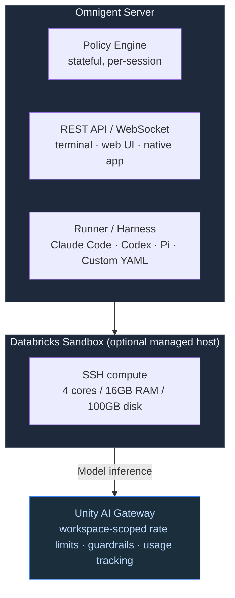
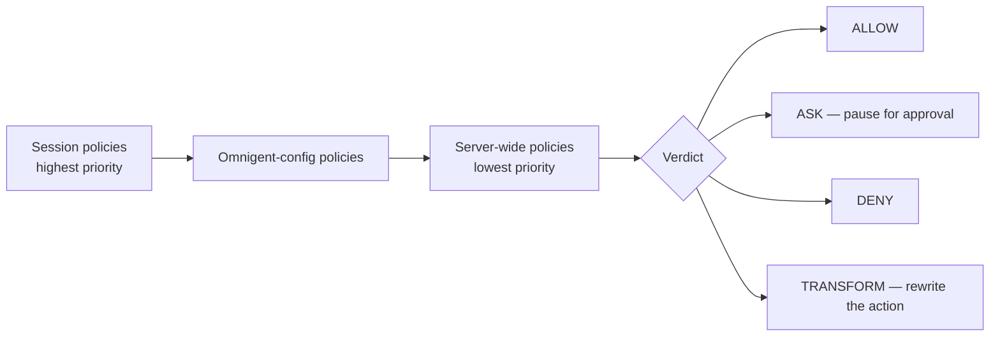

<!--
  Synced from databricks-fieldkit on 2026-07-14
  Sources: ai/omnigent.md, ai/ucode.md
  Public docs grounding:
    - https://docs.databricks.com/aws/en/omnigent/
    - https://docs.databricks.com/gcp/en/omnigent/quickstart
    - https://www.databricks.com/blog/contextual-policies-omnigent-using-session-state-better-govern-ai-agents
    - https://github.com/databricks/ucode
  This file is auto-prepared and human-reviewed before publish.
-->

# Omnigent — Governed Harness for Coding Agents
## Meta-Harness · Unity AI Gateway Integration · Contextual Policies

> **Audience**: Platform Engineers · Security Engineers · Engineering Leads standing up agentic coding tools
> **Cloud**: confirmed working on AWS and GCP; Azure documented separately. The managed compute host (Sandbox) is AWS-only — self-hosted (your own machine or infra) works on every cloud, confirmed end to end

---

## TL;DR

Omnigent is Databricks' meta-harness for AI coding agents — an open-source (Apache 2.0) layer that runs Claude Code, Codex, and custom agents through one unified interface with persistent sessions, team collaboration, and stateful policies. On the Databricks-managed deployment, authentication uses your workspace identity and model inference routes through **Unity AI Gateway**, so a coding agent inherits the same rate limits, guardrails, and usage tracking as any other governed LLM traffic — no separate API keys to provision.

| You want... | Use Omnigent? |
|---|---|
| Run Claude Code / Codex with team-visible sessions and cost guardrails | Yes |
| Orchestrate multiple coding agents across git worktrees | Yes (built-in multi-agent orchestrator) |
| A custom agent framework with arbitrary LLM routing | Partial — the harness must be supported (Claude Code, Codex, Pi, or custom YAML) |
| Production data pipeline / Lakeflow workload | Lakeflow Declarative Pipelines is the right tool for that |
| Chat assistant embedded in a Databricks App | Agent Bricks or Genie Spaces is a closer fit |

---

## Why this matters alongside AI Gateway

[AI Gateway](ai-gateway-patterns.md) governs LLM traffic at the endpoint: rate limits, guardrails, usage tracking, fallback routing. That's Pattern 2 in the traffic-pattern model. Omnigent sits one layer up — it's the **harness** that runs the actual coding-agent loop (tool calls, file edits, shell commands) and, on the managed deployment, sends every model call through that same AI Gateway endpoint. The two are complementary:

- **AI Gateway** answers: *is this LLM call permitted, rate-limited, and logged?*
- **Omnigent** answers: *what is this agent allowed to do in its session, and can we cap session-level spend or require approval as the session evolves?*

---

## When to use / Anti-patterns

**Use when:**
- You want managed, persistent coding-agent sessions accessible via browser, terminal, or desktop app
- You need team collaboration on a live agent session (share via URL, real-time steering, full history)
- You want per-session or server-wide cost caps, shell command approval gates, or risk escalation — without writing custom middleware
- You want to swap between Claude Code and Codex for the same project without restructuring prompts and tools
- You're running in a Databricks Sandbox and want LLM inference to route through AI Gateway with workspace governance automatically applied

**Anti-patterns:**
- Not a general-purpose app runtime — it's a coding-agent layer, not a Streamlit/FastAPI host
- Native Windows isn't supported yet — WSL2 is required
- The Databricks-managed deployment supports built-in contextual policies only; custom YAML policies require self-hosting the Omnigent server
- Workspaces with Serverless Egress Control (SEG) enabled should use the local-machine host option instead of Sandbox

---

## Architecture



**Harness** = the runtime executing the agent loop (Claude Code, Codex, Pi, or a custom YAML-defined agent). Switching harnesses is a one-line config change.

**Sandbox isolation** (filesystem + network) = the agent sees only explicitly granted paths; dotfiles (`.ssh`, `.aws/credentials`) are masked by default. Network access is default-deny with an explicit allowlist. Credential injection uses placeholder tokens — the harness never sees the real secret; the proxy substitutes it only on approved outbound requests.

**Policy engine** = a stateful interceptor for tool calls, LLM requests, and file operations. It maintains state across the whole session — cumulative spend, call counts, risk score.

### Policy decision flow

Every tool call and LLM request passes through policies in priority order:



First non-abstaining policy wins.

### Contextual (stateful) policies

Unlike a static allow/deny rule that evaluates one action in isolation, a **contextual policy** remembers what the agent has done earlier in the session and uses that history to decide on later actions. A policy handler receives `(old_state, new_event)` and returns `(verdict, new_state)`; the new state persists for the rest of that session.

| Policy | State it tracks | Behavior |
|---|---|---|
| **Google Drive** | Documents accessed/created this session | Reading a confidential document tightens write access for the rest of the session (no write-down) |
| **Risk score** | Cumulative session risk | Crossing a threshold requires human approval for sensitive actions (e.g. sending email) |
| **Cost** | Cumulative session spend | Soft threshold pauses and asks; hard cap blocks expensive models until the agent switches to a cheaper one |
| **Intent-based authorization** | The user's initial prompt | Least-privilege — only tools relevant to the stated goal are permitted; blocks unrelated or injected tool calls mid-session |

Example: the same email that would have gone out early in a session may require approval later — the verdict depends on accumulated session state, not just the action in isolation.

---

## Quickstart

### Databricks Sandbox (managed, no local install)

1. Navigate to `<workspace-url>/omnigent`
2. Select **New session** → choose **Sandbox** as the host
3. Describe your task in the composer

Model inference routes through AI Gateway automatically — no separate credentials to manage.

### Self-hosted (local machine as host)

```bash
curl -fsSL https://omnigent.ai/install.sh | sh
omni setup      # wizard detects existing env vars
omni claude     # Claude Code through Omnigent
omni codex      # Codex through Omnigent
```

Then register the machine as a host in the workspace via the login + host registration flow shown after `omni setup`.

### Session with a dollar-denominated spend cap

Agent specs are directories: the entry file must be named `config.yaml`
inside a directory (e.g. `my-agent/config.yaml`).

```yaml
# my-agent/config.yaml
spec_version: 1
name: my-agent
executor:
  type: omnigent
  model: databricks-claude-sonnet-5
  config:
    harness: claude-sdk
os_env:
  type: caller_process
  cwd: .
  sandbox:
    type: none
guardrails:
  policies:
    cost_guard:
      type: function
      on: [request, tool_call]
      function:
        path: omnigent.policies.builtins.cost.cost_budget
        arguments:
          ask_thresholds_usd: [1.0]   # pause and ask user at $1
          max_cost_usd: 5.0           # downgrade-gate above $5
          expensive_models: []        # [] = applies to every model
prompt: |
  You are a helpful assistant.
```

This is the mechanism that adds a **currency-denominated** cap on top of AI Gateway's QPM/TPM rate limits — useful when a team wants a per-session dollar ceiling in addition to endpoint-level throughput limits. Confirmed behavior: `max_cost_usd` is a downgrade gate, not a hard stop — once crossed, it blocks further calls only while the session stays on an "expensive" model (`expensive_models: []` means every model counts), and allows the session to continue once the user switches to a cheaper one via `/model`.

### Per-harness model routing

Each harness talks to its own dedicated Unity AI Gateway surface, matching that harness's native wire format — the same routing pattern Databricks' own [ucode](ucode-governance.md) CLI uses:

| Harness | Base URL | Wire format |
|---|---|---|
| Claude Code | `{workspace}/ai-gateway/anthropic` | Anthropic Messages API |
| Codex | `{workspace}/ai-gateway/codex/v1` | OpenAI Responses API |
| Gemini | `{workspace}/ai-gateway/gemini` | Gemini API |
| Cursor | `{workspace}/cursor/v1` | OpenAI-compatible |

---

## Auth

| Deployment | Identity | Model access |
|---|---|---|
| Databricks managed | Workspace identity (OAuth, same as your Databricks login) | Foundation Model APIs + AI Gateway — no custom API keys |
| Self-hosted | Credentials configured via `omni setup` | Any provider configured in credentials |

On the Databricks-managed deployment, the server runs under your workspace identity, and model calls flow through AI Gateway — inheriting rate limits, usage tracking, and guardrails automatically.

---

## Onboarding checklist

For a team standing up their own agent harness inside a Databricks environment:

1. **Confirm AI Gateway is configured** on the serving endpoint the harness will route through (see [AI Gateway Patterns](ai-gateway-patterns.md))
2. **Choose the host**: Databricks Sandbox (managed, zero install, region-gated) vs. self-hosted (local machine or your own infra, works everywhere)
3. **Pick the harness**: Claude Code, Codex, Pi, or a custom YAML agent — one line in config
4. **Layer in contextual policies** if session-level dollar caps or risk-based approval gates are needed beyond gateway-level rate limits
5. **Verify region support** if using Sandbox — currently `us-east-1`, `us-west-2`, `eu-west-1`, `ap-southeast-1`, `ap-south-1`

---

## Gotchas

- **Two independent workspace settings**: Omnigent and Sandbox are each enabled separately in workspace settings. Both are needed for Sandbox hosting.
- **Custom policies require self-hosting**: the managed deployment supports built-in contextual policies (safety, cost, risk, intent); custom `policy_modules` need a self-hosted server.
- **WSL2 required on Windows** — no native Windows support yet.
- **SEG workspaces**: use the local-machine host option instead of Sandbox.
- **Sandbox resource limits**: 4 cores / 16GB RAM / 100GB disk, max 40 sandboxes per user / 100 per workspace.
- **Sandbox home directory storage is not long-term** — don't store irreplaceable artifacts there; use UC Volumes or a repo for anything you need to keep.

---

## Cloud notes

Confirmed working end to end on both AWS and GCP — the managed deployment (`<workspace-url>/omnigent`) and its full capability set are not cloud-limited. Azure documentation exists separately at `learn.microsoft.com/azure/databricks/omnigent/`. The one cloud-specific piece is the managed **Sandbox** compute host, which is AWS-only and limited to the five regions listed above; every other cloud/region uses the self-hosted (your own machine or infra) host option instead, confirmed to work identically.

---

## Related

- [ucode Governance](ucode-governance.md) — Databricks' simpler, session-less alternative launcher; same per-harness routing under the hood
- [AI Gateway Patterns](ai-gateway-patterns.md) — the LLM governance layer Omnigent routes through on managed deployments
- [MCP Governance](mcp-governance.md) — tool-level access control that composes with AI Gateway guardrails
- [Model Serving Governance](model-serving-governance.md) — endpoint permissions and identity propagation
- [Presentation: AI Agent Cost Control & Governance](../presentations/10-agent-cost-governance.html) — worked example including Omnigent sandbox isolation and contextual policies

## References

- [Databricks Omnigent docs](https://docs.databricks.com/aws/en/omnigent/)
- [Contextual Policies in Omnigent (Databricks blog)](https://www.databricks.com/blog/contextual-policies-omnigent-using-session-state-better-govern-ai-agents)
- [Databricks AI Gateway](https://docs.databricks.com/en/ai-gateway/index.html)
