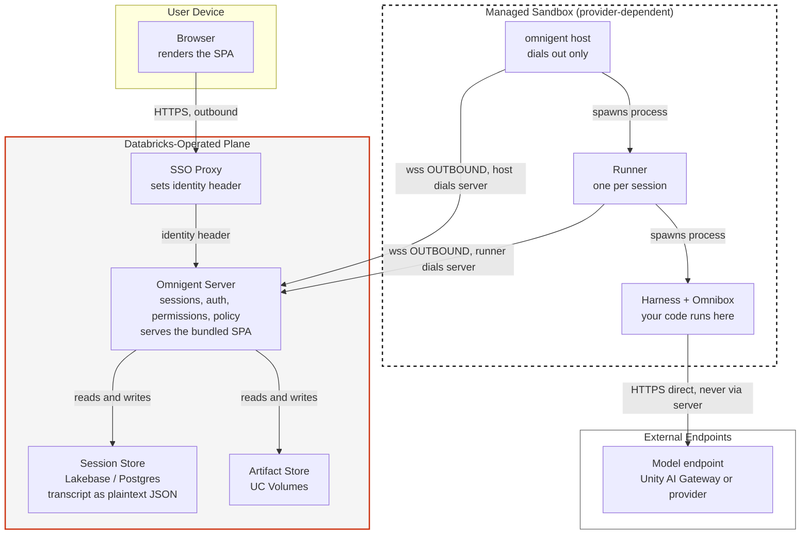
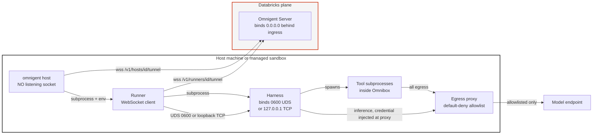
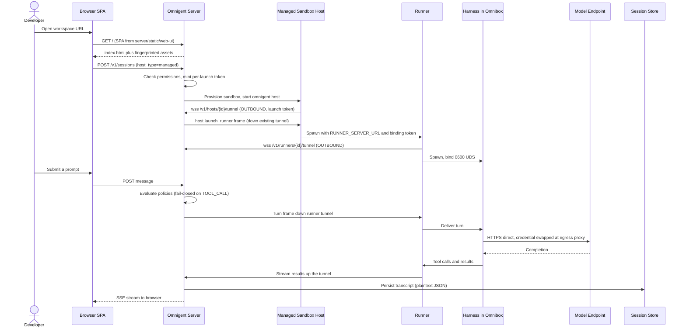

<!--
  Code-grounded security architecture for Databricks-managed Omnigent.
  Scanned: omnigent 0.7.0 wheel (installed), build epoch 1785189710, COMMIT_SHA empty.
  Every claim below cites `path.py:LINE` relative to the omnigent package root.
  Where the code does not answer a question, it says NOT IN CODE — those are
  deployment facts to confirm with the Databricks team, not gaps to paper over.
  Last verified: 2026-08-06
-->

# Databricks-Managed Omnigent: Security Architecture

## What this is, and what "managed" actually means

Read this before the rest, because the industry shorthand is misleading.

**"Managed" is a per-session `host_type`, not a deployment tier.** When a session is created with `host_type="managed"`, the server provisions a cloud sandbox, starts `omnigent host` inside it, and waits for that host to register. From that point the session "rides the exact same host-launch machinery an external host uses (binding token, `host.launch_runner` frame, runner tunnel)" (`server/managed_hosts.py:1-9`).

The consequence matters for a security review: **one Omnigent server can serve both managed-sandbox sessions and sessions pinned to a developer's laptop, concurrently.** They are not separate products or separate deployments. So "is my code on Databricks infrastructure?" is answered per session, by `host_type`, not once by a contract.

Three planes, which vary independently:

| Plane | What it does | Managed session | External-host session |
|---|---|---|---|
| **Server** | Sessions, auth, permissions, policy, durable transcript | Databricks-operated | Databricks-operated |
| **Host** | Runs the agent loop, owns the working tree | Cloud sandbox provisioned per session | Your machine |
| **Sandbox** | Confines the harness process on whichever host | Provider-dependent | OS-dependent |

Managed-launch support exists for `modal`, `daytona`, `cwsandbox`, `islo`, and `openshell`; `lakebox` "parses but rejects at launch" (`server/managed_hosts.py:104-105`). **Which provider backs a given Databricks workspace is NOT IN CODE** — it is a deployment choice, and it determines where your source code physically resides. Ask for it by name.

---

## The question everyone asks first: inbound connections

**No component of Omnigent opens an inbound connection into your network.** Every hop is dialed outbound from your side. This is verifiable in code, not a policy promise:

- **Host → server.** The host is a WebSocket *client*: `self._ws: websockets.asyncio.client.ClientConnection` (`host/connect.py:714`), dialing `{scheme}://{host}/v1/hosts/{host_id}/tunnel` (`host/connect.py:930-939`).
- **Runner → server.** Same pattern, to `/v1/runners/{runner_id}/tunnel` (`runner/transports/ws_tunnel/serve.py:1107-1123`). The code states it plainly: "The runner is the WebSocket client" (`runner/transports/ws_tunnel/serve.py:262-268`).
- **The host binds no listening socket at all.** There is no `bind()` or `listen()` in `host/`.

Control flows *down the tunnels you opened*. When the server needs a runner started, it does not connect to you — it sends a `host.launch_runner` frame over the existing outbound WebSocket (`server/managed_hosts.py:6-9`). That is the whole mechanism, and it is why this design is friendly to egress-only firewalls and Private Link.

**Reconnect behavior**, since a persistent outbound tunnel is a thing your network team will ask about: 0.5s initial delay, 10s cap, ±50% jitter (`host/connect.py:292-294`; `runner/transports/ws_tunnel/serve.py:66-80`). Close codes `{1001, 1012}` and HTTP `502` reset the backoff, treated as routine ingress recycles rather than failures (`runner/transports/ws_tunnel/serve.py:91-92`).

### The one nuance worth stating precisely

The harness *does* listen — but only on a local endpoint the parent allocated, never on a network interface:

- **POSIX**: a Unix domain socket under `/tmp/omnigent-{uid}/`, directory mode `0o700`, socket mode `0o600` (`runtime/harnesses/process_manager.py:67,89,93`, chmod at `:428`). Owner-only; not reachable over any network.
- **Windows**: TCP on `127.0.0.1` with an OS-allocated ephemeral port (`runtime/harnesses/process_manager.py:392`).

The bind is one or the other, enforced: "exactly one of `--socket` or `--bind` is required" (`runtime/harnesses/_runner.py:370-383`).

`0.0.0.0` does appear in the codebase, and honesty requires explaining where: it is the **server's** default bind (`server/paas_env.py:33`), which is correct for a server behind an ingress and is Databricks-side in a managed deployment, not customer-side. The CLI additionally rewrites a `0.0.0.0` server bind to `127.0.0.1` when constructing *client* URLs (`cli.py:1788`). No customer-resident component binds a wildcard address.

---

## Where each process runs, and who spawns it

The spawn chain is four distinct OS processes:

```
Server  ──(host.launch_runner frame, down the existing tunnel)──▶  Host
Host    ──(subprocess, env: RUNNER_SERVER_URL, runner id, binding token)──▶  Runner
Runner  ──(subprocess, harness type + spawn env from the agent spec)──▶  Harness
Harness ──(tool subprocesses: node, python, git, …)──▶  Tools
```

Citations: runner spawn and env injection at `host/connect.py:591-592`; the runner "owns harness subprocesses… resolves the harness type + spawn-env from the agent spec" (`runner/app.py:1-10`, spawn at `:2385-2410`).

**The harness — the thing that actually runs your code — sits on the host, not the server.** In a managed session that is the cloud sandbox; in an external-host session it is your laptop. The server never executes agent code.

---

## Inference: it does not transit the Omnigent server

Model API calls originate **from the harness process** and go directly to the provider or gateway. The server does not proxy, cache, or inspect them.

The mechanism is credential injection at spawn: the harness receives provider credentials as environment variables from a fixed allowlist, `HARNESS_CREDENTIAL_ENV_VARS` (`host/connect.py:494-498`, values at `:477-498`), then calls the base URL it was given (`runner/app.py:9276-9332`). Databricks serving endpoints resolve as `creds.host.rstrip("/") + "/serving-endpoints"` (`runner/app.py:9361`).

There *is* gateway logging, and it is worth knowing it is diagnostic only — it records which gateway the harness resolved to for observability, with no proxying (`runner/app.py:9788-9798`).

**Governance consequence, stated bluntly:** because inference leaves the harness directly, routing it through Unity AI Gateway is a *configuration* property (the base URL the harness was handed), not a structural guarantee of the architecture. If the guardrail and usage-tracking story depends on Gateway transit, the control that enforces it is whatever pins that base URL — verify it behaviorally, per session type, rather than assuming the topology enforces it.

---

## Multitenancy and session isolation

This is the section to read closely, because the answer is "yes, and it is conditional."

**Authentication** is pluggable via `OMNIGENT_AUTH_PROVIDER`:

- **Header mode (default)** trusts `X-Forwarded-Email` from an upstream proxy; header name configurable via `OMNIGENT_AUTH_HEADER` (`server/auth.py:571-614`). In a managed deployment this is the SSO proxy in front of the app.
- **OIDC mode** (`OMNIGENT_AUTH_ENABLED=1` + `OMNIGENT_OIDC_ISSUER`): authorization code flow with PKCE, RS256/ES256 validation, `__Host-ap_session` cookie (HttpOnly, Secure, SameSite=Lax), and an `email_verified` gate (`server/routes/auth.py:725-856`).
- **Accounts mode**: username/password with Argon2id hashes (`db/db_models.py:390`).

Identity is an **email address**, or the reserved `"local"` principal in single-user loopback (`server/auth.py:202-214`).

**Authorization** is a `permissions` table of `(user_id, conversation_id, level)` triples, levels Owner=4 / Manage=3 / Edit=2 / Read=1, plus a `"__public__"` sentinel for link sharing (`server/auth.py:105-109`). Every session route funnels through `_require_access`, which raises 403 for insufficient level and 404 for no access — deliberately not leaking whether the session exists (`server/routes/_auth_helpers.py:147-180`).

### The conditional, and why it matters

Isolation is enforced **only if a permission store is wired**. The guard is the first statement in the check:

```python
if permission_store is None:
    return
```
(`server/routes/_auth_helpers.py:120-121`)

A `None` permission store makes every session-access check a no-op — a silent allow-all across all users. This is a sane default for a single-user laptop server and a catastrophic one for a shared deployment.

**This is not a defect to report; it is the top verification item for any shared deployment.** The builder action is to confirm the deployment constructs a real `PermissionStore` and to prove it with a negative test: authenticate as user B, request user A's session id, and require a 404. A configuration read will not tell you this — only traffic will.

Two related notes:

- **Host ownership is enforced.** Before accepting a host tunnel, the server compares the stored owner and refuses with 409 on mismatch, so user B cannot hijack user A's `host_id` (`server/routes/host_tunnel.py:201-226`). The single-user loopback exception does not apply to shared deployments (`:127-129`).
- **Sharing is server-wide policy**, via `OMNIGENT_SHARING_MODE`: `ON`, `READ_ONLY`, `RESTRICTED_READ_ONLY` (also blocks sharing a session whose cwd is `$HOME` or `/`), `OFF` (`server/auth.py:111-143`). Public link sharing is separately gated by `OMNIGENT_PUBLIC_SHARING` and capped at read (`server/routes/sessions/routes_permissions.py:148-162`).

---

## The UI: where it lives and runs

The web UI is a **built React SPA bundled inside the Python wheel** at `server/static/web-ui/`, mounted at `/` after all API routers so API routes win (`server/app.py:2839-2846`).

That single fact answers the hosting question for both cases: the UI is served by whichever process runs the server. Self-hosted, that is your loopback server. Managed, it is the Databricks-hosted app, on a Databricks domain. **There is no separate UI service and no third-party UI origin.**

Security-relevant details:

- Unmatched `/v1`, `/api`, `/auth`, `/health` paths return JSON 404 rather than the SPA shell (`server/app.py:2915-2929`).
- The session cookie is HttpOnly, so page JavaScript cannot read it (`server/auth.py:186-194`).
- Multipart session creation is origin-checked as CSRF defense (`server/routes/_origin.py`; enforcement at `server/routes/sessions/routes_core.py:169-172`).
- `omnigent_ui_sdk` is a **terminal** UI toolkit (prompt_toolkit + Rich), not part of the web attack surface, and not a security boundary.

---

## Data at rest

### Encryption: the application does none

Stated plainly, because a security reviewer needs the unvarnished version: **Omnigent performs no application-level encryption of persisted data.** Verified by absence as well as presence — there is no SQLCipher, pysqlcipher, pgcrypto, or envelope-encryption code anywhere in the package, and engines are constructed through plain SQLAlchemy `create_engine` with no cipher parameters (`db/utils.py:198-254`).

Conversation content is stored as **plaintext JSON in a `Text` column**: `data: Mapped[str] = mapped_column(Text)` on `conversation_items`, alongside a `search_text` column holding an extracted plaintext copy for search (`db/db_models.py:904-905`).

One easy-to-misread detail: large text columns use **zstandard compression** (`CompressedText`, level 19) (`db/compression.py:27-59,87-110`). Compression is not encryption — it is unkeyed and trivially reversible. Do not let it be presented as a protection.

**So encryption at rest is entirely the storage platform's job.** In a managed deployment that means Lakebase (Databricks-managed Postgres, OAuth token minted per connection — `db/utils.py:88-117`) and UC Volumes for artifacts (`stores/artifact_store/databricks_volumes.py:89-200`). That is a reasonable architecture; the point is to attribute the control correctly. **Whether a given workspace's Lakebase instance uses CMEK is NOT IN CODE** — ask, because "encrypted at rest" and "encrypted with your key" are different answers.

### Where things are stored

| Data | Location | Citation |
|---|---|---|
| Sessions, messages, tool calls | `conversation_items.data` (plaintext JSON) | `db/db_models.py:904` |
| Backend, self-hosted default | SQLite at `~/.omnigent/chat.db` | `db/utils.py:179` |
| Backend, managed | Lakebase / Postgres, per-connection OAuth | `db/utils.py:88-117` |
| Artifacts | UC Volumes, S3, or local FS | `stores/artifact_store/` |
| Comments | `CompressedText` (compressed, not encrypted) | `db/db_models.py:1064` |

### Credentials and tokens: the strong part

This is where the design is genuinely good, and it deserves saying so:

- **Tokens are persisted as digests only, never raw.** Host launch tokens: SHA-256 (`stores/host_store.py:156-169`; column `db/db_models.py:1284`). Device-grant codes and refresh tokens: HMAC-SHA256, with a `prev_refresh_token_hash` for replay detection (`db/db_models.py:513,521,525`). A database leak does not yield usable credentials.
- **Lakebase tokens are short-lived**, re-minted per DBAPI connection with a 10-minute pool recycle inside a ~1h lifetime (`db/utils.py:88-117,141-173`).
- **Local token file** `~/.omnigent/auth_tokens.json` is mode `0600` (observed on disk; `0o600`/`0o700` constants at `runtime/harnesses/process_manager.py:89-93`).

Account/magic tokens are the exception: stored verbatim rather than hashed, because lookup must be constant-time, mitigated by single-use enforcement via `redeemed_at` and a short TTL (`db/db_models.py:403-404,421-422,438`).

---

## Sandbox: inbound and outbound on the managed host

### Backends, and the platform asymmetry

| Backend | Platform | Isolation | Verdict |
|---|---|---|---|
| `linux_bwrap` | Linux | Mount/PID/UTS/IPC namespaces + seccomp | **Hard isolating** |
| `darwin_seatbelt` | macOS | SBPL capability rules, **no syscall filter** | Partial |
| `windows_jobobject` | Windows | Process-tree containment only, **no FS or network isolation** | Advisory |
| `none` | any | None | Disabled |

Selection is per-platform (`sandbox.py:907-957`), and **fails loud**: a missing `bwrap` or `sandbox-exec` binary raises `OSError` rather than silently running unsandboxed (`bwrap_sandbox.py:235-241`; `seatbelt_sandbox.py:380-386`).

This asymmetry is the strongest argument for a managed Linux sandbox over a laptop host: on Linux you get namespaces and seccomp; on macOS there is no syscall filter; on Windows there is effectively no isolation.

### Outbound: default-deny egress with cloud-metadata traps

Egress runs through an L7 proxy that MITMs HTTP/HTTPS and matches each request against an allowlist of `EgressRule` (`inner/egress/proxy.py:47,50,150-209`). An empty rule list denies everything.

Blocked by default (`block_private_destinations=True`): RFC1918, RFC6598 CGNAT, loopback, link-local, reserved, TEST-NET, benchmark, and multicast ranges (`proxy.py:170-184`). Cloud metadata endpoints are explicitly trapped — AWS IMDS `169.254.169.254`, Azure WireServer `168.63.129.16`, Alibaba `100.100.100.200` (`proxy.py:140-147`), with the code citing the Capital One breach pattern as motivation (`proxy.py:130-133`).

The in-sandbox relay listens on an ephemeral loopback port **chosen by the parent** so a hostile process cannot pre-squat it, and aborts loudly if the bind fails (`sandbox.py:113-116`; `seatbelt_sandbox.py:600-604`).

### Inbound to the sandbox: none

There is no inbound path into the sandbox. The harness endpoint is a `0600` Unix socket or a loopback TCP port (above), reachable only by the parent runner at the same UID.

### Filesystem

`$HOME` is **never** mounted (`bwrap_sandbox.py:30-31`). System paths are read-only (`bwrap_sandbox.py:106-113`; `seatbelt_sandbox.py:285-297`). The cwd is read-only unless the spec grants `write_paths` (`bwrap_sandbox.py:247-254`).

Dotfiles are masked by a recursive walk over the cwd and every `read_paths` root — directories replaced with an empty tmpfs, files bound to `/dev/null` (`bwrap_sandbox.py:1096-1151`; macOS deny rules at `seatbelt_sandbox.py:1001-1004`). The default allow list is just `.venv` (`bwrap_sandbox.py:100`), and the credential-bearing names it exists to stop — `.aws`, `.ssh`, `.gnupg`, `.kube`, `.docker`, `.netrc`, `.env`, `.databrickscfg`, `.azure`, `.gcloud` — warn when explicitly opted in (`seatbelt_sandbox.py:179-198`). On macOS, `$HOME/Library` is denied by default to protect keychains, cookies, and Slack tokens (`seatbelt_sandbox.py:266`).

### Syscalls (Linux)

A denylist derived from the Kubernetes/containerd `RuntimeDefault` profile: mount family, module loaders, `bpf`, keyring calls, `ptrace`, `process_vm_readv/writev`, `perf_event_open`, `unshare`, `setns` (`inner/_seccomp.py:12-24`).

Two implementation details that show real care:

- `clone()` with any `CLONE_NEW*` bit is denied per-bit via masked comparison, blocking nested namespace creation while leaving `fork` and `pthread_create` working (`bwrap_sandbox.py:600-614,150-166`).
- `clone3()` returns **ENOSYS, not EPERM**, because glibc only falls back to legacy `clone` on ENOSYS; returning EPERM would break `pthread_create` on glibc 2.34+ (`bwrap_sandbox.py:44-51,616-617`).

`socket()` is restricted to `AF_UNIX`, `AF_INET`, `AF_INET6`, with all other families denied including any future ones via a `>=` rule (`bwrap_sandbox.py:174-178,618-651`).

### Credentials never enter the sandbox

Default mode is **swap-on-access**: the harness sends a request with no `Authorization` header and the egress proxy injects the real credential on the way out, so the secret never crosses into the sandbox (`inner/credential_proxy.py:12-16`).

Opt-in **placeholder mode** mints an `oa_cred_`-prefixed token from `secrets.token_urlsafe()` for the sandbox to carry, swapped at the proxy (`credential_proxy.py:31,52`). A leaked placeholder is bound to one host and rejected with 403 if replayed elsewhere (`credential_proxy.py:67-70`), and cannot be reversed into the real secret.

Structurally enforced: the credential proxy config is deliberately excluded from `SandboxPolicy.to_jsonable()`, so real secrets never cross the parent→helper config boundary (`sandbox.py:159-165`).

---

## Memory and skills persistence

**Memory is in-process only and does not survive a restart.** `Memory` is a plain dict with a `scope` label (`per_session`, `per_user`, `cross_user`) and no database backing (`inner/datamodel.py:199-252`). Two implications worth being explicit about: there is no durable memory to encrypt or retain, and the `cross_user` scope carries **no enforcement in code** — it is a label on an in-memory dict, so do not present it as an isolation boundary.

**Skills are files on the host**, discovered from the agent bundle at `<bundle>/skills/<name>/SKILL.md` and from harness locations such as `~/.claude/skills/`, with enabled plugins tracked in `~/.claude/settings.json` and a managed-plugin tier at `~/.claude/plugins/managed_plugins.json` (`spec/skill_sources.py:93-98,154-156,174`). Scope is per-user or per-project; there is no cross-user skill registry. Note that skills bundled into an agent are readable by anyone who can load that bundle — there is no skill-level access control.

---

## Telemetry: metadata only

Telemetry is metadata-only. Events carry session/agent/harness identifiers, version and OS strings, timestamps, duration, an `anon_user_id` computed as the first 16 hex chars of `sha256("<installation_id>:<user_id>")`, and aggregate token counts and cost on session delete (`telemetry/events.py:15-83`; `telemetry/client.py:275-314,287`).

**No prompts, responses, message content, or tool arguments are transmitted.**

Opt-outs: `OMNIGENT_ANALYTICS=0`, `DISABLE_TELEMETRY`, `OMNIGENT_DISABLE_TELEMETRY`, `DO_NOT_TRACK=1`, any CI environment variable, or `telemetry: false` in `~/.omnigent/config.yaml` (`telemetry/client.py:215-252`). Remote config, including a kill switch and rollout percentage, is fetched per version (`telemetry/client.py:123-182`).

---

## Request flow, end to end

A single turn in a managed session:

1. Browser loads the SPA from the Databricks-hosted server (`server/app.py:2839-2846`) and authenticates through the SSO proxy; the server reads identity from the trusted header (`server/auth.py:571-614`).
2. `POST /v1/sessions` with `host_type="managed"`. The server provisions a sandbox, starts `omnigent host` inside it, and waits for registration (`server/managed_hosts.py:1-9`). It returns before the launch completes; the launch is tracked in memory by session id (`server/managed_hosts.py:278-280`).
3. The sandbox host dials **outbound** to `/v1/hosts/{host_id}/tunnel`, presenting a per-launch token the server minted (`host/connect.py:930-939`; `server/routes/host_tunnel.py:161-175`).
4. The server sends `host.launch_runner` down that tunnel. The host spawns the runner with `RUNNER_SERVER_URL` and a binding token (`host/connect.py:591-592`).
5. The runner dials **outbound** to `/v1/runners/{runner_id}/tunnel` (`runner/transports/ws_tunnel/serve.py:1107-1123`).
6. The runner spawns the harness, which binds a `0600` Unix socket (POSIX) or loopback TCP (Windows) (`runtime/harnesses/process_manager.py:210,392,428`).
7. Policies evaluate the turn; every session route checks permissions first (`server/routes/_auth_helpers.py:147-180`).
8. The harness calls the model **directly** at its configured base URL — not through the server (`runner/app.py:9276-9332`). Tool execution runs inside the sandbox, egress filtered by the allowlist proxy (`inner/egress/proxy.py:50`).
9. Results stream back up the runner tunnel. The transcript persists as plaintext JSON in the session store (`db/db_models.py:904`).

---

## Diagrams

### C4 Level 1 — trust boundaries and connection direction



**Read this diagram for one thing: every arrow touching a customer-resident component points outward.** Nothing dials in.

### C4 Level 2 — process and socket detail



### Request sequence — one turn, managed session



### Data at rest, by store

```
+---------------------------------------------------------------+
|  DATABRICKS PLANE                                             |
|                                                               |
|  +-----------------------------+  +------------------------+   |
|  | Session Store [Lakebase]    |  | Artifacts [UC Volumes] |   |
|  | conversations               |  | bundles, state tars    |   |
|  | conversation_items.data     |  |                        |   |
|  |   -> PLAINTEXT JSON (Text)  |  | app encryption: NONE   |   |
|  | search_text -> PLAINTEXT    |  | platform + UC grants   |   |
|  | comments -> zstd COMPRESSED |  +------------------------+   |
|  |            (not encrypted)  |                              |
|  |                             |  +------------------------+   |
|  | app encryption: NONE        |  | Tokens [same DB]       |   |
|  | platform: Lakebase at rest  |  | SHA-256 / HMAC digests |   |
|  |   (CMEK? NOT IN CODE)       |  | raw tokens NEVER kept  |   |
|  +-----------------------------+  +------------------------+   |
+---------------------------------------------------------------+

+---------------------------------------------------------------+
|  MANAGED SANDBOX (ephemeral)                                  |
|  working tree, skills on disk, in-process Memory (dict)        |
|  $HOME never mounted | dotfiles masked | creds never enter     |
+---------------------------------------------------------------+
```

---

## Answers, condensed

| Question | Answer | Citation |
|---|---|---|
| Inbound connections from Databricks into my network? | **None.** Host and runner are WebSocket clients; host binds nothing. | `host/connect.py:714,930-939` |
| Where does the harness reside? | On the host: managed sandbox, or your machine. Never the server. | `runner/app.py:1-10,2385-2410` |
| Where does the UI run? | SPA bundled in the wheel, served by the server process at `/`. | `server/app.py:2839-2846` |
| Where does inference run? | Called from the harness, direct to the endpoint. Not via the server. | `runner/app.py:9276-9332` |
| Where does execution happen? | Harness plus tool subprocesses inside Omnibox, on the host. | `runtime/harnesses/process_manager.py` |
| How does multitenancy work? | Per-user permission grants, checked on every session route. | `server/routes/_auth_helpers.py:147-180` |
| Is tenant isolation guaranteed? | **Only if a permission store is wired.** `None` = allow-all. | `server/routes/_auth_helpers.py:120-121` |
| Encryption in transit? | wss tunnels; HTTPS to model endpoints; local IPC over `0600` UDS. | `host/connect.py:930-939` |
| Encryption at rest? | **No application-level encryption.** Platform's responsibility. | `db/utils.py:198-254`; `db/db_models.py:904` |
| Session and transcript persistence? | Plaintext JSON in `conversation_items.data`. | `db/db_models.py:904` |
| Memory persistence? | In-process dict, not persisted. `cross_user` scope is unenforced. | `inner/datamodel.py:199-252` |
| Skills persistence? | Files on the host; per-user or per-project; no cross-user registry. | `spec/skill_sources.py:93-98` |
| Sandbox outbound? | Default-deny allowlist proxy; private ranges and IMDS blocked. | `inner/egress/proxy.py:140-184` |
| Sandbox inbound? | None. `0600` UDS or loopback TCP, parent-only. | `runtime/harnesses/process_manager.py:89-93` |
| Do credentials enter the sandbox? | No. Swap-on-access at the egress proxy by default. | `inner/credential_proxy.py:12-16` |
| Does content leave in telemetry? | No. Metadata and aggregate counts only. | `telemetry/events.py:15-83` |

---

## Verify these before you deploy

Not gaps in the product — the items a code read cannot settle, and where the builder's action matters.

1. **Prove tenant isolation with traffic.** Authenticate as user B, request user A's session id, require a 404. `permission_store is None` disables every check silently (`server/routes/_auth_helpers.py:120-121`), and no configuration read will reveal it.
2. **Name the sandbox provider.** `modal`, `daytona`, `cwsandbox`, `islo`, and `openshell` all have managed-launch support (`server/managed_hosts.py:104-105`). This determines where your source code physically lives and under whose terms. Ask.
3. **Confirm the at-rest posture, including CMEK.** The application encrypts nothing. Get the Lakebase and UC Volumes answer in writing, and distinguish "encrypted at rest" from "encrypted with your key."
4. **Set the sharing mode deliberately.** Default is `ON`. `RESTRICTED_READ_ONLY` additionally blocks sharing a session rooted at `$HOME` or `/` (`server/auth.py:111-143`).
5. **Verify Gateway transit behaviorally.** Inference leaves the harness directly, so Gateway routing is configuration, not topology. Send traffic and confirm a `429` or a policy block; do not infer it from the architecture.
6. **Prefer a Linux managed host for isolation strength.** macOS has no syscall filter and Windows has effectively none.
7. **Treat `sandbox: type: none` as a review trigger.** The bundled examples ship with it set, which is fine for demos and not for production (`resources/examples/*/config.yaml`).

---

## Scan provenance

Findings are from the installed **omnigent 0.7.0** wheel, build epoch `1785189710`, `COMMIT_SHA` empty (`_build_info.py`). Paths are relative to the `omnigent` package root.

Two caveats on scope, so the citations are not over-trusted:

- **This is the OSS package, not the Databricks control plane.** How Databricks configures it — auth provider, permission store, sandbox provider, sharing mode, storage encryption — is deployment configuration and does not appear here. Every "NOT IN CODE" above is that boundary.
- **Version drift.** Related notes elsewhere reference `0.8.0.dev0`; this scan is `0.7.0`. Re-verify citations against the version actually deployed before quoting line numbers in a customer document.
