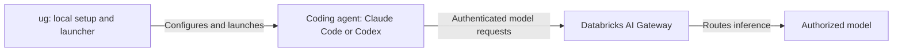

# Getting Started with `ug` (Formerly `ucode`)

Run your coding agent through Databricks without wiring its model connection by hand.

**Jump to:** [Why ug](#why-ug) · [Setup](#get-running) · [Governed tools](#governed-tool-access-mcp-and-skills) · [Choose a model service](#choose-a-model-service) · [Configure routing](#configure-model-service-routing) · [Smart Routing vs. model routing](#smart-routing-vs-model-service-routing)

## Why ug

`ug` gives coding agents one governed entry point to Databricks. Rather than each developer wiring endpoints, tokens, and environment variables by hand, the CLI configures the agent and routes its model calls through the gateway, where the platform team already controls access, spend, and audit.

| Benefit | What it gives you |
|---------|-------------------|
| Simple setup | `ug` runs OAuth sign-in and writes each agent's configuration, so there is no manual endpoint, token, or environment-variable wiring. |
| No API keys for normal use | Agents authenticate with Databricks workspace credentials over OAuth instead of long-lived provider keys. |
| One CLI for many agents | Configure and launch Claude Code, Codex, Gemini CLI, OpenCode, Copilot CLI, Pi, and Cursor through the same command. Supported agents depend on your workspace and CLI version. |
| Centralized governance | Traffic flows through Unity Gateway, so the platform team sets model permissions, rate limits, usage tracking, and inference tables at the model-service, user, or group level. |
| Unified visibility and cost | Usage across coding tools is visible in one place, and `ug usage` summarizes spend. |
| Governed MCP tools | Register Databricks MCP servers (SQL, Unity Catalog functions, AI Search, and external connections) with supported agents, governed by Unity Catalog. |
| Secure token refresh | The local MCP proxy obtains a fresh OAuth token per request, reducing expired-token interruptions without developers managing credentials. |
| Smart Routing | For Claude Code and Codex, `ug` can select a lower-cost capable model per task. See the caveats in [Smart Routing vs. Model-Service Routing](#smart-routing-vs-model-service-routing). |
| Unity Gateway Skills | Connect agents to governed Skills published in Unity Catalog, downloaded locally or loaded live through MCP. |
| Backward compatibility | Existing `ucode` commands keep working; use `ug` for new configuration. |

Routing model traffic through the gateway governs the model calls, not what the agent does on your filesystem or which tools it may run. Keep agent approvals and tool authorization separate, as described in [How the Pieces Connect](#how-the-pieces-connect) and [Governed Tool Access](#governed-tool-access-mcp-and-skills) below.

## First, the Names

| Name | What it means |
|------|---------------|
| `ug` | The command you run locally to set up and launch a supported coding agent. |
| `ucode` | The older command name. It remains a backward-compatible alias; use `ug` for new instructions. |
| `unity-gateway` | The Python package that installs both commands. |
| Unity Gateway | The hosted gateway; older material may call it UAIG. The workspace sidebar and some documentation still use **AI Gateway**. |

**The CLI is not the hosted gateway.** Installing it does not provision gateway infrastructure or grant model access. See the [CLI README](https://github.com/databricks/unity-gateway#readme) for supported agents and naming compatibility.

## Get Running

**Before you start:** have Python 3.12+, `uv`, and a Databricks workspace URL. Have `npm` available if coding-agent CLIs need automatic installation. Your administrator must enable the relevant gateway features and grant model access. Follow the [CLI requirements](https://github.com/databricks/unity-gateway#requirements), [workspace prerequisites](https://docs.databricks.com/aws/en/ai-gateway/coding-agent-integration-model-services), and [uv installation](https://docs.astral.sh/uv/getting-started/installation/) if needed.

### 1. Install

```bash
uv tool install git+https://github.com/databricks/unity-gateway
ug --version
ug --help
```

`uv tool` isolates the CLI's Python dependencies. Record the version when troubleshooting; help should list the available commands.

### 2. Connect your workspace

**Clear conflicting environment overrides first.** Existing `ANTHROPIC_*` variables and equivalent OpenAI/Codex authentication or endpoint overrides can interfere with `ug`/`ucode` configuration or send requests to the wrong provider. Remove pre-existing overrides before configuring, and launch the agent from the same clean shell.

In Bash or Zsh, clear these common overrides without printing their values:

```bash
unset ANTHROPIC_API_KEY ANTHROPIC_AUTH_TOKEN ANTHROPIC_BASE_URL ANTHROPIC_MODEL
unset ANTHROPIC_DEFAULT_OPUS_MODEL ANTHROPIC_DEFAULT_SONNET_MODEL ANTHROPIC_DEFAULT_HAIKU_MODEL
unset ANTHROPIC_SMALL_FAST_MODEL ANTHROPIC_CUSTOM_HEADERS
unset OPENAI_API_KEY OPENAI_BASE_URL OPENAI_ORG_ID OPENAI_ORGANIZATION OPENAI_PROJECT_ID CODEX_API_KEY
```

This is a common-variable checklist, not an exhaustive list. Remove any additional pre-existing `ANTHROPIC_*` overrides and custom provider credential/endpoint variables used by your Codex configuration. Do not indiscriminately unset every `CODEX_*` variable; some control local runtime behavior rather than provider access.

`unset` affects only the current shell. Also remove or disable the corresponding exports in your shell startup files (such as `~/.zshrc` or `~/.bashrc`), project environment loaders, and IDE terminal settings so they are not reintroduced. Keep credentials in an approved secret store, not copied into this guide or diagnostic output. Do not remove variables that `ug` itself supplies to the launched agent.

Replace the example URL with your own workspace URL:

```bash
ug configure --workspace https://YOUR-WORKSPACE-HOST --agents claude,codex
```

Follow the browser sign-in and terminal prompts. Configuration discovers available models and configures the selected coding tools. Sign in as yourself; do not paste someone else's token into configuration. Existing local settings may be updated and backed up; follow your organization's managed-config policy.

### 3. Launch one agent

Run **one** of these from the project directory you want to work in:

```bash
ug claude
```

Or, for Codex:

```bash
ug codex
```

Ask: “Reply with hello. Do not use tools or change files.” A response confirms a basic inference round trip—not every governance control. Your administrator can verify the associated gateway usage record. The [official walkthrough](https://docs.databricks.com/aws/en/ai-gateway/coding-agent-integration-model-services) covers setup and usage monitoring.

## How the Pieces Connect



This is a logical model-request path, not a process-level network diagram. Local adapters or proxies can sit in the path depending on the agent and configuration. `ug` handles configuration and authentication integration; the gateway handles model access and routing. See the [CLI implementation and configuration reference](https://github.com/databricks/unity-gateway#readme).

**Model governance is not tool governance.** AI Gateway supports permission controls, rate limits, and usage monitoring; guardrails and payload logging require configuration. Do not assume every control is enabled because setup succeeded. See the [gateway overview](https://docs.databricks.com/aws/en/ai-gateway/overview-model-services).

Likewise, routing model traffic through a gateway is not a filesystem sandbox or a grant of SQL/MCP access. Keep agent approvals and tool authorization separate: [Custom MCP Principles](custom-mcp-principles.md) and [Authorization](../identity/authorization.md).

## Governed Tool Access: MCP and Skills

Model routing decides which model answers a prompt. Tool access decides what the agent can read, run, and act on. Beyond routing model calls, `ug` can register governed Databricks tools with a supported agent so those tool calls run through Unity Catalog rather than through ad hoc local configuration.

### Register MCP servers

Add Databricks-hosted MCP servers to a supported agent:

```bash
ug mcp add
```

This makes governed servers available to the agent, spanning capabilities such as SQL, Unity Catalog functions, AI Search, and external connections. Registering a server does not by itself grant data access. Each call is still governed by Unity Catalog privileges on the underlying objects, so confirm the caller has the grants it needs. See the [CLI README](https://github.com/databricks/unity-gateway#readme) for the exact server types your version supports, and [Custom MCP Principles](custom-mcp-principles.md) for the governance model.

### Secure token refresh

Registered servers are reached through a local MCP proxy that obtains a fresh OAuth token per request. This reduces interruptions from expired tokens without asking developers to store, paste, or rotate credentials by hand. Treat the proxy as part of the request path, not as a grant of access. Authorization still comes from Unity Catalog on every call.

### Unity Gateway Skills

Skills published in Unity Catalog give agents governed, reusable capabilities. `ug` can connect an agent to these Skills, either downloading them locally or loading them live through MCP. Because the Skills are published in Unity Catalog, the same permission model that governs other catalog objects applies to them.

**Availability varies.** MCP server support, Skills, and per-request token refresh depend on your workspace configuration and CLI version. Do not assume a capability is present because setup succeeded. Record `ug --version` when reporting differences, and confirm with your administrator which features are enabled.

## Choose a Model Service

Both choices use a Unity Catalog name: **`catalog.schema.service`**. `system.ai.*` is a namespace shorthand, not a literal wildcard to pass to the CLI.

| Choice | Example | When to use it |
|--------|---------|----------------|
| System-provided service | `system.ai.claude-sonnet-4-5` | Start with a ready-to-query model you have permission to use. |
| Your own catalog service | `main.ai.coding_claude` | Give callers a stable name while you control its destinations and routing. |

Copy the exact name from your workspace; availability varies. These are model **services**, not necessarily registered-model version names. See [querying model services](https://docs.databricks.com/aws/en/ai-gateway/query-model-services).

### Use a system-provided service

After configuration, select a compatible service explicitly:

```bash
ug claude --model system.ai.claude-sonnet-4-5
```

For Codex, substitute an authorized OpenAI-backed service from your workspace:

```bash
ug codex --model system.ai.gpt-5-6-sol
```

### Use your own catalog service

After creating the services described below, use their names instead:

```bash
ug claude --model main.ai.coding_claude
ug codex --model main.ai.coding_openai
```

Run only the agent you need. These are example services you must create, not preinstalled models. Keep Claude's `--model` before any `--` prompt separator. `--provider` refers to a different object—a **model provider service**—and is not the flag for selecting this model service. See the [CLI argument implementation](https://github.com/databricks/unity-gateway/blob/main/src/ucode/cli.py).

**Check API compatibility before adding destinations.** Native Anthropic requests require Claude-backed services; native OpenAI Responses requests require OpenAI-backed services. A routing rule does not translate arbitrary model protocols. For cross-provider application calls, use a supported unified API. See [native and unified API support](https://docs.databricks.com/aws/en/ai-gateway/query-model-services#query-model-services-with-native-apis).

## Configure Model-Service Routing

**Want to change routing on a system-provided service? Create your own front door instead.** Keep clients pointed at that service while changing its destinations.

### 1. Create the front door

In **Catalog Explorer → Create → Service → Model service**, choose your catalog/schema, name the service (for example, `main.ai.coding_claude`), and choose its primary model destination. Then create it. Alternatively, start at **AI Gateway → Create**.

The creator needs `USE CATALOG`, `USE SCHEMA`, and `CREATE SERVICE` in the target schema, plus `EXECUTE` on referenced models. Provider-service destinations also require their catalog/schema usage privileges. Updating an existing service requires ownership or `MANAGE`. See [create and manage model services](https://docs.databricks.com/aws/en/ai-gateway/create-model-services).

### 2. Split initial traffic

Open your new service's **Routing** tab/section. Add model destinations and assign percentages totaling **100%**:

| Destination | Initial traffic |
|-------------|-----------------|
| Model A: existing compatible model | 90% |
| Model B: candidate compatible model | 10% |

Use this for a canary, A/B comparison, load distribution, or gradual migration—not task-complexity selection. The documented UI saves automatically once the total reaches 100%, so treat edits to an in-use service as live changes.

### 3. Add ordered fallbacks

Configure backup destinations in the service's routing configuration in the order you want them attempted. Splitting selects the **first attempt**; fallbacks retry eligible failures, such as 429 or 5xx responses. Retries follow the fallback order, not the split weights. For example: initial attempt at A fails → backup C → backup D, stopping on success.

Up to five split destinations are supported. Fallback destinations cannot themselves have traffic splitting. Sessions with identifying headers stay on one destination; a 90/10 split is not a promise that ten requests from one coding session produce nine A calls and one B call. See [routing, fallbacks, and session affinity](https://docs.databricks.com/aws/en/ai-gateway/configure-traffic-splitting).

### 4. Grant callers access

On the service's **Permissions** tab, grant the intended group or identity `EXECUTE`. Also grant `USE CATALOG` on its catalog and `USE SCHEMA` on its schema. Callers use **`main.ai.coding_claude`**, not Model A or Model B directly. Permission to read inference logs is separate. See [grant access](https://docs.databricks.com/aws/en/ai-gateway/create-model-services#grant-access-to-a-model-service).

### 5. Verify before rollout

Start with a separate test service. Send a harmless prompt through its name and inspect the gateway usage records. The `routing_information` field in `system.ai_gateway.usage` records split/fallback decisions. Validate distribution across enough independent sessions, not one short session. Test failure handling in a controlled environment before relying on it. See [routing observability](https://docs.databricks.com/aws/en/ai-gateway/configure-traffic-splitting#observability).

## Smart Routing vs. Model-Service Routing

| Mechanism | What chooses the destination? | Use it for |
|-----------|-------------------------------|------------|
| Explicit `--model` | You name one service. That service can still route internally. | Predictable service selection. |
| Model-service traffic splitting | Your configured percentages. | Canary rollout, A/B testing, load distribution. |
| Model-service fallbacks | Failure followed by your ordered backup list. | Availability when a destination fails. |
| Smart Routing | A task-aware router selects a capable, lower-cost model. | Coding-task cost/quality selection, not 90/10 allocation. |

**Smart Routing currently selects only `system.ai` services—not your custom catalog services.** Do not combine the custom-service example with Smart Routing expecting it to honor your service's 90/10 configuration. An account administrator must enable the Smart Routing preview, and the caller needs access to every candidate model. See [Smart Routing requirements and limitations](https://docs.databricks.com/aws/en/ai-gateway/smart-routing).

### Use Smart Routing

Pass the enable flag and a prompt together on each launch:

```bash
ug claude --enable-smart-routing -- "Explain this repository's purpose. Do not modify files."
```

Or:

```bash
ug codex --enable-smart-routing -- "Explain this repository's purpose. Do not modify files."
```

**Version caveat:** the [CLI README](https://github.com/databricks/unity-gateway#usage) says enablement is launch-scoped; the [product page](https://docs.databricks.com/aws/en/ai-gateway/smart-routing) still describes a persistent setting and requires a command-line prompt for root-task routing. The examples include both the flag and prompt to avoid relying on persistence or interactive-session behavior. Record `ug --version` when reporting differences.

For older persisted hooks, run `ug claude --disable-smart-routing` or `ug codex --disable-smart-routing`, then launch separately without the enable flag. In the inspected CLI implementation, disabling removes hooks and exits; it does not launch the agent. See the [CLI implementation](https://github.com/databricks/unity-gateway/blob/main/src/ucode/cli.py).

**Rule of thumb:** choose a custom service for administrator-defined traffic policy; choose Smart Routing for task-aware model selection. They solve different problems.

## If It Does Not Work

| Symptom | First thing to check |
|---------|----------------------|
| `ug: command not found` | Ensure the executable directory reported by `uv tool dir --bin` is on your shell's `PATH`; reopen the terminal. |
| Sign-in or model access fails | Confirm the workspace URL, signed-in identity, and administrator-granted access. Re-run `ug configure --workspace ...` if you selected the wrong workspace. |
| The agent needs its configuration refreshed | Run `ug claude --refresh` or `ug codex --refresh`; these refresh configuration and launch the agent. |
| The agent uses the wrong provider, endpoint, or credentials | Clear pre-existing Anthropic/OpenAI/Codex provider overrides, disable their source exports, then configure and launch from the clean shell. |
| Custom service fails while a system model works | Check the exact service name, caller grants, destinations, and native API compatibility. |
| Smart Routing reports missing models | Ask the administrator to grant access to every candidate named in the error; access to one model is insufficient. |

**Already using `ucode`?** Both command names remain supported. If your installation still uses the legacy package, follow the [package migration instructions](https://github.com/databricks/unity-gateway#upgrading-from-ucode); command compatibility and package upgrades are separate concerns.
